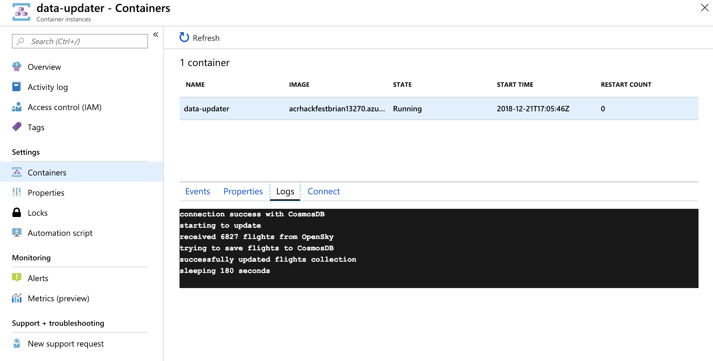

# Lab: Azure Container Instances and AKS Virtual Nodes

## Prerequisites

* Complete previous labs:
    * [Azure Kubernetes Service](../create-aks-cluster/README.md)
    * [Build Application Components in Azure Container Registry](../build-application/README.md)
    * [Helm Setup and Deploy Application](../helm-setup-deploy/README.md)

## Instructions

This lab has 2 components. First we will use Azure Container Instances to deploy a batch process to periodically update our CosmosDB collection. Then we will use the AKS Virtual Nodes feature to scale out our application using ACI.

### Azure Container Instance

1. Create container image for batch processing

    ```bash
    az acr build -t hackfest/data-updater:1.0 -r $ACRNAME --no-logs ~/kubernetes-hackfest/app/data-updater
    ```

2. Configure ACR credentials to be stored in Azure Key Vault

    We are storing our container images securely in ACR. In order to deploy into ACI, we should use a service principal and safely store these creds in Azure Key Vault as a best practice. 

    > Note. For AKS, we stored these credentials in a Kubernetes secret. In a security lab, we show how to use Key Vault here as well. 

    ```bash
    # create azure key vault instance
    AKV_NAME=keyvault${UNIQUE_SUFFIX}
    echo $AKV_NAME
    echo export AKV_NAME=keyvault${UNIQUE_SUFFIX} >> ~/.bashrc

    az keyvault create -g $RGNAME -n $AKV_NAME
    ```

    Next create a service principal, store it's password in AKV (the registry *password*)
    ```bash
    # note that we can use the service principal created in lab 1 for this.
    az keyvault secret set \
    --vault-name $AKV_NAME \
    --name $ACRNAME-pull-pwd \
    --value $(az ad sp create-for-rbac \
                --name $ACRNAME-pull \
                --scopes $(az acr show --name $ACRNAME --query id --output tsv) \
                --role reader \
                --query password \
                --output tsv)
    ```

    Next, store service principal ID in AKV (the registry *username*)
    ```bash
    az keyvault secret set \
    --vault-name $AKV_NAME \
    --name $ACRNAME-pull-usr \
    --value $(az ad sp show --id http://$ACRNAME-pull --query appId --output tsv)
    ```

3. Gather environment variables needed for running ACI

    This container uses the following envvars to run. You may need to look these up in the Azure portal or use commands from lab 2 to obtain.

    ```bash
    # set these values for your lab
    export MONGODB_USER=
    export MONGODB_PASSWORD=
    export APPINSIGHTS_INSTRUMENTATIONKEY=
    ```

4. Create ACI using the Azure CLI. Note: You can also complete this step using the Azure portal

    ```bash
    az container create \
    --name data-updater \
    --image $ACRNAME.azurecr.io/hackfest/data-updater:1.0 \
    --resource-group $RGNAME \
    --location eastus \
    --cpu 1 --memory 2 \
    --registry-login-server $ACRNAME.azurecr.io \
    --registry-username $(az keyvault secret show --vault-name $AKV_NAME -n $ACRNAME-pull-usr --query value -o tsv) \
    --registry-password $(az keyvault secret show --vault-name $AKV_NAME -n $ACRNAME-pull-pwd --query value -o tsv) \
    --environment-variables MONGODB_USER=$MONGODB_USER \
    MONGODB_PASSWORD=$MONGODB_PASSWORD \
    APPINSIGHTS_INSTRUMENTATIONKEY=$APPINSIGHTS_INSTRUMENTATIONKEY \
    UPDATE_INTERVAL=180000
    ```

    > Note: we are also using an envvar called UPDATE_INTERVAL to determine how often the update will occur in milliseconds.

5. Check the status of your ACI in the Azure portal. Validate the ACI logs and verify your Flights collection is being updated.

    


### Azure Kubernetes Service Virtual Nodes

To rapidly scale application workloads in an Azure Kubernetes Service (AKS) cluster, you can use virtual nodes. With virtual nodes, you have quick provisioning of pods, and only pay per second for their execution time. You don't need to wait for Kubernetes cluster autoscaler to deploy VM compute nodes to run the additional pods.

For this lab, we are creating a new AKS cluster. Depending on your quota, you may need to delete your existing AKS cluster. 

1. Create a virtual network

    ```bash
    az network vnet create \
        --resource-group $RGNAME \
        --name myVnet \
        --address-prefixes 10.0.0.0/8 \
        --subnet-name myAKSSubnet \
        --subnet-prefix 10.240.0.0/16
    ```

    And an additional subnet
    ```bash
    az network vnet subnet create \
        --resource-group $RGNAME \
        --vnet-name myVnet \
        --name myVirtualNodeSubnet \
        --address-prefix 10.241.0.0/16
    ```

2. Validate Service Principal

    We created a service principal in lab #1 for our previous AKS cluster. 

    ```bash
    echo $APPID
    echo $CLIENTSECRET
    ```

3. Assign permissions to the virtual network

    ```bash
    export VNETID=$(az network vnet show --resource-group $RGNAME --name myVnet --query id -o tsv)
    echo $VNETID
    ```
    ```bash
    az role assignment create --assignee $APPID --scope $VNETID --role Contributor
    ```

4. Create an AKS Cluster

    Create a unique cluster name. This cannot be the same name used in lab #1
    ```bash
    export AKSNAME=
    export SUBNET=$(az network vnet subnet show --resource-group $RGNAME --vnet-name myVnet --name myAKSSubnet --query id -o tsv)
    ```
    
    Create the cluster
    ```bash
    az aks create \
        --resource-group $RGNAME \
        --name $AKSNAME \
        --node-count 1 \
        --network-plugin azure \
        --service-cidr 10.0.0.0/16 \
        --dns-service-ip 10.0.0.10 \
        --docker-bridge-address 172.17.0.1/16 \
        --vnet-subnet-id $SUBNET \
        --service-principal $APPID \
        --client-secret $CLIENTSECRET
    ```

5. Validate cluster

    Once the creation is complete, get your credentials and ensure cluster is operating.

    ```bash
    az aks get-credentials -n $AKSNAME -g $RGNAME
    ```

    ```bash
    kubectl get nodes
    ```

6. Enable virtual nodes

    Add extension
    ```bash
    az extension add --source https://aksvnodeextension.blob.core.windows.net/aks-virtual-node/aks_virtual_node-0.2.0-py2.py3-none-any.whl
    ```

    Enable
    ```bash
    az aks enable-addons \
        --resource-group $RGNAME \
        --name $AKSNAME \
        --addons virtual-node \
        --subnet-name myVirtualNodeSubnet
    ```

    Verify
    ```bash
    kubectl get nodes

    NAME                       STATUS   ROLES   AGE     VERSION
    aks-nodepool1-56333375-0   Ready    agent   2m51s   v1.9.11
    virtual-node-aci-linux     Ready    agent   7s      v1.11.2
    ```

7. Create deployment targeting virtual node

    Edit the file `service-tracker-ui.yaml` in the `/kubernetes-hackfest/labs/aci` directory.

    You need to replace the `APPINSIGHTS_INSTRUMENTATIONKEY` with your key. It is on line 26 in the file.
    ```
    - name: APPINSIGHTS_INSTRUMENTATIONKEY
      value: <replace>
    ```

    Create the new deployment
    ```bash
    kubectl apply -f ./labs/aci/service-tracker-ui.yaml -n hackfest
    ```

    Validate that the pod is running on the virtual node and verify that you have an ACI in the Azure portal
    ```bash
    kubectl get pod -n hackfest -o wide

    NAME                                      READY     STATUS    RESTARTS   AGE       IP            NODE
    data-api-7c97ffc64b-8spp4                 1/1       Running   5          1d        10.240.0.7    aks-nodepool1-56333375-0
    flights-api-c6fdc889c-bkdqm               1/1       Running   0          1d        10.240.0.25   aks-nodepool1-56333375-0
    quakes-api-7bfc7b5b4b-xtt66               1/1       Running   0          1d        10.240.0.41   aks-nodepool1-56333375-2
    service-tracker-ui-aci-684984d764-45lcx   1/1       Running   0          8m        10.241.0.6    virtual-node-aci-linux
    service-tracker-ui-aci-684984d764-h8ln4   1/1       Running   0          8m        10.241.0.5    virtual-node-aci-linux
    service-tracker-ui-aci-684984d764-zhrw4   1/1       Running   0          10m       10.241.0.4    virtual-node-aci-linux
    weather-api-867bdcb845-h5mpn              1/1       Running   0          1d        10.240.0.14   aks-nodepool1-56333375-0
    ```

    For testing purposes, delete your existing service-tracker-ui deployment. Your web app should still work properly because the deployment has the same labels.
    ```bash
    kubectl delete deploy service-tracker-ui -n hackfest
    ```

## Troubleshooting / Debugging


## Docs / References

* ACI Docs. https://docs.microsoft.com/en-us/azure/container-instances/container-instances-overview 
* AKS Virtual Nodes. https://docs.microsoft.com/en-us/azure/aks/virtual-nodes-cli
* Virtual Kubelet. https://github.com/virtual-kubelet/virtual-kubelet 
* Using ACI with ACR. https://docs.microsoft.com/en-us/azure/container-instances/container-instances-using-azure-container-registry 