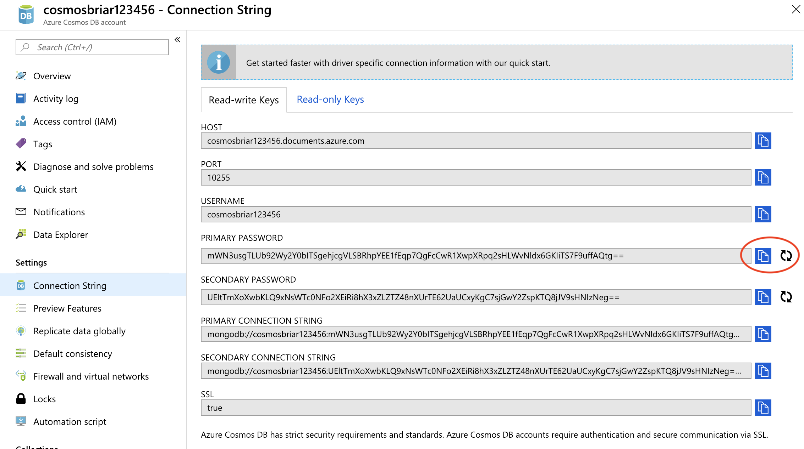

# Lab: Best Practices for App Developers

This lab walks through some basic best practices for developers using AKS. In many cases, the operations and developer best practices overlap. 

## Prerequisites

* Complete previous labs:
    * [Azure Kubernetes Service](../create-aks-cluster/README.md)
    * [Build Application Components in Azure Container Registry](../build-application/README.md)
    * [Helm Setup and Deploy Application](../helm-setup-deploy/README.md)

## Instructions

This lab has a number of exercises in no particular order: 

- [Handling Base Container Images](#handling-base-container-images)
- [Version Control and Image Tags](#version-control-and-image-tags)
- [Readiness and Liveness Probes](#readiness-and-liveness-probes)
- [Handling Failures](#handling-failures)
- [Define pod resource requests and limits](#define-pod-resource-requests-and-limits)
- [Pod Security](#pod-security)
- [Visual Studio Code Extension for Kubernetes](#visual-studio-code-extension-for-kubernetes)
- [Develop and Debug Applications Against an AKS Cluster](#develop-and-debug-applications-against-an-AKS-cluster)


### Handling Base Container Images
- - -

* It is important to select a proper base image for containers. Images should be lean to reduce size and eliminate tools that can lead to a larger attack surface. 

* It is recommended to start with super lean images such as alpine as a base image. Note that these images often exclude troubleshooting tools such as curl and do not include a full bash shell. 

* In our containers, you will notice that we used an alpine based node image for the base: 

    ```Dockerfile
    FROM node:10.9.0-alpine

    WORKDIR /usr/src/app
    COPY package*.json ./
    RUN npm ci

    COPY . .
    ENV NODE_ENV "development"
    EXPOSE 3003

    CMD [ "npm", "run", "container" ]
    ```

* Exec into the `flights-api` pod and attempt to use some typical linux tools.

    ```bash
    kubectl get pod -n hackfest

    NAME                                  READY     STATUS    RESTARTS   AGE
    data-api-847ff65574-7jlg2             1/1       Running   0          1d
    flights-api-6b5d7fd7fb-842p5          1/1       Running   0          1d
    quakes-api-6fbcf77dd5-2fr98           1/1       Running   0          1d
    service-tracker-ui-68fb7d7b87-4sh4q   1/1       Running   0          1d
    weather-api-677bc7ffc6-5x725          1/1       Running   0          1d
    ```

    ```bash
    # this command will fail since bash is not available
    kubectl exec -it flights-api-6b5d7fd7fb-842p5 -n hackfest /bin/bash

    # try sh instead
    kubectl exec -it flights-api-6b5d7fd7fb-842p5 -n hackfest /bin/sh

    # explore various commands such as curl
    /usr/src/app $ curl www.microsoft.com
    ```

* Use the "Builder Pattern" or multi-stage builds for Dockerfiles

    * Each instruction in a Dockerfile adds a layer which can lead to enormous images. These will be slower to start and store in registries. 
    * With Docker multi-stage builds you can copy files from builder images to a final, super-slim image. 
        > Note: requiring Docker 17.05 or higher
    * Try it with this new Dockerfile

        ```Dockerfile
        # build stage (use full node image to provide tooling needed for CI)
        FROM node:10.9.0 as build-stage

        WORKDIR /usr/src/app
        COPY package*.json ./
        RUN npm ci
        COPY . /usr/src/app/

        # final stage (using slim)
        FROM node:10.9.0-slim
        WORKDIR /app
        COPY --from=build-stage /usr/src/app/ /app/
        ENV NODE_ENV "development"
        EXPOSE 3003

        CMD [ "npm", "run", "container" ]
        ```

    * Build the new image and try it out

        ```bash
        az acr build -t hackfest/flights-api:multistage -r $ACRNAME --no-logs labs/best-practices/appdev/flights-api
        ```
    
    * Check out the image scanning lab in the [Best Practices for Cluster Operators](../operators/README.md) section.

### Version Control and Image Tags
- - -

* Never use `latest` for container image tags. Just don't do it. Trust me. Stop it. Now.
* In our labs we tagged images with a version such as `hackfest/data-api:1.0`. This is a simple starting point, but in best practice the image tag should map to a commit ID in source control.
* Review the approach in the [CI/CD labs](https://github.com/Azure/kubernetes-hackfest/blob/master/labs/cicd-automation/README.md) in this Hackfest. 
* Ideally, the image could be tagged using details from the git commit. For example: 

    ```
    def  imageTag = "${env.BRANCH_NAME}.${env.GIT_SHA}"
    ```


### Readiness and Liveness Probes
- - -

In this lab, we will add code to our `data-api` service to provide a health check route for kubernetes to determine if the pod is alive and ready. 

* Review the code at line 39. We have added an API route for `\healthz` that will validate the app is up and running.

    ```javascript
    router.get('/healthz', (req, res, next) => {
        res.json({status: 'UP'});
    });
    ```

* Using this source code, create a new container image

    ```bash
    az acr build -t hackfest/data-api:2.0 -r $ACRNAME --no-logs labs/best-practices/appdev/data-api
    ```

* Delete the existing `data-api` deploy

    ```bash
    kubectl delete deploy data-api -n hackfest
    ```

* Update the `data-api-probes.yaml` file on line 16 and set your ACR name as the prefix for the image. 
    * Note the new image tag, "2.0" Eg. - `- image: briaracr.azurecr.io/hackfest/data-api:2.0`

* Review the configuration of the health probes in the `data-api-probes.yaml` starting on line 26

    ```yaml
    readinessProbe:
      httpGet:
        port: 3009
        path: /healthz
    livenessProbe:
      httpGet:
        port: 3009
        path: /healthz
    ```

* Deploy the updated `data-api`
    ```bash
    kubectl apply -n hackfest -f labs/best-practices/appdev/data-api-probes.yaml
    ```

* Validate the health check endpoint is working

    ```bash
    kubectl get svc data-api -n hackfest

    NAME       TYPE           CLUSTER-IP     EXTERNAL-IP     PORT(S)          AGE
    data-api   LoadBalancer   10.0.206.235   44.85.168.311   3009:31732/TCP   2d
    ```

    Browse to http://your-ip-address:3009/healthz to validate. You should see:

    ```json
    {
        "status": "UP"
    }
    ```

    The kubelet will use these endpoints to determine readiness and liveness for each instance of the pod.


### Handling Failures
- - -

In this lab, we will update our application to handle failures gracefully and then create issues to test. For this lab, we will use the `data-api` service.

* Review the code for our updated `data-api` in this folder. There are a few changes, but look closely at the code starting at line 58.

    ```javascript
    mongoose.connect(
      cosmosConnectString,
      {
        user: user,
        pass: password,
        useNewUrlParser: true
      }
    )
    .then (() => {
      appInsights.defaultClient.trackEvent({ name: 'MongoConnSuccess' });
      console.log('connection success with CosmosDB');
    })
    .catch ((err) => {
      appInsights.defaultClient.trackException({exception: new Error(err)});
      console.log('CosmosDB connection failed with error: ' + err);
      appInsights.defaultClient.flush({callback: (responseFromAppInsights) => {
        process.exit(-1);
      }});
    });
    ```

* If there is a failure connecting to CosmosDB, we want the pod to log an error with App Insights, log to standard out, and FAIL. This way the pod doesn't receive any traffic while not connected. Likely might include some retry logic here, but this is a good starting point. 

* Using this source code, create a new container image

    ```bash
    az acr build -t hackfest/data-api:error-handling -r $ACRNAME --no-logs labs/best-practices/appdev/data-api
    ```

* Delete the existing `data-api` deploy

    ```bash
    kubectl delete deploy data-api -n hackfest
    ```

* Update the `data-api-error.yaml` file on line 16 and set your ACR name as the prefix for the image. 
    * Note the new image tag, "error-handling" Eg. - `- image: briaracr.azurecr.io/hackfest/data-api:error-handling`

* Prior to deploying, we will simulate a failure by changing the CosmosDB password in the Azure portal.

    

* Deploy the updated `data-api`
    ```bash
    kubectl apply -n hackfest -f labs/best-practices/appdev/data-api-error.yaml
    ```

* The pod should fail to start. You should be able to find the exception logged in App Insights (it can take a few minutes)


### Define pod resource requests and limits
- - -

**Pod requests** define a set amount of CPU and memory that the pod needs. **Pod limits** are the maximum amount of CPU and memory that a pod can use.

* Note that the pods deployed in our application have both of these set in the configuration.

    ```bash
    kubectl describe pod quakes-api-6fbcf77dd5-zjdls -n hackfest
    ```

    In the results, you will see in the output: 

    ```yaml
    Limits:
      cpu:     500m
      memory:  128Mi
    Requests:
      cpu:     100m
      memory:  64Mi
    ```

    > Note: You can read more about how these values are handled [here.](https://kubernetes.io/docs/concepts/configuration/manage-compute-resources-container/#meaning-of-cpu)

* Delete the existing `quakes-api` deploy

    ```bash
    kubectl delete deploy quakes-api -n hackfest
    ```

* Update the `quakes-api.yaml` file on line 16 and set your ACR name as the prefix for the image.
    * Eg. - `- image: briaracr.azurecr.io/hackfest/quakes-api:1.0`

* Deploy the updated `quakes-api`
    ```bash
    kubectl apply -n hackfest -f labs/best-practices/appdev/quakes-api.yaml
    ```

* Scale the deployment. You should see some pods go to `Pending` state.

    ```bash
    kubectl scale deploy quakes-api -n hackfest --replicas=5
    ```

### Pod Security 
- - -

In this lab, we will ensure our Pods cannot run as root and other important security settings. We will use the `weather-api` app for this.

* Update the `weather-api.yaml` file on line 16 and set your ACR name as the prefix for the image.
    Eg. - `- image: briaracr.azurecr.io/hackfest/weather-api:1.0`
    
* Delete the existing deploy
    ```bash
    kubectl delete deploy weather-api -n hackfest
    ```

* Note the updated settings in the `weather-api.yaml` file starting at line 26

    ```yaml
    securityContext:
      runAsUser: 1000
      allowPrivilegeEscalation: false
      capabilities:
        add: ["NET_ADMIN", "SYS_TIME"]
    ```
    
* Deploy the updated app
    ```bash
    kubectl apply -n hackfest -f labs/best-practices/appdev/weather-api.yaml
    ```

* Exec into pod and compare to one of the other API pods. Note that the weather pod is not running as root. 

    ```bash
    kubectl exec -it weather-api-59b64cd67b-6phkl -n hackfest /bin/sh

    /usr/src/app $ ps aux

    PID   USER     TIME  COMMAND
    1     node     0:00  npm
    16    node     0:00  node ./bin/www
    33    node     0:00  /bin/sh
    38    node     0:00  ps aux
    ```

* You can also view the status for process 1 to view the capabilities bitmap.

    ```bash
    cd /proc/1
    cat status
    ```

    You will see something similar to the below. Compare the same result with one of the other API pods.
    ```bash
    ...
    CapPrm:	0000000000000000
    CapEff:	0000000000000000
    ...
    ```

* Review the guidance for [Limiting credential exposure](https://docs.microsoft.com/en-us/azure/aks/developer-best-practices-pod-security#limit-credential-exposure) here.


### Visual Studio Code Extension for Kubernetes
- - -

> Note: This lab will require working from your local machine and NOT the Azure Cloud Shell.

* Install VS Code on your machine. [Installation here](https://code.visualstudio.com)
* Add the Kubernetes extension for VS Code. [Here](https://github.com/Azure/vscode-kubernetes-tools)
* Connect to your AKS cluster and experiment with the feature set

### Develop and Debug Applications Against an AKS Cluster
- - -

> Note: This lab will require working from your local machine and NOT the Azure Cloud Shell.

* Draft
    * Draft makes it easier for developers to build applications that run on Kubernetes by doing two main things:
        * The draft create command gives developers the artifacts they need to build and run their applications in Kubernetes
        * The draft up command builds the container image for an application and deploys it to Kubernetes
    * Draft targets the "inner loop" of a developer's workflow: as they hack on code, but before code is committed to version control
    * Get started with Draft here. https://github.com/azure/draft 

* Dev Spaces. 
    * Try the lab here: [Azure Dev Spaces](../../dev-spaces/README.md)


## Troubleshooting / Debugging


## Docs / References

* [Full AKS Best Practices Documentation](https://docs.microsoft.com/en-us/azure/aks/best-practices)
* [5 reasons you should be doing container native development](https://cloudblogs.microsoft.com/opensource/2018/04/23/5-reasons-you-should-be-doing-container-native-development) 
* [Kube Advisor](https://github.com/Azure/kube-advisor)
* https://www.weave.works/blog/kubernetes-best-practices 
* http://technosophos.com 