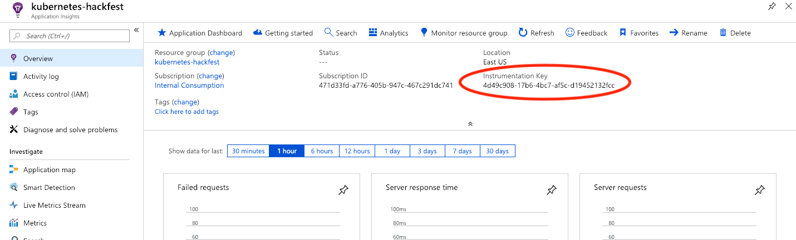

# Lab: Build Application Components and Prerequisites

In this lab we will build Docker containers for each of the application components and setup the back-end database.

## Prerequisites

* Complete previous labs:
    * [Azure Kubernetes Service](../create-aks-cluster/README.md)

## Instructions

1. Create Azure Container Registry (ACR)
    * Use the same resource group that was created for AKS (in lab 1)
    * In this step, you will need a unique name for your ACR instance. Use the following step to create the ACR name and then deploy.

    ```bash
    # Use the UNIQUE_SUFFIX from the first lab. Validate that the value is still set.
    echo $UNIQUE_SUFFIX
    # Set Azure Container Registry Name
    export ACRNAME=acrhackfest$UNIQUE_SUFFIX
    # Check ACR Name (Can Only Container lowercase)
    echo $ACRNAME
    # Persist for Later Sessions in Case of Timeout
    echo export ACRNAME=acrhackfest$UNIQUE_SUFFIX >> ~/.bashrc
    # Create Azure Container Registry
    az acr create --resource-group $RGNAME --name $ACRNAME --sku Basic
    ```

1. Attach the Azure Container Registery to the AKS Cluster

    ```bash
    az aks update -n $CLUSTERNAME -g $RGNAME --attach-acr $ACRNAME
    ```

    **NOTE: If the role assignment fails due to permissions, we will do it the hard way and create an Image Pull Secret.**

    ```bash
    # !!!!!!!!!!
    # Only do these steps if the above Service Principal Role Assignment fails.
    # !!!!!!!!!!

    # Extract Container Registry details needed for Login
    # Login Server
    ACR_FQDN=$(az acr show -n $ACRNAME --query "{acrLoginServer:loginServer}" -o tsv)
    # Enable ACR admin 
    az acr update -n $ACRNAME --admin-enabled true
    # Registry Username and Password
    ACR_USER=$(az acr credential show -n $ACRNAME --query "username" -o tsv)
    ACR_PASSWD=$(az acr credential show -n $ACRNAME --query "passwords[0].value" -o tsv)

    # Use the login and credential information from above
    kubectl create -n hackfest secret docker-registry regcred \
      --docker-server=$ACR_FQDN \
      --docker-username=$ACR_USER \
      --docker-password=$ACR_PASSWD

    # !!!!!!!!!!
    # Only do these steps if the above Service Principal Role Assignment fails.
    # !!!!!!!!!!
    ```

1. Create Application Insights Instance

    Continue using the same resource group that was created previously
    
    ```bash
    # Create a unique application insights name
    APPINSIGHTSNAME=appInsightshackfest$UNIQUE_SUFFIX
    # Deploy the appinsights ARM template   
    az deployment group create --resource-group $RGNAME --template-file labs/build-application/app-Insights.json --parameters type=Node.js name=$APPINSIGHTSNAME regionId=eastus --no-wait
    ```

    Alternatively :    

    * In your Azure portal, click "Create a resource", select "Developer tools", and choose "Application Insights"
    * Pick a unique name (you can use the unique identifier created in the 1st lab)
    * Use "Node.js Application" for the app type
    * Select "kubernetes-hackfest" for the Resource Group
    * Use "East US" for location
    * When this is completed, select "All services", and search for "Application Insights" 
    * Select your newly created Application Insights instance
    * On the Overview Page take note of the Instrumentation Key 

        

1. Deploy Cosmos DB

    In this step, create a Cosmos DB account for the Mongo api. Again, we will create a random, unique name.

    ```bash
    export COSMOSNAME=cosmos$UNIQUE_SUFFIX
    # Check COSMOS Name
    echo $COSMOSNAME
    # Persist for Later Sessions in Case of Timeout
    echo export COSMOSNAME=cosmos$UNIQUE_SUFFIX >> ~/.bashrc
    # Create Cosmos DB
    az cosmosdb create --name $COSMOSNAME --resource-group $RGNAME --kind MongoDB
    ```

    You can validate your Cosmos instance in the portal. The credentials and connect string will be used in the next lab.

1. Create Kubernetes secrets for access to CosmosDB and App Insights

    You will use a secret to hold the credentials for our backend database and Azure App Insights. In the next lab, you will use this secret as a part of your deployment manifests.

    Once the secret is created, these envvars are no longer needed. 

    * Set the CosmosDB user and password

    ```bash
    export MONGODB_USER=$(az cosmosdb show --name $COSMOSNAME --resource-group $RGNAME --query "name" -o tsv)
    ```

    ```bash
    export MONGODB_PASSWORD=$(az cosmosdb keys list --name $COSMOSNAME --resource-group $RGNAME --query "primaryMasterKey" -o tsv)
    ```

    Use Instrumentation Key from step 3 above.
    ```bash
    export APPINSIGHTS_INSTRUMENTATIONKEY='replace-me'
    ```

    ```bash
    kubectl create secret generic cosmos-db-secret --from-literal=user=$MONGODB_USER --from-literal=pwd=$MONGODB_PASSWORD --from-literal=appinsights=$APPINSIGHTS_INSTRUMENTATIONKEY -n hackfest
    ```

1. Create Docker containers in ACR

    In this step we will create a Docker container image for each of our microservices. We will use ACR Builder functionality to build and store these images in the cloud. 

    ```bash
    az acr build -t hackfest/data-api:1.0 -r $ACRNAME --no-logs -o json app/data-api
    az acr build -t hackfest/flights-api:1.0 -r $ACRNAME --no-logs -o json app/flights-api
    az acr build -t hackfest/quakes-api:1.0 -r $ACRNAME --no-logs -o json app/quakes-api
    az acr build -t hackfest/weather-api:1.0 -r $ACRNAME --no-logs -o json app/weather-api
    az acr build -t hackfest/service-tracker-ui:1.0 -r $ACRNAME --no-logs -o json app/service-tracker-ui
    ```

    You can see the status of the builds by running the command below.

    ```bash
    az acr task list-runs -r $ACRNAME -o table

    az acr task logs -r $ACRNAME --run-id <run id>
    ```

    Browse to your ACR instance in the Azure portal and validate that the images are in "Repositories."

## Troubleshooting / Debugging

* Make sure all of you ACR Task commands are pointing to the correct Azure Container Registry. You can check repositories by navigating to your ACR in the Azure Portal UI.

## Docs / References

* Azure Container Registry Docs. https://docs.microsoft.com/en-us/azure/container-registry 

#### Next Lab: [Helm Setup and Deploy Application](../helm-setup-deploy/README.md)
