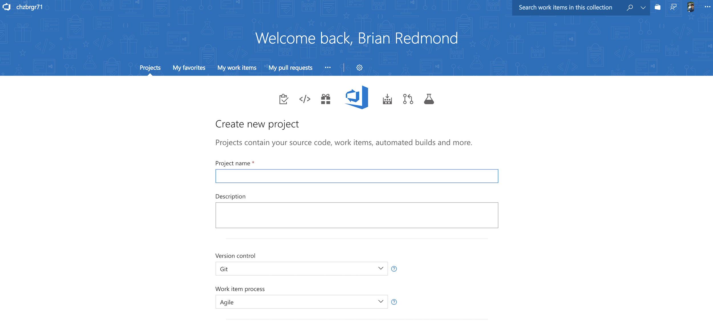

# Lab: Azure DevOps CI/CD

This workshop will guide you through building Continuous Integration (CI) and Continuous Deployment (CD) pipelines with Azure DevOps for use with Azure Kubernetes Service. The pipeline will utilize Azure Container Registry to build the images and Helm for application updating. 

## Prerequisites 

* Complete previous labs:
    * [Azure Kubernetes Service](../../create-aks-cluster/README.md)
    * [Build Application Components in Azure Container Registry](../../build-application/README.md)
    * [Helm Setup and Deploy Application](../../helm-setup-deploy/README.md)

## Instructions

The general workflow/result will be as follows:

- Push code to source control
- Trigger a continuous integration (CI) build pipeline when project code is updated via Git
- Package app code into a container image (Docker Image) created and stored with Azure Container Registry
- Trigger a continuous deployment (CD) release pipeline upon a successful build
- Deploy container image to AKS upon successful a release (via Helm chart)
- Rinse and repeat upon each code update via Git
- Profit


#### Setup Azure DevOps Project

1. Create a Azure DevOps organization/account. Follow the steps here: https://docs.microsoft.com/en-us/azure/devops/user-guide/sign-up-invite-teammates?view=vsts

2. Create New Project in Azure DevOps

    * Name your project "azure-devops-aks" and give it a description.
    * Leave the Version control as Git

    

3. On the next screen, choose "import a repository" and use the source from this repo

    

#### Create Build Pipeline

1. Create an empty build pipeline. Hover over "Build and release" and select "Build"
2. Click the "New Definition" button
3. Select to "start with an Empty process"
4. Change the Agent queue to use the "Hosted Linux Preview"
5. Choose "Get Sources" and select "VSTS Git" and leave other settings as is

    > Note that we are using the master branch here. Normally we would use other branches and PR's. For simplicity, we are using master just for this lab.

6. Click the plus sign by Phase 1 to add a task
7. Search tasks for "Azure" and add the Azure CLI task

    

8. Click on the Azure CLI task and choose your Azure subscription and Authorize
9. Choose "Inline script" and enter the following (be sure to replace the ACR name with yours). Notice how we create a dynamic image tag using our build ID from VSTS.

    ```
    export ACRNAME=<replace>
    export IMAGETAG=vsts-$(Build.BuildId)

    az acr build -t hackfest/node-data-api:v1 -r $ACRNAME --no-logs ./app/node-data-api
    az acr build -t hackfest/node-flights-api:v1 -r $ACRNAME --no-logs ./app/node-flights-api
    az acr build -t hackfest/web-ui:v1 -r $ACRNAME --no-logs ./app/web-ui    
    ```

10. Add another task and search for "Publish Build Artifacts". Use "charts" for the artifact name and browse to the charts folder for the "Path to publish"

    

11. Test this by clicking "Save & queue" and providing a comment
12. Click on "Builds" to check result
13. Enable Continuous integration for the build definition. Edit the build definition and you will find this setting under "Triggers"


#### Create Deployment Pipeline

In the deployment pipeline, we will create a Helm task to update our application. To save time, we will only deploy the web-ui application in this lab. 

1. Hover over "Build and release" and select "Release"
2. Click the "New Definition" button
3. Select to "start with an Empty process"
4. Name the release Environment "dev"
5. Click on "+ Add" next to Artifacts
6. In "Source (Build Definition)", select the build we created earlier (should be named "vsts-aks-CI")

    

7. Click on the lightning bolt next to the Artifact we just created and enable "Continuous deployment trigger"
8. Hover over dev environment and select "View environment tasks"
9. In Agent phase, change the Agent queue to "Hosted Linux Preview"
10. On the Agent phase, click the "+" to add a Task
11. Search for "helm" and add the task called "Package and deploy Helm charts"
12. Click on the task to configure all of the settings for the release
    
    * Select your Azure subscription in the dropdown and click "Authorize"
    * Select the Resource Group and AKS Cluster
    * For the Command select "upgrade"
    * For Chart type select "File Path"
    * For Chart path, click the "..." button and browse to the "web-ui" chart in the charts directory

#### Run a test build

1. In VSTS, click on Builds and click the "Queue new build" button
2. Monitor the builds and wait for the build to complete

    

3. The release will automatically start when the build is complete (be patient, this can take some time). Review the results as it is complete. 

    

4. Now kick-off the full CI/CD pipeline by making an edit to the web-ui frontend code in VSTS.

#### Next Lab: [Networking](labs/networking/README.md)

## Troubleshooting / Debugging

## Docs / References

* Blog post by Jessica Dean. http://jessicadeen.com/tech/microsoft/how-to-deploy-to-kubernetes-using-helm-and-vsts 