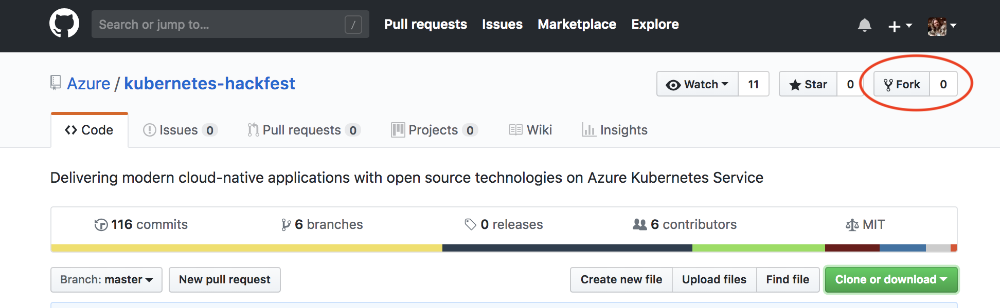
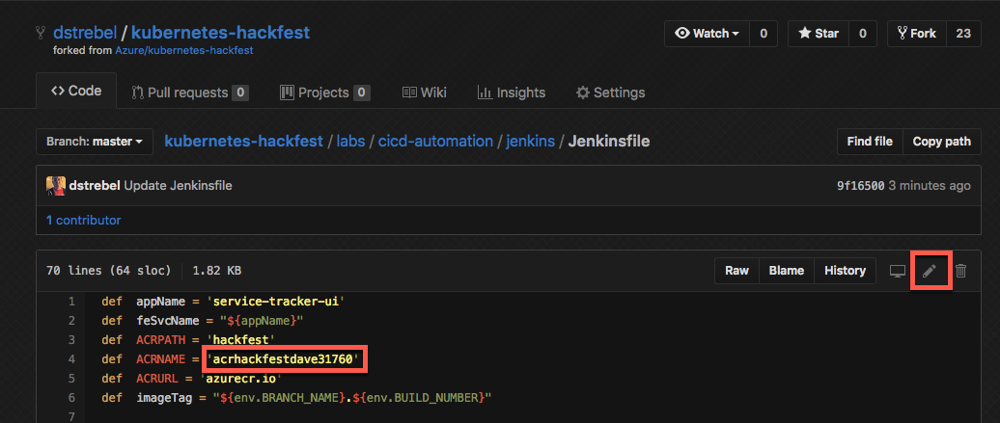
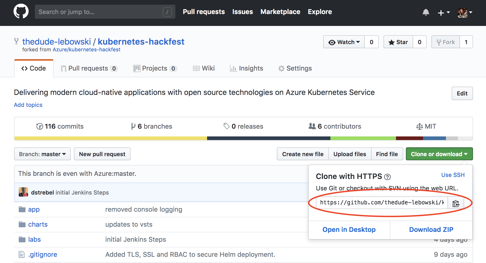
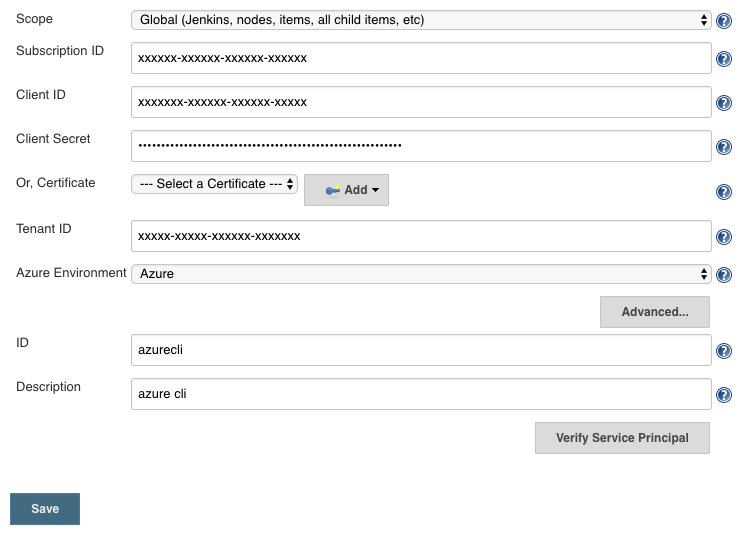
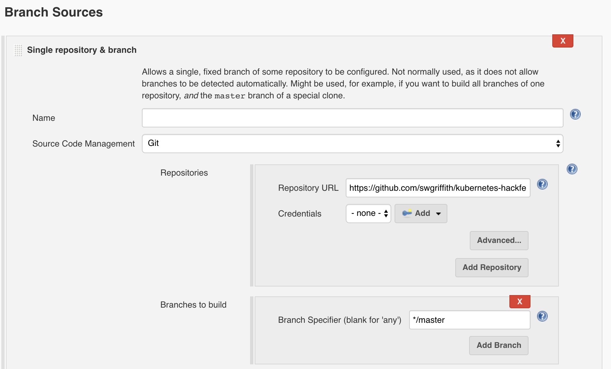
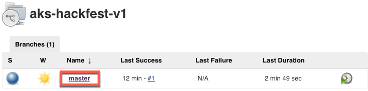
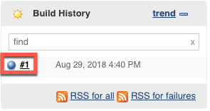
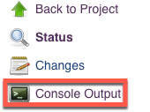

# Lab: Jenkins CI/CD

This workshop will guide you through building Continuous Integration (CI) and Continuous Deployment (CD) pipelines with Jenkins. The pipeline will utilize Azure Container Registry to build the images and Helm for application updating. 

## Prerequisites

* Complete previous labs:
    * [Azure Kubernetes Service](../create-aks-cluster/README.md)
    * [Build Application Components in Azure Container Registry](../build-application/README.md)
    * [Helm Setup and Deploy Application](../helm-setup-deploy/README.md)

## Instructions

The general workflow/result will be as follows:

* Push code to source control (Github)
* Trigger a continuous integration (CI) build pipeline when project code is updated via Git
* Package app code into a container image (Docker Image) created and stored with Azure Container Registry
* Trigger a continuous deployment (CD) release pipeline upon a successful build
* Deploy container image to AKS upon successful a release (via Helm chart)
* Rinse and repeat upon each code update via Git
* Profit


#### Setup Github Repo

In order to trigger this pipeline you will need your own Github account and forked copy of this repo. Log into Github in the browser and get started. 

1. Broswe to https://github.com/azure/kubernetes-hackfest and click "Fork" in the top right.

    

2. Modify the Jenkinsfile pipeline Within Github Fork (Needs to be done from Github)

    The pipeline file references your Azure Container Registry in a variable. Edit the `labs/cicd-automation/jenkins/Jenkinsfile` file and modify line 4 of the code: 

    ```bash
    def ACRNAME = 'youracrname'
    ```

    

3.  Your newly forked repo will have the default ACR URL hardcoded in the Helm chart for the service-tracker-ui app (which was manually updated locally in step 4 of the 'Lab: Helm Setup and Deploy Application' lab). This needs to be updated on line 10 of ./charts/service-tracker-ui/values.yaml in your fork of the repo.

    ```bash
    acrServer: "<update this with your acr name>.azurecr.io"
    ```


4. Grab your clone URL from Github which will look something like: `https://github.com/thedude-lebowski/kubernetes-hackfest.git`

    

5. Clone your repo in Azure Cloud Shell.

    > Note: If you have cloned the repo in earlier labs, the directory name will conflict. You can either delete the old one or just rename it before this step.

    ```bash
    git clone https://github.com/<your-github-account>/kubernetes-hackfest.git

    cd kubernetes-hackfest/labs/cicd-automation/jenkins
    ```

#### Deploy Jenkins Helm Chart

1. Validate helm. Helm was configured in the lab 3.

    ```bash
    helm version

    version.BuildInfo{Version:"v3.0.0", GitCommit:"e29ce2a54e96cd02ccfce88bee4f58bb6e2a28b6", GitTreeState:"clean", GoVersion:"go1.13.4"}
    ```

2. Deploy Jenkins

   ```bash
   kubectl create namespace jenkins
   helm repo add jenkinsci https://charts.jenkins.io
   helm repo update
   helm install jenkins -n jenkins -f jenkins-values.yaml jenkinsci/jenkins
   ```

   This will take a couple of minutes to fully deploy

3. Get credentials and IP to Login To Jenkins

   ```bash
   printf $(kubectl get secret --namespace jenkins jenkins -o jsonpath="{.data.jenkins-admin-password}" | base64 --decode);echo

   export SERVICE_IP=$(kubectl get svc --namespace jenkins jenkins --template "{{ range (index .status.loadBalancer.ingress 0) }}{{ . }}{{ end }}")

   echo http://$SERVICE_IP:8080/login
   ```

   Login with the password from previous step and the username: admin

   > Note: The Jenkins pod can take a couple minutes to start. Ensure it is `Running` prior to attempting to login. You can run the following to watch the pod creation: **watch kubectl get pods**

#### Configure Azure Integration In Jenkins

1. Browse to Jenkins Default Admin Screen

2. Click on `Credentials`

3. Select `System` under Credentials

4. On the right side click the `Global Credentials` drop down and select `Add Credentials`

5. Enter the following: *Example Below*
    * Kind = Azure Service Principal
    * Scope = Global
    * Subscription ID = use Subscription ID from cluster creation
    * Client ID =  use Client/App ID from cluster creation
    * Client Secret = use Client Secret from cluster creation
    * Tenant ID = use Tenant ID from cluster creation
    * Azure Environment = Azure
    * Id = azurecli
    * Description = Azure CLI Credentials

6. Click `Verify Service Principal`

7. Click `Save`

   

#### Verify Updated ACRNAME in Jenkinsfile

1. Within Azure Cloud Shell edit Jenkinsfile  with the following command `code Jenkinsfile`

2. If not updated, replace the following variable with the Azure Container Registry created previously
   * def  ACRNAME = '<container_registry_name>'


#### Create Jenkins Multibranch Pipeline

1. Open Jenkins Main Admin Interface

2. Click `New Item`

3. Enter "aks-hackfest" for Item Name

4. Select `Multibrach Pipeline` and then click Ok

5. Under Branch Sources `Click Add` -> `Single repository & branch`

6. Name the repo and branch 'Master' and then in 'Replository URL' enter `your forked git repo`

   

7. Leave the 'Branch Specifier' as '*/master'

8. In Build Configuration -> Script Path -> use the following path 

   `labs/cicd-automation/jenkins/Jenkinsfile`

   

9. Scroll to bottom of page and click `Save`

#### Run Jenkins Multibranch Deployment

1. Go back to Jenkins main page

2. Select the newly created pipeline

3. Select `Scan Multibranch Pipeline Now`

This will scan your git repo and run the Jenkinsfile build steps. It will clone the repository, build the docker image, and then deploy the app to your AKS Cluster.

#### View Build Console Logs

1. Select the `master` under branches

   

2. Select `build #1` under Build History

   

3. Select `Console Output`

   

4. Check streaming console output for any errors

#### Verify Deployed Application

1. Confirm pods are running 

   ```bash
   kubectl get pods -n hackfest
   ```

2. Get service IP of deployed app

   ```bash
   kubectl get service/service-tracker-ui -n hackfest
   ```

3. Open browser and test application `EXTERNAL-IP:8080`


## Troubleshooting / Debugging


## Docs / References

* Docs. https://docs.microsoft.com/en-us/azure/aks/jenkins-continuous-deployment 

#### Next Lab: [Networking](../../networking/README.md)
