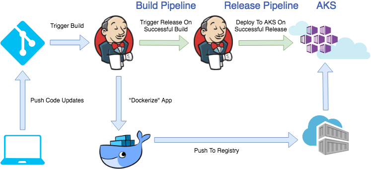

*** Work IN Progress ***
# Lab: Jenkins CI/CD

This workshop will guide you through building Continuous Integration (CI) and Continuous Deployment (CD) pipelines with Visual Studio Team Services (VSTS) for use with Azure Kubernetes Service. The pipeline will utilize Azure Container Registry to build the images and Helm for application updating. 

## Prerequisites 

* Clone this repo in Azure Cloud Shell.
* Complete previous labs:
    * [Azure Kubernetes Service](../create-aks-cluster/README.md)
    * [Build Application Components in Azure Container Registry](../build-application/README.md)
    * [Helm Setup and Deploy Application](../helm-setup-deploy/README.md)

## Instructions

The general workflow/result will be as follows:

- Push code to source control (Github)
- Trigger a continuous integration (CI) build pipeline when project code is updated via Git
- Package app code into a container image (Docker Image) created and stored with Azure Container Registry
- Trigger a continuous deployment (CD) release pipeline upon a successful build
- Deploy container image to AKS upon successful a release (via Helm chart)
- Rinse and repeat upon each code update via Git
- Profit




#### Setup Github Repo

In order to trigger this pipeline you will need your own Github account and forked copy of this repo. Log into Github in the browser and get started. 

1. Broswe to https://github.com/azure/kubernetes-hackfest and click "Fork" in the top right.

    

2. Grab your clone URL from Github which will look something like: `https://github.com/thedude-lebowski/kubernetes-hackfest.git`

    

3. Clone your repo in Azure Cloud Shell.

    > Note: If you have cloned the repo in earlier labs, the directory name will conflict. You can either delete the old one or just rename it before this step.

    ```bash
    git clone https://github.com/<your-github-account>/kubernetes-hackfest.git

    cd kubernetes-hackfest/labs/cicd-automation/jenkins
    ```

#### Deploy Jenkins Helm Chart

1. Initialize Helm
   
   ```bash
   helm init
   ```

   ```bash
   helm install stable/jenkins --name jenkins -f values.yaml
   ```

   This will take a couple of minutes to fully deploy

2. Get credentials and IP to Login To Jenkins
   ```bash
   printf $(kubectl get secret --namespace default jenkins -o jsonpath="{.data.jenkins-admin-password}" | base64 --decode);echo
   ```
   ```bash
   export SERVICE_IP=$(kubectl get svc --namespace default jenkins --template "{{ range (index .status.loadBalancer.ingress 0) }}{{ . }}{{ end }}")
   ```
   ```bash
   echo http://$SERVICE_IP:8080/login
   ```

   Login with the password from previous step and the username: admin

#### Configure Azure Integration In Jenkins

1. Configure Crendentials In Jenkins Credential Store