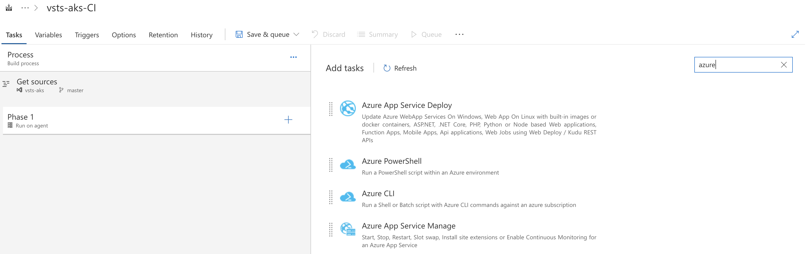

# Lab: Visual Studio Team Service CI/CD

This workshop will guide you through building Continuous Integration (CI) and Continuous Deployment (CD) pipelines with Visual Studio Team Services (VSTS) for use with Azure Kubernetes Service. The pipeline will utilize Azure Container Registry to build the images and Helm for application updating. 

## Prerequisites 

* Clone this repo in Azure Cloud Shell.
* Complete previous labs:
    * [Azure Kubernetes Service](../create-aks-cluster/README.md)
    * [Build Application Components in Azure Container Registry](../build-application/README.md)
    * [Helm Setup and Deploy Application](../helm-setup-deploy/README.md)

## Instructions

The general workflow/result will be as follows:

- Push code to source control (Github)
- Trigger a continuous integration (CI) build pipeline when project code is updated via Git
- Package app code into a container image (Docker Image) created and stored with Azure Container Registry
- Trigger a continuous deployment (CD) release pipeline upon a successful build
- Deploy container image to AKS upon successful a release (via Helm chart)
- Rinse and repeat upon each code update via Git
- Profit


#### Setup VSTS and Project

1. Create a VSTS account. Follow the steps here: https://docs.microsoft.com/en-us/vsts/organizations/accounts/create-account-msa-or-work-student?view=vsts 

2. Create New Project in VSTS

    * Name your project "vsts-aks" and give it a description.
    * Leave the Version control as Git

    

3. On the next screen, choose "import a repository" and use the source from this repo

    

#### Create Build Pipeline


1. Create an empty build pipeline. Hover over "Build and release" and select "Build"
2. Click the "New Definition" button
3. Select to "start with an Empty process"
4. Change the Agent queue to use the "Hosted Linux Preview"
5. Choose "Get Sources" and select "VSTS Git" and leave other settings as is

    > Note that we are using the master branch here. Normally we would use other branches and PR's. For simplicity, we are using master just for this lab.

6. Click the plus sign by Phase 1 to add a task
7. Search tasks for "Azure" and add the Azure CLI task

    

8. Click on the Azure CLI task and choose your Azure subscription and Authorize
9. Choose "Inline script" and enter the following (be sure to replace the ACR name with yours). Notice how we create a dynamic image tag using our build ID from VSTS.

    ```
    export ACRNAME=briaracr
    export IMAGETAG=vsts-$(Build.BuildId)

    az acr build -t hackfest/data-api:$IMAGETAG -r $ACRNAME ./app/data-api
    az acr build -t hackfest/auth-api:$IMAGETAG -r $ACRNAME ./app/auth-api
    az acr build -t hackfest/flights-api:$IMAGETAG -r $ACRNAME ./app/flights-api
    az acr build -t hackfest/web-ui:$IMAGETAG -r $ACRNAME ./app/web-ui
    ```

10. Add another task and search for "Publish Build Artifacts". Use "charts" for the artifact name and browse to the charts folder for the "Path to publish"

    

11. Test this by clicking "Save & queue" and providing a comment
12. Click on "Builds" to check result


#### Create Deployment Pipeline


## Troubleshooting / Debugging

## Docs / References

* Blog post by Jessica Dean. http://jessicadeen.com/tech/microsoft/how-to-deploy-to-kubernetes-using-helm-and-vsts 