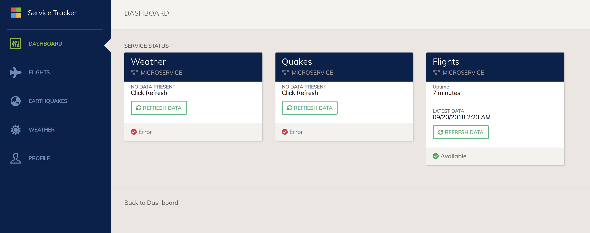

# Lab: Helm Setup and Deploy Application

In this lab we will setup Helm in our AKS cluster and deploy our application with Helm charts.

## Prerequisites

* Helm Version 3+
* Clone this repo in Azure Cloud Shell.
* Complete previous labs:
    * [Azure Kubernetes Service](../create-aks-cluster/README.md)
    * [Build Application Components in Azure Container Registry](../build-application/README.md)

## Instructions

>Note: The following lab assumes Helm version 3. Run the following to confirm your Helm version:
```bash
helm version

# Example Output:
version.BuildInfo{Version:"v3.8.0", GitCommit:"d14138609b01886f544b2025f5000351c9eb092e", GitTreeState:"clean", GoVersion:"go1.17.5"}
```

1. Review the Helm Chart components

    In this repo, there is a folder for `charts` with a sub-folder for each specific app chart. In our case each application has its own chart. 

    The `values.yaml` file has the parameters that allow you to customize release. This file has the defaults, but they can be overridden on the command line. 

    The `templates` folder holds the yaml files for the specific kubernetes resources for our application. Here you will see how Helm inserts the parameters into resources with this bracketed notation: eg -  `{{.Values.deploy.image}}`

1. Customize Chart Parameters

    In each chart we will need to update the values file with our specific Azure Container Registry. 

    * Get the value of your ACR Login Server:

        ```bash
        az acr list -o table --query "[].loginServer" -g $RGNAME

        Result
        -------------------
        youracr.azurecr.io

        ```

    * Replace the `acrServer` value below with the Login server from previous step. In the Azure Cloud Shell, select the file editor '{}'.  Navigate to the yaml files below.  To save changes, select the elipticals on the right hand side and select Save. You will make this change in all of the charts below:
    
        Replace all `acrServer` values:
        ```bash
        export ACRSERVER=$(az acr list -g $RGNAME -o table --query "[].loginServer" --output json | jq -r '.[]')
        echo "export ACRSERVER=$ACRSERVER" >> ~/workshopvars.env
        find charts -name values.yaml -exec sed -i 's/youracr.azurecr.io/'${ACRSERVER}'/g' {} \;

        ```

        [charts/service-tracker-ui/values.yaml](../../charts/service-tracker-ui/values.yaml)

        [charts/weather-api/values.yaml](../../charts/weather-api/values.yaml)

        [charts/flights-api/values.yaml](../../charts/flights-api/values.yaml)

        [charts/quakes-api/values.yaml](../../charts/quakes-api/values.yaml)

        [charts/data-api/values.yaml](../../charts/data-api/values.yaml)

        Example:
        ```yaml
        # Default values for chart

        service:
        type: ClusterIP
        port: 3009

        deploy:
        name: data-api
        replicas: 1
        acrServer: "youracr.azurecr.io"
        imageTag: "1.0"
        containerPort: 3009
        ```

    * Validate that the `imageTag` parameter matches the tag you created in Azure Container Registry in the previous lab.

    * Add `imagePullSecret` to each deployment.yaml file for each microservice

        **NOTE: Only do if the Service Principal role assignment in Build Application lab failed. You will need to add the Docker Registry secret that was created to each deployment via a mechanism called an imagePullSecret.**

        [charts/service-tracker-ui/templates/deployment.yaml](../../charts/service-tracker-ui/templates/deployment.yaml)

        [charts/weather-api/templates/deployment.yaml](../../charts/weather-api/templates/deployment.yaml)

        [charts/flights-api/templates/deployment.yaml](../../charts/flights-api/templates/deployment.yaml)

        [charts/quakes-api/templates/deployment.yaml](../../charts/quakes-api/templates/deployment.yaml)

        [charts/data-api/templates/deployment.yaml](../../charts/data-api/templates/deployment.yaml)

        Example Before:
        ```yaml
        ...

        containers:
          - image: "{{.Values.deploy.acrServer}}/hackfest/weather-api:{{.Values.deploy.imageTag}}"
            imagePullPolicy: Always

        ...
        ```

        Example After (2 imagePullSecrets lines added):
        ```yaml
        ...

        imagePullSecrets:
        - name: regcred
        containers:
          - image: "{{.Values.deploy.acrServer}}/hackfest/weather-api:{{.Values.deploy.imageTag}}"
            imagePullPolicy: Always

        ...
        ```

1. Deploy MongoDB

    ```bash
    kubectl apply -f charts/mongo/.
    ```

    Wait for the mongo pod to be in 'Ready' state before deploying the rest of the application. You can watch the pod status with the following:

    ```bash
    watch kubectl get pods -n hackfest
    ```

2. Deploy Charts

    Ensure namespace was created earlier:
    ```bash
    kubectl get ns hackfest

    NAME       STATUS    AGE
    hackfest   Active    4m
    ```

    Install each chart as below (note: the following commands expect your working directory to be /kubernetes-hackfest you may need to return to this if you have changed workind directory in previous steps):

    ```bash
    # Application charts

    helm upgrade --install data-api charts/data-api --namespace hackfest
    helm upgrade --install quakes-api charts/quakes-api --namespace hackfest
    helm upgrade --install weather-api charts/weather-api --namespace hackfest
    helm upgrade --install flights-api charts/flights-api --namespace hackfest
    helm upgrade --install service-tracker-ui charts/service-tracker-ui --namespace hackfest
    ```

3. Initialize application

    * First check to see if pods and services are working correctly

    ```bash
    kubectl get pod,svc -n hackfest

    NAME                                     READY   STATUS    RESTARTS   AGE
    pod/data-api-5bdc5c94b4-8xfq2            1/1     Running   3          5d3h
    pod/flights-api-77f77464df-n7jb4         1/1     Running   4          5d15h
    pod/quakes-api-7c8b96b594-vm5qd          1/1     Running   4          5d15h
    pod/service-tracker-ui-c4476d778-hpn5q   1/1     Running   3          5d6h
    pod/weather-api-56d6c57b89-cds8v         1/1     Running   4          5d15h

    NAME                         TYPE           CLUSTER-IP     EXTERNAL-IP   PORT(S)          AGE
    service/data-api             ClusterIP      10.0.179.206   <none>        3009/TCP         7d4h
    service/flights-api          ClusterIP      10.0.255.59    <none>        3003/TCP         7d4h
    service/quakes-api           ClusterIP      10.0.122.46    <none>        3012/TCP         7d4h
    service/service-tracker-ui   LoadBalancer   10.0.24.184    40.71.20.1    8080:30757/TCP   5d6h
    service/weather-api          ClusterIP      10.0.124.80    <none>        3015/TCP         7d4h
    ```

    * Browse to the web UI

    ```bash
    kubectl get service service-tracker-ui -n hackfest

    NAME                 TYPE           CLUSTER-IP    EXTERNAL-IP   PORT(S)          AGE
    service-tracker-ui   LoadBalancer   10.0.24.184   40.71.20.1    8080:30757/TCP   5d6h
    ```

    Open the browser to http://40.71.20.1:8080 (your IP will be different #obvious)

    * You will need to click "REFRESH DATA" for each service to load the data sets.

        

    * Browse each map view and have some fun.

## Troubleshooting / Debugging

* Make sure Helm version on the client and server are the same to ensure compatibility.

## Docs / References

* [Helm](http://helm.sh)

#### Next Lab: [CI/CD Automation](../cicd-automation/README.md)
