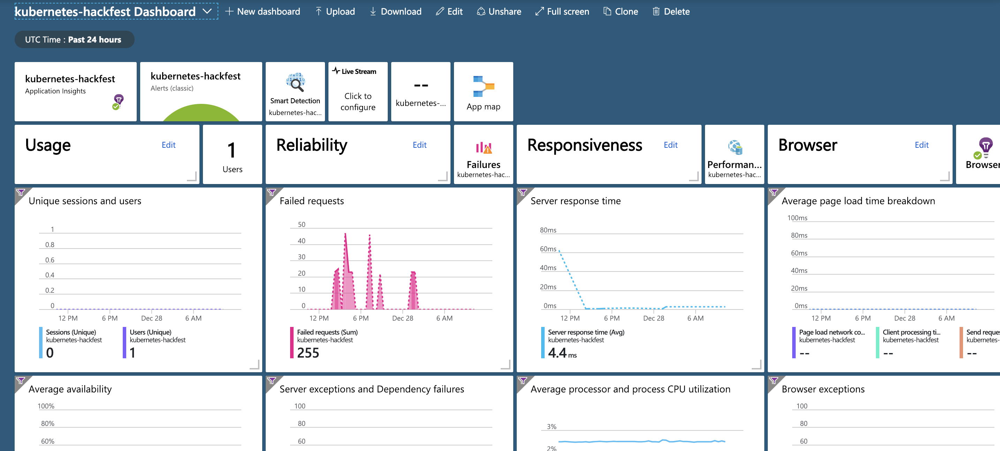

# Lab: Azure Monitor and App Insights

This section shows how to leverage Azure Monitor for Containers for gaining Monitoring and Logging insights into your AKS Cluster. If you recall from the AKS Cluster Creation section, the optional **monitoring** add-on was enabled which automatically integrated Azure Log Analytics with AKS. We will now explore what that add-on provides.

## Prerequisites

* Complete previous labs:
    * [Azure Kubernetes Service](../../create-aks-cluster/README.md)
    * [Build Application Components in Azure Container Registry](../../build-application/README.md)
    * [Helm Setup and Deploy Application](../../helm-setup-deploy/README.md)

## Instructions

1. Setup Azure Monitor for Containers

    * There is nothing more to do if the **monitoring** add-on was enabled at AKS Cluster creation time. Proceed to **Step 2**.
    * If the **monitoring** add-on was not enabled, no worries, it can be added after the fact via the enable-addons command. If you are not sure you can check via the following command to see if the Pods are running. No out put means **monitoring** add-on is not running.

        ```bash
        kubectl get ds omsagent --namespace=kube-system
        ```
    * To enable the add-on run the following command against your AKS Cluster.

        ```bash
        az aks enable-addons -a monitoring -g $RGNAME -n $CLUSTERNAME
        ```

2. Enable Master Node Logs in AKS

    * One of the first things you are going to want to do is enable the Master Node Logs to help with troubleshooting production running Applications. This will help gain additional insights into potential issues.
        * Go to the Azure Portal and select your Resource Group.
        * Choose the **Diagnostic settings** Blade at the Resource Group level.
        * Select your AKS Cluster.
        * Click on **Turn on diagnostics** to collect logs.
        * Fill in a **Name**, click on the **Send to Log Analytics** checkbox, select your **Log Analytics Workspace**, and the Master Node logs you are interested in.
        * Click "Save"

        

    * NOTE: It takes a while for the Master Node Logs to start syncing with Log Analytics so we will take a look at existing logs and then come back to this at the end.

3. Gaining Insights into Cluster Performance

    * Let's see what we get out of the box with Azure Monitor for Containers when it comes to overall Cluster Health.
        * Go to the Azure Portal and select your Resource Group that containers your AKS Cluster.
        * Select your AKS Cluster.
        * From the **Overview** Blade, click on the **Monitor containers** link and you should be taken to a screen that looks something like this.

        

        * Explore the Cluster, Nodes, Controllers and Containers Tabs. When you switch to Nodes, Controllers, and Containers tab, automatically displayed on the right-side of the page is the property pane. It shows the properties of the item selected, including labels you define to organize Kubernetes objects. Click on the >> link in the pane to view\hide the pane.
        * On the **Containers** Tab you should see the Pods associated to the Microservices Application that has been deployed.

        

        * See if you can find which Nodes the Microservices Application Pods are running on.

        **HINT:** Look at the **Nodes** Tab.

4. Getting Access to Container Logs

    * Ok, we have seen the overall performance of the Cluster, but what about actual Container logs in the event troubleshooting is required.
        * If you recall from the step above, there is a property pane on the right-hand side.
        * On the **Containers** tab, select one of the Containers, **service-tracker-ui** for example.
        * In the Property Pane, click the **View container logs** link and you should see something that looks like the following (same output as running kubectl logs on the Pod).

        

5. Running Custom Queries Against Logs

    * If you still have the Containers Log Blade window open you can use that. If not, do the following to get to the Logs windows.
        * Go to the Azure Portal and select your Resource Group that containers your AKS Cluster.
        * Select your AKS Cluster.
        * From the **Overview** Blade, click on the **View logs** link and you should be taken to a screen that looks something like this.

        

    * Once you are on the Logs window, copy and paste the following query examples into the query window and then click on the **Run** button.
        * As you are going through the queries take note of the left-hand side that shows a bunch of the **Filters** that can be used to further drill in. If you take a look at the **Schema** you will see the different types of Objects you can query inside of the Log Analytics Workspace.
        * List our Microservices Application Images

        ```text
        ContainerInventory
        | distinct Image
        | where Image contains "hackfest"
        | render table
        ```

        

        * List all of a container's lifecycle information.

        ```text
        ContainerInventory
        | project Computer, Name, Image, ImageTag, ContainerState, CreatedTime, StartedTime, FinishedTime
        | render table
        ```

        * Kubernetes Events

        ```text
        KubeEvents
        | where not(isempty(Namespace))
        | sort by TimeGenerated desc
        | render table
        ```

        * Image Inventory

        ```text
        ContainerImageInventory
        | summarize AggregatedValue = count() by Image, ImageTag, Running
        ```

6. Master Node Logs

    * Ok, we have looked at logs on the Worker Nodes, what about the Master Nodes? The Master Node Logs should be synced up by now and starting to be captured so let's give it at try.
    * Similar to the above with AKS Logs, here are some examples of Master Node Queries that can be used.
        * Look at Categories inside of Azure Diagnostics

        ```text
        AzureDiagnostics
        | distinct Category
        ```

        

        * Look at kube-apiserver Logs

        ```text
        AzureDiagnostics
        | where Category == "kube-apiserver"
        | project log_s
        ```

        * Look at a specific pod in the kube-apiserver Logs

        ```text
        AzureDiagnostics
        | where Category == "kube-apiserver"
        | where log_s contains "pods/service-tracker-ui"
        | project log_s
        ```

7. Application Insights

    We enabled App Insights in our application in earlier labs. Application Insights is an extensible Application Performance Management (APM) service for web developers on multiple platforms.

    * In the Azure Portal, click on "All services", then search for "Monitor"
    * Click on "Monitor"
    * Under Insights, select "Applications"
    * Select the Application Insights instance we created earlier. It should be called "kubernetes-hackfest"

    > Note: You may need to create traffic on your app by browsing the web site.

    * Click on "Application Map
    * Click on "Metrics"
    * Click on "Performance"
    * Click on "Application Dashboard" Browse the dashboard and the telemetry data. 

        


## Troubleshooting / Debugging

* [Troubleshoot Azure Monitor for Containers](https://docs.microsoft.com/en-us/azure/monitoring/monitoring-container-insights-troubleshoot)

## Docs / References

* [Azure Monitor for Containers](https://docs.microsoft.com/en-us/azure/monitoring/monitoring-container-insights-overview?toc=%2fazure%2fmonitoring%2ftoc.json)
* [Understand AKS Cluster Performance](https://docs.microsoft.com/en-us/azure/monitoring/monitoring-container-insights-analyze?toc=%2fazure%2fmonitoring%2ftoc.json)
* [View kubelet Logs](https://docs.microsoft.com/en-us/azure/aks/kubelet-logs)