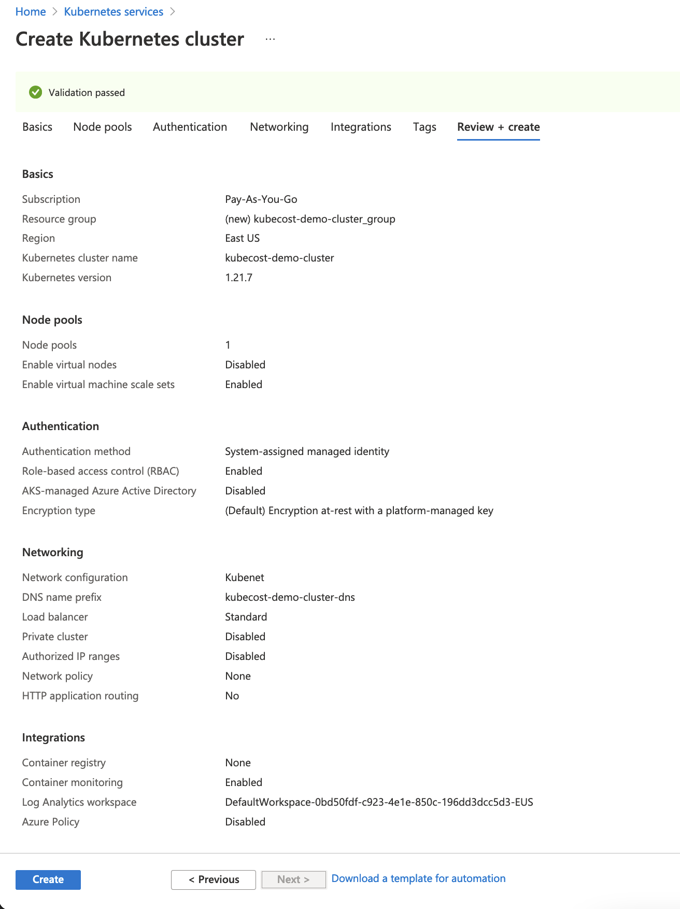

# Module 1: Creating an AKS cluster

In this section, we'll be using the Azure Portal to create an Azure Kubernetes Service (AKS) cluster, configure `kubectl` access to it, and deploy a sample application.

Adapted from the official Azure AKS [documentation](https://docs.microsoft.com/en-us/azure/aks/kubernetes-walkthrough-portal).

CLI version of these docs is also available from a [previous lab](https://github.com/Azure/kubernetes-hackfest/tree/master/labs/create-aks-cluster).

## Prerequisites

- You have signed into the [Azure Portal](https://portal.azure.com/)
- You have the access permissions required to create and manage K8s clusters in your organization
- [You have set up cost data](../0_create-azure-cost-export/README.md)
- You have installed [Azure CLI](https://docs.microsoft.com/en-us/cli/azure/install-azure-cli?view=azure-cli-latest)
- You have installed [kubectl](https://kubernetes.io/docs/tasks/tools/)

## Step 1: Configure and deploy the cluster

1. In the Azure Portal, search for **Kubernetes services** -> **Create** -> **Create a Kubernetes cluster**
2. Configure cluster details.

    ### Basics

    - Project details:
        - Select an Azure Subscription.
        - Select or create an Azure Resource group, such as myResourceGroup.
    - Cluster details:
        - Choose the **Standard ($$)** preset configuration.
        - Enter a Kubernetes cluster name, such as `kubecost-demo-cluster`.
        - Select a **Region**.
        - Select a Kubernetes version for the AKS cluster. At the time of writing this document, the version used is `1.21.7` (default).
    - Primary node pool:
        - Leave the default values selected.

    ### Networking

    - Select **Kubenet**, and leave the **DNS name prefix** unchanged.
    - (optional) Enable HTTP application routing. This step is required if you intend to expose the Kubecost UI dashboard via a Load Balancer.

3. Go to **Review + create** tab and click **Create**

Here is what the configuration should look like.



## Step 2: Configure `kubectl` access to the cluster

We will be accessing the cluster using the Azure CLI `az aks` command and `kubectl`.

1. Open the terminal and login to Azure with the same credentials you used to create the AKS cluster.

    ```
    $ az login
    ```
    This will open your browser and take you to the sign in page to confirm your identity.

2. Sign in with your account credentials in the browser.

3. Configure `kubectl` to connect to your Kubernetes cluster using the `az aks get-credentials` command. The following command downloads credentials and configures the current `kubectl` context to use them.

    ```
    $ az aks get-credentials --resource-group myResourceGroup --name kubecost-demo-cluster
    ```
4. Verify the connection to your cluster using kubectl get to return a list of the cluster nodes.

    ```
    $ kubectl get nodes
    ```
The output shows the single node created in the previous step.

```
NAME                                STATUS   ROLES   AGE    VERSION
aks-agentpool-28582544-vmss000000   Ready    agent   15m   v1.21.7
aks-agentpool-28582544-vmss000002   Ready    agent   15m   v1.21.7
```

## Step 3: Deploy a sample application

This step is optional. For the sake of this demo, we'll deploy a small [nginx server](https://k8s.io/examples/application/deployment.yaml ) so that we can explore more cost data using Kubecost in the next section of this lab.

1. Create a namespace

    ```
    $ kubectl create namespace nginx-app
    ```

2. Deploy the application

    ```
    $ kubectl apply -f https://k8s.io/examples/application/deployment.yaml -n nginx-app
    ```

3. Verify the deployment

    ```
    $ kubectl get deployments -n nginx-app
    ```

The output should look like this. Make sure the deployment is in `READY` state.

```
NAME               READY   UP-TO-DATE   AVAILABLE   AGE
nginx-deployment   2/2     2            2           10s
```
