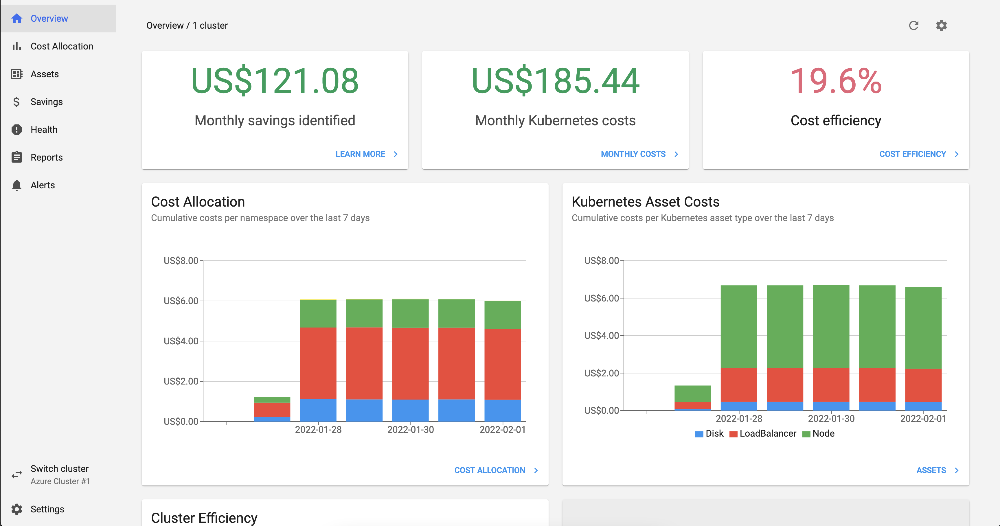
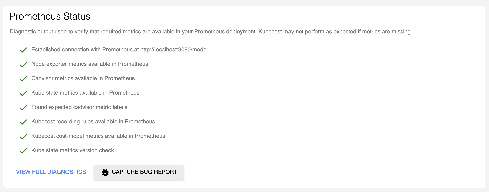

# Module 2: Install Kubecost on AKS

This section helps you install Kubecost on the cluster you've successfully created in Section 1. Optionally, you'll also expose your Kubecost UI via a Load Balancer.

## Prerequisites

- You have completed Section 1 of this lab
- You can access your cluster via `kubectl`
- You have installed [helm3 CLI](https://helm.sh/docs/intro/install/)

## Step 1: Install Kubecost

These instructions are also available in [kubecost.com/install](https://kubecost.com/install).

1. Open the terminal, and create a `kubecost` namespace in your cluster.

    ```shell
    $ kubectl create namespace kubecost 
    ```

2. Add the official Kubecost helm repository.

    ```shell
    $ helm repo add kubecost https://kubecost.github.io/cost-analyzer/ 
    ```

3. Run the install command. A standard Kubecost installation will also install the Prometheus and Grafana dependencies within the `kubecost` namespace.

    If you created the Azure Cost Export as directed in [Module 0](labs/monitoring-logging/kubecost/0_create-azure-cost-export), follow `A. With Azure Cost Export`, otherwise, follow `B. Without Azure Cost Export`
  
    **A. With Azure Cost Export**

    Replace `{subscription-id}`, `{storage-account-name}`, `{storage-container-name}`, and `{storage-access-key}` with the appropriate values

    ```shell
    $ helm install kubecost kubecost/cost-analyzer --namespace kubecost --set kubecostProductConfigs.azureSubscriptionID={subscription-id} --set kubecostProductConfigs.azureStorageAccount={storage-account-name} --set kubecostProductConfigs.azureStorageAccessKey={storage-access-key} --set kubecostProductConfigs.azureStorageContainer={storage-container-name} --set kubecostProductConfigs.azureStorageCreateSecret=true
    ```

    **B. Without Azure Cost Export**
    ```shell
    $ helm install kubecost kubecost/cost-analyzer --namespace kubecost
    ```

    This step will take a couple of minutes to complete. Once it's done, verify that all the containers have been created and are running without issues:

    ```shell
    $ kubectl get pods -n kubecost
    ```

## Step 2: View Kubecost data

You can expose the Kubecost UI dashboards locally using Port Forwarding.

1. Run the `port-forward` command.

    ```shell
    $ kubectl port-forward --namespace kubecost deployment/kubecost-cost-analyzer 9090
    ```

2. In your browser, open `localhost:9090` to see the data. It should look like this:



3. The Kubecost API depends on its bundled Prometheus installation. Verify that the Kubecost API is in full force. **Settings** -> **Prometheus Status**.



## (optional) Step 3: Expose Kubecost UI deployment outside of the cluster

One of the available options to open your Kubecost deployment to the world is by exposing port 9090 via Azure's Load Balancer.

1. Create a file called `kubecost-cost-analyzer.yml` with the following contents. This file is also available within this section's files.

    ```yaml
    apiVersion: v1
    kind: Service
    metadata:
        name: public-svc
    spec:
        type: LoadBalancer
        ports:
        - port: 9090
    selector:
        app: cost-analyzer
    ```
    The `app` should be the service name of the Kubecost app minus the `kubecost-` prefic. You can view your services by running `kubectl get services -n kubecost`.

2. Apply to cluster.

    ```shell
    $ kubectl apply -f kubecost-cost-analyzer.yml -n kubecost
    ```

3. Verify that the `public-svc` service has been created as a Load Balancer, exposing port 9090.

```shell
NAME                                TYPE           CLUSTER-IP     EXTERNAL-IP     PORT(S)                      AGE
kubecost-cost-analyzer              ClusterIP      10.0.208.169   <none>          9001/TCP,9003/TCP,9090/TCP   1h
kubecost-grafana                    ClusterIP      10.0.181.47    <none>          80/TCP                       1h
kubecost-kube-state-metrics         ClusterIP      10.0.2.211     <none>          8080/TCP                     1h
kubecost-prometheus-node-exporter   ClusterIP      None           <none>          9100/TCP                     1h
kubecost-prometheus-server          ClusterIP      10.0.228.40    <none>          80/TCP                       1h
public-svc                          LoadBalancer   10.0.104.222   20.85.139.189   9090:32660/TCP               1h
```

4. View Kubecost data by visiting the `public-svc` address: `http://<EXTERNAL-IP>:9090`

5.  Party time! 💃💃💃
