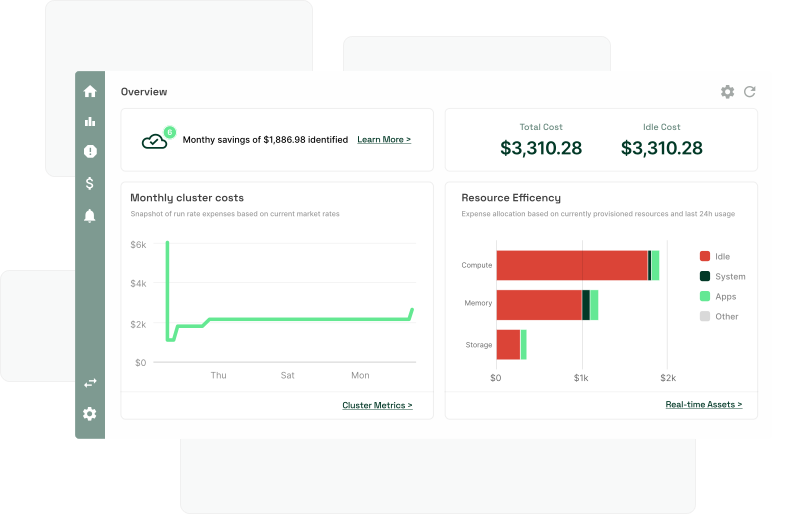

=======
# Kubecost Workshop at AKS

[Kubecost](https://www.kubecost.com/) provides real-time cost visibility and insights for teams using Kubernetes.

Installing Kubecost on a single cluster or a fleet of clusters uncovers patterns that create overspending on infrastructure and helps teams prioritize where to focus optimization efforts. By identifying root causes for negative patterns, customers using Kubecost save up to 80% of their Kubernetes cloud infrastructure costs. Today, Kubecost empowers thousands of teams across companies of all sizes to monitor and reduce costs, while balancing cost, performance, and reliability.

Kubecost is tightly integrated with the open source Cloud Native ecosystem and built for engineers and developers first, making it easy to drive adoption within any organization. 

## About the workshop

The workshop walks you through the all the steps required to leverage Kubecost on a single AKS cluster — from correctly setting up a cluster, to viewing all your K8s data via the Kubecost UI and the API.

##  Who is the workshop for?

- Developers
- Solutions Architects
- DevOps Engineers
- SREs
- Infrastructure & Cloud Engineers

## Learning objectives

The workshop is organized into 4 modules:

- Module 0: [Creating an Azure Cost Export](0_create-azure-cost-export/README.md)
- Module 1: [Creating an AKS cluster](1_create-aks-cluster/README.md)
- Module 2: [Installing Kubecost on AKS](2_install-kubecost-on-aks/README.md)
- Module 3: [Using the Kubecost API](3_kubecost-api/README.md)

At the end of completing them, you should be able to:

- Prepare your Azure tenant to collect cost data
- Create an AKS cluster
- Install and configure Kubecost along with its Prometheus and Grafana dependencies
- Expose Kubecost outside of the cluster using a Load Balancer Controller
- Leverage Kubecost to view real-time K8s spend data and uncover optimizations

## Lab Prerequisites

- Azure account
- Storage Account with Cost Export data

## Documentation & Support

Official Kubecost documentation is available [here](https://guide.kubecost.com). We'd also like to invite you to [join our Slack community](https://join.slack.com/t/kubecost/shared_invite/enQtNTA2MjQ1NDUyODE5LWFjYzIzNWE4MDkzMmUyZGU4NjkwMzMyMjIyM2E0NGNmYjExZjBiNjk1YzY5ZDI0ZTNhZDg4NjlkMGRkYzFlZTU) — for additional support, feature discussions, and general banter!
