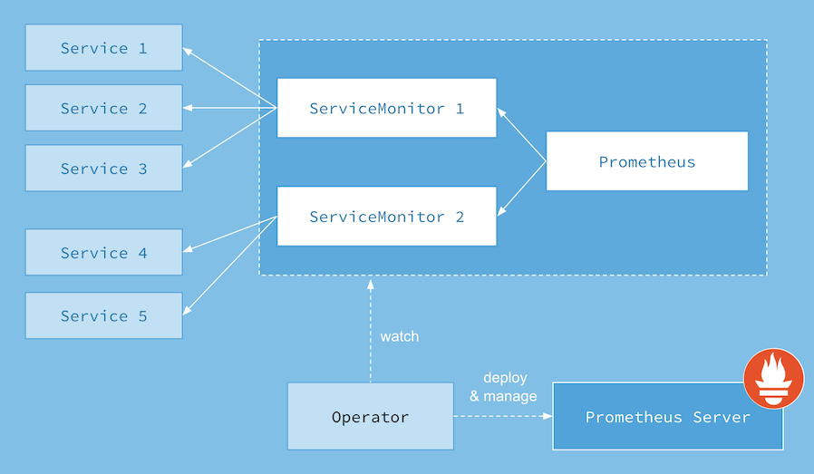
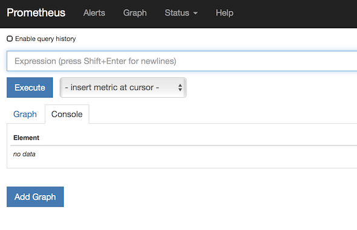
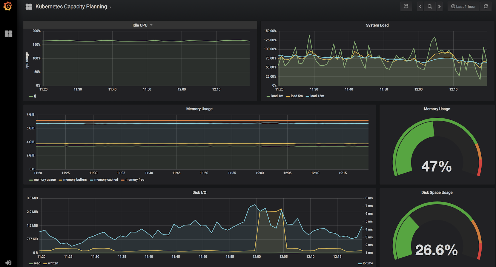
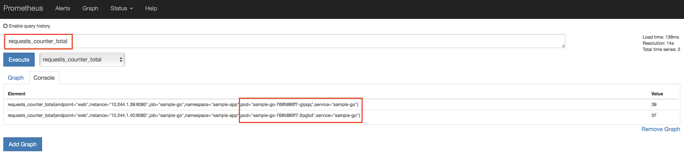
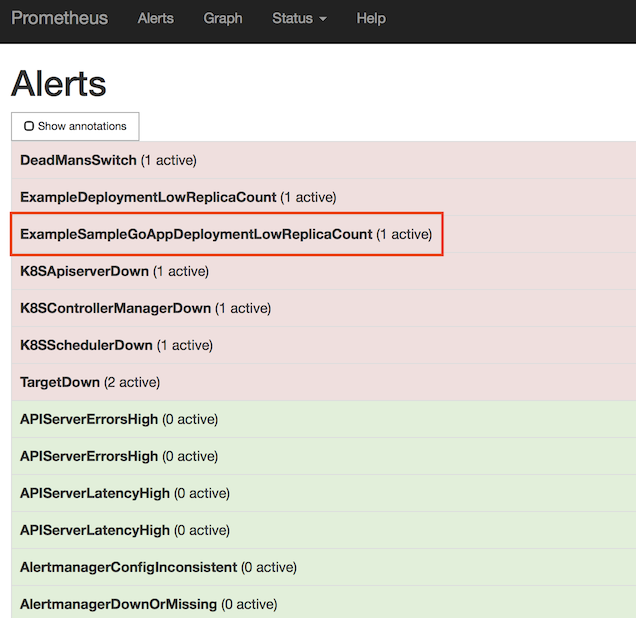
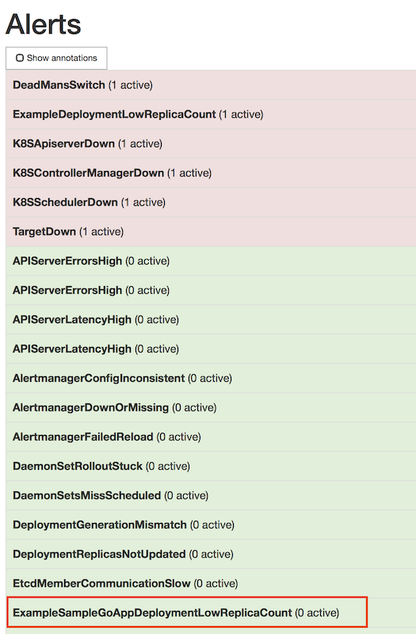

# Lab: Adding Prometheus and Grafana to AKS Cluster

This lab will walkthrough using the Core OS Prometheus Operator to add Monitoring and Visualization capabilities to our AKS Cluster. The Operator will be installed using HELM.



## Prerequisites

* Complete previous labs:
    * [Azure Kubernetes Service](../../create-aks-cluster/README.md)
    * [Build Application Components in Azure Container Registry](../../build-application/README.md)
    * [Helm Setup and Deploy Application](../../helm-setup-deploy/README.md)

## Instructions

1. Deploy Prometheus Operator

    ``` bash
    # Create a new Monitoring Namespace to deploy Prometheus Operator too
    kubectl create namespace monitoring
    
    # Add the stable repo for Helm 3
    helm repo add stable https://kubernetes-charts.storage.googleapis.com
    helm repo update
    
    # Install Prometheus Operator
    helm install prometheus-operator stable/prometheus-operator --namespace monitoring
    kubectl -n monitoring get all -l "release=prometheus-operator"
    
    # Check to see that all the Pods are running
    kubectl get pods -n monitoring
    
    # Other Useful Prometheus Operator Resources to Peruse
    kubectl get prometheus -n monitoring
    kubectl get prometheusrules -n monitoring
    kubectl get servicemonitor -n monitoring
    kubectl get cm -n monitoring
    kubectl get secrets -n monitoring
    ```

>**Note:** The following explains how to expose Prometheus, Alert Manager and Grafana dashboards via a public IP. This is only for lab purposes, and would not be recommended for production. A more secure alternative would be to use a Kubernetes [port-forward](https://kubernetes.io/docs/tasks/access-application-cluster/port-forward-access-application-cluster/). (Ex. kubectl port-forward services/prometheus-operator-prometheus -n monitoring 9090:9090)

1. Expose Services to Public IP's

    ```bash
    # use your VI skills to change the below snippet. The type should be "LoadBalancer" and not "ClusterIP"

    kubectl edit service prometheus-operator-prometheus -n monitoring
    ```

    ```yaml
    spec:
      clusterIP: 10.0.79.78
      ports:
      - name: http
        port: 9090
        protocol: TCP
        targetPort: 9090
      selector:
        app: prometheus
        prometheus: kube-prometheus
      sessionAffinity: None
      type: LoadBalancer
    ```

    ```bash
    # repeat for Alert Manager
    kubectl edit service prometheus-operator-alertmanager -n monitoring
    ```

    ```bash
    # repeat for Grafana
    kubectl edit service prometheus-operator-grafana -n monitoring
    ```

    > Note: These settings should not generally be used in production. The endpoints should be secured behind an Ingress. This just aides the lab experience. 

1. Interact with Prometheus (Prometheus and Alert Manager Dashboards)

    ```bash
    # Get your public IP address for the Prometheus dashboard (if <pending>, you must wait...)
    kubectl get service prometheus-operator-prometheus -n monitoring
    ```

    Open up a brower to http://<your-public-ip>:9090 and you will see the Prometheus dashboard

    * Screenshot of Default Prometheus UI

        

    ```bash
    # Get your public IP address for the Prometheus Alert Manager (if <pending>, you must wait...)
    kubectl get service prometheus-operator-alertmanager -n monitoring
    ```

    Open up a brower to http://<your-public-ip>:9093 and you will see the Prometheus dashboard

    * Screenshot of Default Alert Manager UI

        

1. Interact with Grafana Dashboard

    ```bash
    # Get your public IP address for Grafana (if <pending>, you must wait...)
    kubectl get service prometheus-operator-grafana -n monitoring
    ```

    Open up a brower to http://<your-public-ip>:80 and you will need to log in to see the Prometheus dashboard. Username: admin Password: prom-operator

    * Screenshot of Kubernetes Capacity Planning Dashboard

        

1. Deploy Sample App with Integrated and Custom Prometheus Metrics

    * Create Namespace for Sample GO App

        ```bash
        # Create custom Namespace to deploy sample app to.
        kubectl create namespace sample-app
        ```
    * Build [Sample GO App](../../../app/sample-go/README.md) Container & Update Deployment Manifest

        ```bash
        # 1. Use ACR Build to create Container and Push to ACR
        # 2. Update Container Image in Deployment manifest (prom-graf-sample-go-app.yaml) 
        # Deploy the Sample GO Application with Updated Container Image
        kubectl apply -f prom-graf-sample-go-app.yaml -n sample-app
        # Deploy the ServiceMonitor to Monitor the Sample GO App
        kubectl apply -f prom-graf-servicemonitor.yaml -n monitoring
        # Deploy the ConfigMap to Raise Alerts for the Sample GO App
        kubectl apply -f prom-graf-alert-rule.yaml -n monitoring
        ```
    * If there is interest in how Prometheus Metrics and Custom Metrics can be added to an existing application take a look at the [GO Code](../../../app/sample-go/app.go).

    * Get the IP address of the sample and send some requests to it to get some metrics loaded.

        ```bash
        kubectl get svc -n sample-app

        # Either pop out to a browser or curl http://<ExternalIP>:8080
        curl -H 'Cache-Control: no-cache' <ExternalIP>:8080

        # To view the metrics endpoint
        curl <ExternalIP>:8080/metrics
        ```

1. Check Metrics and Alerts are Working for Sample GO App

    * Using the technique above, port-forward to the Prometheus Dashboard.
    * Check custom metric `requests_counter_total` in the deployed sample GO App:

        

    * Check Replica Count custom alert for the sample GO App:

        

1. Fix Replica Count Custom Alert

    * Scale the Deployment to 3 replicas to stop the Alert from FIRING.

        ```bash
        kubectl scale deploy sample-go -n sample-app --replicas=3
        ```

    * Using the technique above, port-forward to the Prometheus Dashboard and check that the Alert is now Green and not FIRING. Be patient, this will take a couple of minutes for the metrics to be updated and the evaluation process to respond accordingly.

        


## Docs / References

* [Prometheus Operator](https://github.com/helm/charts/blob/master/stable/prometheus-operator/README.md)
* [Crash Course to Monitoring K8s](https://www.sumologic.com/blog/cloud/how-to-monitor-kubernetes/)
* [Prometheus Operator Alerting](https://github.com/coreos/prometheus-operator/blob/v0.17.0/Documentation/user-guides/alerting.md)

#### Next Lab: [Service Mesh w/ Distributed Tracing](../../servicemesh-tracing/README.md)
