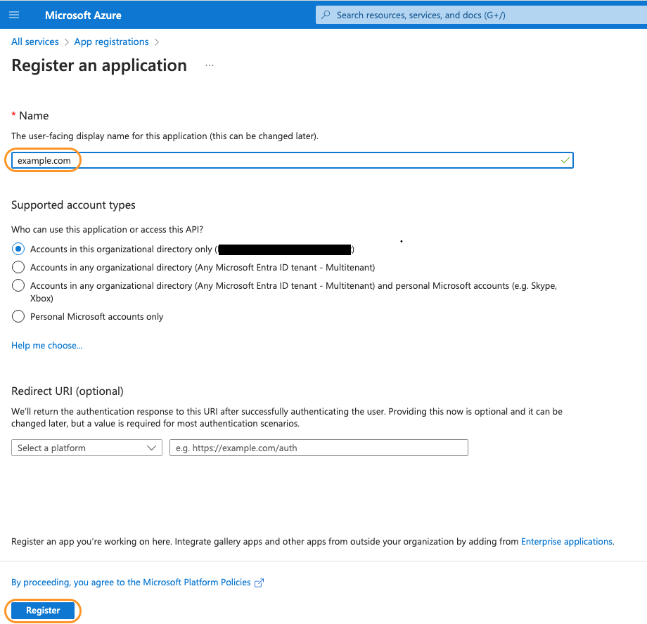
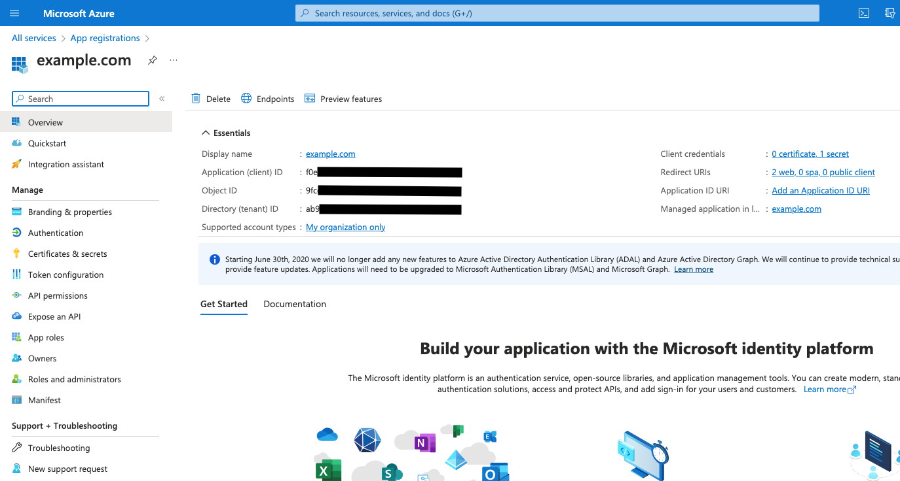
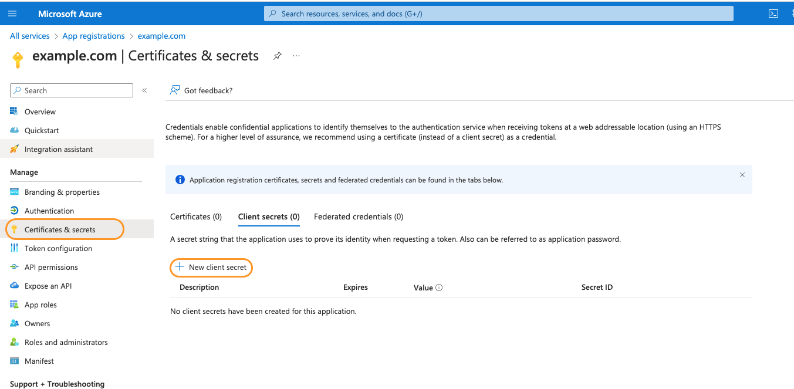
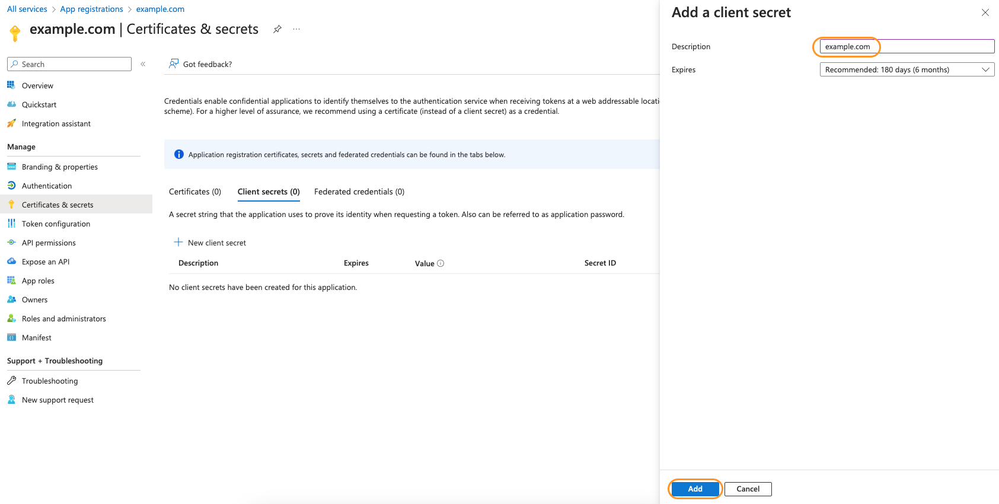
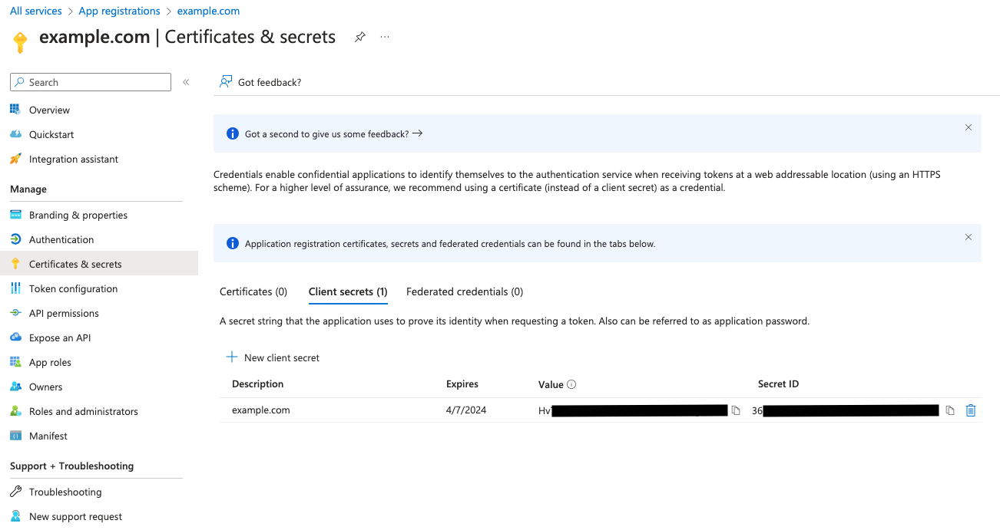
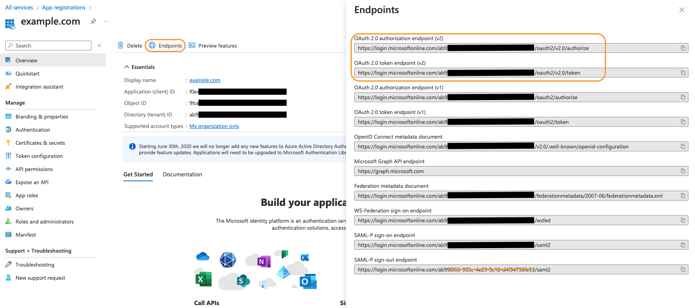
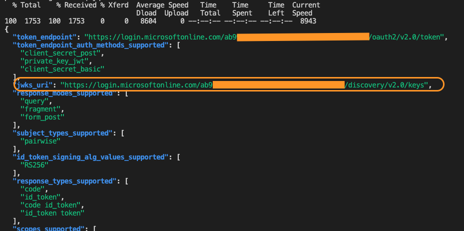
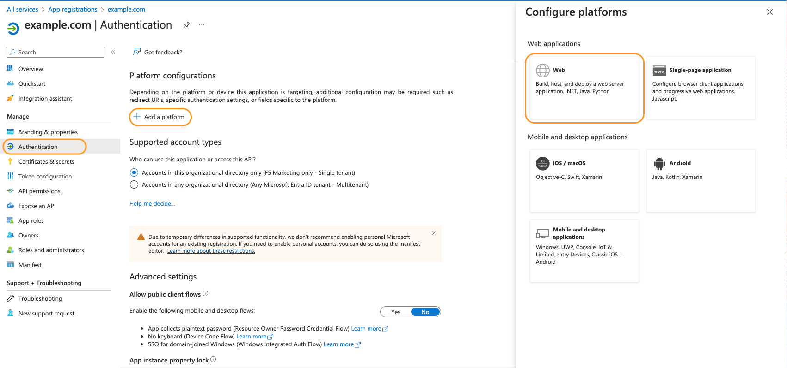
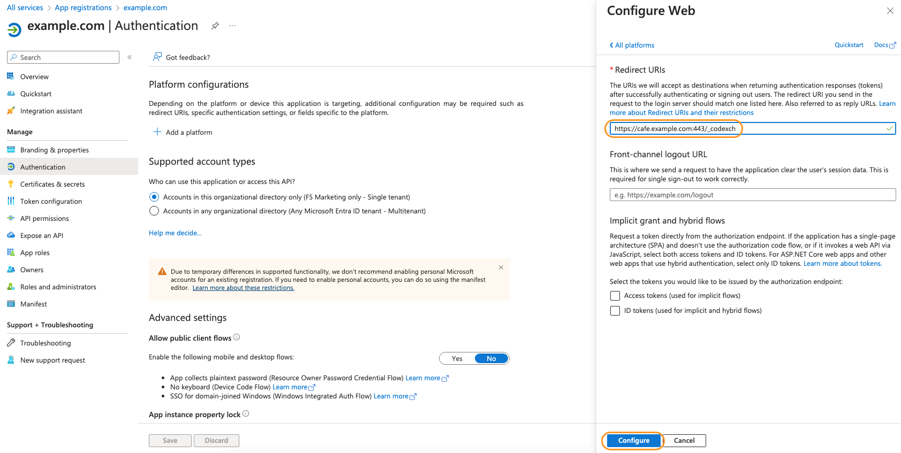

# Lab 3: Configuring NIC with AzureAD

<br/>

## Introduction

In this section, you will be configuring NGINX Ingress controller with Microsoft Azure Active directory to add authentication to a specific application. You will be adding a `policy` and `client-secret` to the cluster to know how to connect to Microsoft Azure Active Directory.
<br/>

## Learning Objectives

- Register a new application with Azure AD
- Creating Client Credentials
- Creating Kubernetes Secret
- Configuring OIDC Policy manifest file
- Configure Redirect URI in Azure AD
- Setting up NGINX Ingress controller

## Register an application with Azure AD

To enable an application to use Azure AD for authentication, you will need to create a new `app registration` from within Azure Active Directory.

1. Login into Microsoft Azure Portal and navigate to `App registrations`.
2. CLick the `+` button at the top for `New registration`
3. Fill out the name your application registration.
   For this workshop we provided name as `example.com`.
4. Select the necessary account types based on who would be using this application.
5. You can ignore `Redirect URI` for now. We will configure this later.
6. Click on `Register` to register your application.
   
    

7. Once the application has been registered you would be redirected to the `Overview` page of the newly created application.

    

    Take note of the `Application (client) ID` and `Directory (tenant) ID` as that will be required for setup in later steps.

## Creating Client Credentials

You will need to create a new `client credentials secret` that will be used with NGINX Ingress Controller to make use of Azure AD as an IDP.

1. Within your new App Registration, click on `Certificates & Secrets` option from left menu. This should open the `Certificate & Secrets` section.
2. Click the `+ New client Secret` button within the `Client Secrets` tab to create a new client secret that will be used by NGINX Ingress controller. This secret will be used to generate a Kubernetes Secret as part of the workflow.
   
   

3. Fill out the description for the client secret. For this workshop we provided name as `example.com`.

4. You can also change the duration when the client secret expires or keep the default recommended value. Click on `Add` to generate the new client secret.
   
   

5. Once you click on the `Add` button, you will see the secret within the `Client Secrets` tab as seen in below screenshot. The `Value` column will be the field you want to look for and copy. This is what will be used to create our Kubernetes secret for OIDC.
   
   

6. Copy the the `Value` portion of the client secret which you will use in next section of this lab.

## Creating Kubernetes Secret

With the secret value copied, you are going to create a kubernetes secret. 

1. Use the builtin in `base64` function to encode the client-secret (`Value` portion that we copied in last section). This encoded client-secret will then be used in the `client-secret.yaml` manifest to create the kubernetes secret needed for OIDC. 

    ```bash
    echo -n '138cvj3kj43kjkjlkjflks' | base64
    ```
    ```
    ###Sample Output###
    MTM4Y3ZqM2tqNDNramtqbGtqZmxrcw==
    ```

2. Copy this base64 encoded value from previous step and paste it into your `lab3/client-secret.yaml` manifest file.
   
   Below is a sample content of `client-secret.yaml` manifest file after pasting in the base64 encoded value.

    ```yaml
    apiVersion: v1
    kind: Secret
    metadata:
      name: oidc-secret
    type: nginx.org/oidc
    data:
      client-secret: MTM4Y3ZqM2tqNDNramtqbGtqZmxrcw== 
    ```

3. After updating your `client-secret.yaml` file, apply it to your AKS cluster by running below command.
   ```bash
   kubectl apply -f lab3/client-secret.yaml
   ```

## Configuring OIDC Policy manifest file
With the kubernetes secret getting created, the next piece is to configure `oidc-policy.yaml` manifest file. This file would require the `authorization`, `token` and `jwksURI` endpoints from Azure AD.

1. Open the Application's `Overview` page within `App Registration` service of Azure.
   
2. Within the `Overview` page, click on the `Endpoints` tab. This will open all the application specific endpoints in a right pane as shown below. For NGINX Ingress Controller point of view you would only need the authorization endpoint and the token endpoint.
  

1. Copy the `OAuth2.0` authorization endpoint and token endpoint and paste it within your `lab3/oidc-policy.yaml` manifest file at their respective position.

2. To retrieve the `jwksURI` endpoint you need to `curl` the `.well-known/openid-configuration` endpoint. You are going to be using `OpenID Connect metadata document` to find your `.well-known/openid-configuration`. 
   
   In the below curl command, replace the `<your_tenant_id>` with your `Directory (tenant) ID` that you saved in the first section.

    ```bash
    curl https://login.microsoftonline.com/<your_tenant_id>/v2.0/.well-known/openid-configuration | jq
    ```
    

3. Copy the `jwks_uri` endpoint and paste it within your `lab3/oidc-policy.yaml` manifest file at its respective position.
   
4. Also copy the `Application (client) ID` that we stored in first section and paste it in the `lab3/oidc-policy.yaml` manifest file.
   
5. Once all the updates are done, apply the `lab3/oidc-policy.yaml` file to your AKS cluster by running below command.
   ```bash
   kubectl apply -f lab3/oidc-policy.yaml
   ```

## Configure Redirect URI in Azure AD
The last piece we need to configure in Azure AD is setting up the `redirect` urls.

1. Open the Application's `Overview` page within `App Registration` service of Azure.

2. Click on `Authentication` option from left menu. This should open the Authentication section. 
   
3. Click the `+ Add a platform` button within the `Platform Configurations` subsection. This will open a `Configure platforms` right pane. Click on `web` within this pane as highlighted in the below screenshot.
   
   
     
4. On the next screen, you will need to provide a `redirect URIs`. You can optionally also provide a  `Front-channel logout URL`. <br/>

    For the `redirect URI`, you will want to fill in with the hostname of the NGINX Ingress controller instance, including the port number, with `/_codexch`.
    <br/>
    For example, in this workshop, NGINX Ingress controller is configured for OIDC to access `cafe.example.com`. So the `redirect URI` for the workshop will be the following:
    ```bash
    https://cafe.example.com:443/_codexch
    ```
    

    >**Note:** Make sure you are specifing `HTTPS` and port 443. This is required setting.


## Setting up NGINX Ingress controller

To enable OIDC authentication, you will need to use NGINX provided custom resource definitions. This includes `virtualserver` and `policy` crds.

1. You will need to define a `resolver` so NGINX Ingress Controller can resolve the IdP hostname. This can be done using a `configmap`. Here is a sample configmap that can be used:

    ```yaml
    kind: ConfigMap
    apiVersion: v1
    metadata:
      name: nginx-config
      namespace: nginx-ingress
    data:
      resolver-addresses: <kube-dns-ip>
      resolver-valid: 5s
    ```
    The `configmap` makes use of `kube-dns` service Cluster IP. This is required by NGINX Ingress controller to resolve Microsoft Azure AD correctly and complete the authentication process. NGINX by default caches DNS queries using the TTL value from the response. `resolver-valid` allows us to override that and allows you to define your own TTL value.

2. To find your `kube-dns` service Cluster IP, you can run the following command:
    ```bash
    kubectl get svc kube-dns -n kube-system
    ```
    ```
    ###Sample Output###
    NAME       TYPE        CLUSTER-IP   EXTERNAL-IP   PORT(S)         AGE
    kube-dns   ClusterIP   10.0.0.10    <none>        53/UDP,53/TCP   50d
    ```
    From the above, we can identify that our `kube-dns` service  Cluster IP address is `10.0.0.10`

3. Update your `kube-dns` service  Cluster IP address in `lab3/nginx-config.yaml` manifest file. Once updated, apply the manifest file to your AKS cluster using below command
   ```bash
   kubectl apply -f lab3/nginx-config.yaml
   ```

4. Observe line 26-27 within `lab3/cafe-virtualserver.yaml` manifest file. You can see that we have added the `oidc-policy` to the `\tea` path. 
   
   This policy would enforce users are authenticated before they are able to access the `tea` service.
    ```yaml
    ...
      upstreams:
        - name: coffee
          service: coffee-svc
          port: 80
        - name: tea
          service: tea-svc
          port: 80
      routes:
        - path: /
          action:
            redirect:
              url: https://cafe.example.com/coffee
              code: 302
        - path: /tea
          policies:
          - name: oidc-policy # This enables Azure AD authentication for /tea path
          action:
            pass: tea
        - path: /coffee
          action:
            pass: coffee
        ...
    ```

5. Now apply the new `virtualserver` manifest file, to restrict access to the `tea` application.
   ```bash
   kubectl apply -f lab3/cafe-virtualserver.yaml
   ```

6. You can validate the `virtualserver` has been successfully applied by running the following commands:  
    ```bash
    kubectl get virtualserver
    ```
    ```bash
    ###Sample Output###
    NAME     STATE   HOST                 IP           PORTS      AGE
    cafe   Valid   cafe.example.com   172.18.0.2   [80,443]   10m
    ```
7. You can also validate that your oidc-policy is in `Valid` state by running below command.
   ```bash
   kubectl get policy
   ```
   ```bash
   ###Sample Output###
   NAME          STATE   AGE
   oidc-policy   Valid   4h
   ```

8. With the status of `virtualserver` and `policy` showing `valid`, you can conclude that you have successfully configured NGINX Ingress controller.

9. You can now test your Azure AD setup with NGINX Ingress controller. To test open up your browser and head to `https://cafe.example.com/tea`. <br/>
If everything has been configured correctly, you should see the browser address bar redirect to Azure AD for authentication logon prompt. <br/>
Once your credentials have been successfully verified by Microsoft Azure AD, NGINX Ingress controller will allow your request to the backend resource.

**This completes the Lab.** 
<br/>

## References: 

- [NGINX Ingress controller OIDC](https://docs.nginx.com/nginx-ingress-controller/configuration/policy-resource/#oidc)
<br/>

### Authors
- Chris Akker - Solutions Architect - Community and Alliances @ F5, Inc.
- Shouvik Dutta - Solutions Architect - Community and Alliances @ F5, Inc.
- Jason Williams - Principle Technical Product Management Engineer @ F5, Inc.

-------------

Navigate to ([Lab4](../lab4/readme.md) | [Main Menu](../LabGuide.md#lab-outline))
