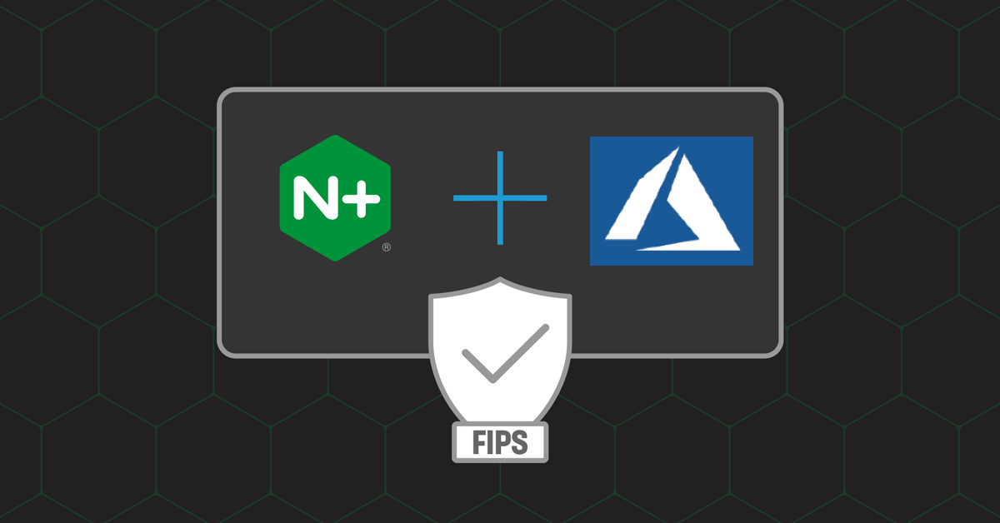
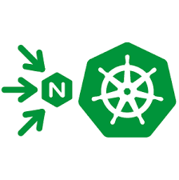

# Lab 5: Deploying NGINX Ingress with FIPS in AKS

<br/>

## Introduction

In this section, you will run the NGINX Plus Ingress Controller in FIPS mode, for compliance with Federal Information Processing Systems 140-2 Level 1 requirements.  A FIPS compliant NGINX Ingress image will be used, configured, and tested to verify that the Nginx Plus Ingress Controller meets this requirement.  You will also verify that the traffic being processed is only using FIPS compliant ciphers.

FIPS compliant software is often a requirement for traffic being used in the US Government, Military, Financial, Insurance, and other industries and computer networking environments.  NGINX provides an Ingress Controller image that could be used as part of an ecosystem of FIPS compliant software.

<br/>

Azure  |  Kubernetes  |  NGINX Plus
:-------------------------:|:-------------------------:|:-------------------------:
  |     |  

<br/>

## Learning Objectives

- Review the NGINX Ingress Controller image details
- Verity the NGINX Ingress Controller Alpine Linux OS is running in FIPS mode
- Verify the NGINX Ingress FIPS check module is working
- Verify the NGINX Ingress can process FIPS compliant requests
- Verify the NGINX Ingress is not processing non-FIPS compliant requests
- Update and Review the NGINX logging variables to capture SSL/FIPS related fields
- Verify proper TLS Cipher communications 

<br/>

## Review the NGINX Ingress Controller image being used



<br/>

Set the $NIC environment variable:

```bash
export NIC=$(kubectl get pods -n nginx-ingress -o jsonpath='{.items[0].metadata.name}')
```

Describe the NGINX Ingress pod:

```bash
kubectl describe pod $NIC -n nginx-ingress
```

```bash
### Sample Output - abbreviated  - look for "alpine-fips" in the Image name ###
.
.
Containers:
  nginx-plus-ingress:
    Container ID:  docker://e57d091bac4b7914bb60513ccdbd5d93de37725cfcc4e42a0fdd04ebcc6d8010
    Image:         private-registry.nginx.com/nginx-ic/nginx-plus-ingress:3.2.1-alpine-fips    ## Look here
    Image ID:      docker-pullable://private-registry.nginx.com/nginx-ic/nginx-plus-ingress@sha256:d16d23a489f115915c3660fe0b012b6d350e395a316e497d1219fd9c354fb423
    .
    .
```

Kube Exec to the Alpine Shell in the NIC Container:

```bash
  kubectl exec -it $NIC -n nginx-ingress -- /bin/ash
```

<br/>


<br/>

## Check if the NGINX Ingress Controller Alpine Linux OS is running in FIPS mode:

After logging into the Ingress Controller, check the Alpine OS.  The Kernel boot parameters should have `fips=1`.

```bash
cat /proc/cmdline
```
```bash
### Sample Output ###
BOOT_IMAGE=/boot/vmlinuz-5.4.0-1115-azure-fips root=PARTUUID=c1e71e77-08eb-480f-b49d-6919c188db0a ro console=tty1 console=ttyS0 earlyprintk=ttyS0 fips=1 panic=-1
```

Check the Alpine Linux System Control parameter:

```bash
sysctl -a |grep fips
```
```bash
### Sample Output ###
crypto.fips_enabled = 1    # the Alpine OS is running in FIPS mode
kernel.osrelease = 5.4.0-1115-azure-fips
kernel.version = #122+fips1-Ubuntu SMP Tue Aug 29 05:04:03 UTC 2023
```

If you see ...

```bash
### Sample Output ###
crypto.fips_enabled = 0    # the Alpine OS is NOT running in FIPS mode !!

```

>**Note:** If the value = 0, Alpine is **not running in FIPS mode!**  Are your Kubernetes Nodes Operating System running as FIPS enabled ?  If they are not, then the Ingress Controller cannot run as FIPS enabled.  If you are unsure, check your Nodes OS for FIPS compliance.  Also, you MUST be running the NGINX Alpine based image with FIPS added.

<br/>


<br/>

Also Review the Version of NGINX Plus in the NIC image:

```bash
nginx -V
```
```bash
### Sample Output ###
nginx version: nginx/1.25.1 (nginx-plus-r30)
built by gcc 12.2.1 20220924 (Alpine 12.2.1_git20220924-r10) 
built with OpenSSL 3.1.1 30 May 2023 (running with OpenSSL 3.1.2 1 Aug 2023)
TLS SNI support enabled
...
```

Verify the `NGINX FIPS check module` is configured to load when NGINX starts in the Container, check the nginx.conf file:

```bash
cd /etc/nginx
more nginx.conf
```

```bash
### Sample Output ###
worker_processes  auto;

daemon off;

error_log  stderr notice;
pid        /var/lib/nginx/nginx.pid;
load_module modules/ngx_fips_check_module.so;   ### the FIPS check module is being loaded into memory when NGINX starts
...
```

Check the entire NGINX configuration for FIPS related parameters. 

```bash
nginx -T |grep fips
```

```bash
### Sample Output ###
~ $ nginx -T |grep fips
...
nginx: the configuration file /etc/nginx/nginx.conf syntax is ok
2023/10/11 17:46:22 [notice] 38#38: OpenSSL FIPS Mode is enabled        ## FIPS Mode is enabled
nginx: configuration file /etc/nginx/nginx.conf test is successful
load_module modules/ngx_fips_check_module.so;        ## FIPS check module will be loaded
```
<br/>


<br/>

## Verify the Version of OpenSSL, and FIPS Provider is available

Also Verify / Check the OpenSSL version is FIPS enabled:

```bash
openssl version
```
```bash
### Sample Output ###
OpenSSL 3.1.2 1 Aug 2023 (Library: OpenSSL 3.1.2 1 Aug 2023)
```

List the SSL providers:

```bash
openssl list -providers
```
```bash
### Sample Output ###
Providers:
  base
    name: OpenSSL Base Provider
    version: 3.1.2
    status: active
  fips
    name: OpenSSL FIPS Provider
    version: 3.0.8
    status: active
```

>**Note:** If the fips Provider is missing, OpenSSL **cannot provide FIPS mode!**

<br/>

OpenSSL Self Tests

 - Verify SHA1 works as expected:

    ```bash
    openssl sha1 /dev/null
    ```
    ```bash
    ### Sample Output ###
    SHA1(/dev/null)= da39a3ee5e6b4b0d3255bfef95601890afd80709
    ```

- Verify MD5 is not working (as `MD5 is not a permitted hash by FIPS`):

    ```bash
    openssl md5 /dev/null
    ```
    ```bash
    ### Sample Output ###
    Error setting digest
    484BF51AC07F0000:error:0308010C:digital envelope routines:inner_evp_generic_fetch:unsupported:crypto/evp/evp_fetch.c:341:Global default library context, Algorithm (MD5 : 94), Properties ()
    484BF51AC07F0000:error:03000086:digital envelope routines:evp_md_init_internal:initialization error:crypto/evp/digest.c:272:
    ```

    >**Note:** If the MD5 hash DOES work, OpenSSL is not running in FIPS mode!
    >```bash
    >### Sample Output ###
    >~ $ openssl md5 /dev/null
    >MD5(/dev/null)= d41d8cd98f00b204e9800998ecf8427e
    >```

Type `exit` to exit out of the Alpine Shell.

<br/>

## Verify the NGINX FIPS check module

Next, verify the NGINX FIPS check module is running.  The FIPS check module looks for a `FIPS enabled OS and FIPS enabled OpenSSL` when NGINX starts.

```bash
kubectl logs $NIC -n nginx-ingress | grep FIPS
```

```bash
### Sample Output ###
2023/10/11 17:44:28 [notice] 13#13: OpenSSL FIPS Mode is enabled
```

> **Note:** If NGINX Ingress Controller is not running in FIPS mode, you will see a statement like this:
>```bash
>### Sample Output ###
>2023/10/10 15:15:13 [notice] 239:239: OpenSSL FIPS Mode is not enabled    # Warning -  not in FIPS mode !
>```

<br/>

## Update the NGINX Ingress logging format to see SSL/FIPS related fields

How do you know if/what FIPS or non-FIPS traffic is being handled by NGINX?  What visibility is available for `audits and attestations?`  NGINX has the ability to log all TLS related components, including client/server requests/responses metadata for connections/sessions.  Let's add a few of these important logging variables, so you can see what the requests/responses look like in the `NGINX Access Log`.

Here is a list of the 3 TLS variables you will add, and what they are:

- **$ssl_session_id** : returns the unique session identifier of an established SSL connection
- **$ssl_protocol** : returns the protocol of an established SSL connection
- **$ssl_cipher** : returns the name of the cipher used for an established connection

>**Note:**  There are many more variables available, but we are only showing a few in this exercise.  There is a link to the complete list of variables in the [References](#references) section at the end of this exercise.

Inspect the `lab5/nginx-fips-logging.yaml` ConfigMap manifest.  This ConfigMap is used to configure additional NGINX settings.  The Access log format has 3 new additional logging fields added, for the $ssl variables.

To apply these new log variables, you will add them to the existing NGINX Access Log format, using the NIC's `nginx-config` ConfigMap.

```bash
kubectl apply -f lab5/nginx-fips-logging.yaml
```

```bash
### Sample Output ###
configmap/nginx-config configured
```

Tail the Nginx Ingress Controller logs:

```bash
kubectl logs $NIC -n nginx-ingress --tail 20 --follow
```

Using curl or the browser, send a couple requests to https://cafe.example.com/coffee, and review the Access Logs.

```bash
### Sample Output ###
24.15.246.206 [11/Oct/2023:20:53:18 +0000] "GET /coffee HTTP/1.1" 200 675 rn="cafe-vs" "default" svc="coffee-svc" ua=“10.244.0.4:80” sslid="bbb6e4061033d4ad322faf32b53afb02ce32158d8a13a5d84abf7788c2bf3ed1" sslpr="TLSv1.3" sslci="TLS_AES_128_GCM_SHA256"
```

If you scroll to the right in the above textbox, you can see, that NGINX is now populating the `$ssl_*` logging variables with data from your requests/responses.

Type Ctrl-C when you are finished looking at the log.

<br/>

## Test TLS ciphers with OpenSSL client 

<br/>


<br/>

This RC4 cipher is not allowed with FIPS, so it should fail:

```bash
(echo "GET /" ; sleep 1) | openssl s_client -connect cafe.example.com:443 -cipher RC4-MD5
```
```bash
### Sample Output ###
Call to SSL_CONF_cmd(-cipher, RC4-MD5) failed
809E285CF87F0000:error:0A0000B9:SSL routines:SSL_CTX_set_cipher_list:no cipher match:ssl/ssl_lib.c:2761:
```

This Camellia cipher is on the FIPS approved list, so it should be successful:

```bash
(echo "GET /" ; sleep 1) | openssl s_client -connect cafe.example.com:443 -cipher CAMELLIA256-SHA
```

```bash
### Sample Output ###
CONNECTED(00000005)
depth=0 C = US, ST = CA, O = Internet Widgits Pty Ltd, CN = cafe.example.com
verify error:num=18:self-signed certificate
verify return:1
depth=0 C = US, ST = CA, O = Internet Widgits Pty Ltd, CN = cafe.example.com
verify error:num=10:certificate has expired
notAfter=Sep 11 16:15:35 2023 GMT
verify return:1
depth=0 C = US, ST = CA, O = Internet Widgits Pty Ltd, CN = cafe.example.com
notAfter=Sep 11 16:15:35 2023 GMT
verify return:1
---
Certificate chain
 0 s:C = US, ST = CA, O = Internet Widgits Pty Ltd, CN = cafe.example.com
   i:C = US, ST = CA, O = Internet Widgits Pty Ltd, CN = "cafe.example.com  "
   a:PKEY: rsaEncryption, 2048 (bit); sigalg: RSA-SHA256
   v:NotBefore: Sep 12 16:15:35 2018 GMT; NotAfter: Sep 11 16:15:35 2023 GMT
---
Server certificate
-----BEGIN CERTIFICATE-----

...

-----END CERTIFICATE-----
subject=C = US, ST = CA, O = Internet Widgits Pty Ltd, CN = cafe.example.com
issuer=C = US, ST = CA, O = Internet Widgits Pty Ltd, CN = "cafe.example.com  "
---
No client certificate CA names sent
Peer signing digest: SHA256
Peer signature type: RSA-PSS
Server Temp Key: X25519, 253 bits
---
SSL handshake has read 1378 bytes and written 346 bytes
Verification error: certificate has expired
---
New, TLSv1.3, Cipher is TLS_AES_256_GCM_SHA384
Server public key is 2048 bit
This TLS version forbids renegotiation.
Compression: NONE
Expansion: NONE
No ALPN negotiated
Early data was not sent
Verify return code: 10 (certificate has expired)
---
---
Post-Handshake New Session Ticket arrived:
SSL-Session:
    Protocol  : TLSv1.3
    Cipher    : TLS_AES_256_GCM_SHA384
    Session-ID: 58741DC78B757CF82C1293686C3D1D3EA4420CFCEC60E9A517F52993B7227C92
    Session-ID-ctx: 
    Resumption PSK: 6447D5EBEF9D0276E545DF1B0D0F92D09E5CDE81BDD947E5DD2DC1CE264CAC4BB32348DED495DE657A240D9BA68C125F
    PSK identity: None
    PSK identity hint: None
    SRP username: None
    TLS session ticket lifetime hint: 300 (seconds)
    TLS session ticket:

...

    Start Time: 1697051127
    Timeout   : 7200 (sec)
    Verify return code: 10 (certificate has expired)
    Extended master secret: no
    Max Early Data: 0
---
read R BLOCK
---
Post-Handshake New Session Ticket arrived:
SSL-Session:
    Protocol  : TLSv1.3
    Cipher    : TLS_AES_256_GCM_SHA384
    Session-ID: EEEE75932819E73AFDFAFDD1356F5408062CF3AB7F38AAA00C81C9BA583A13B1
    Session-ID-ctx: 
    Resumption PSK: D87408681B7BDD76BAD869C0C93390A2578413C88957D144B9F81D9A54DA257BB4DA2B5331D5A2B009E89492C1C5A00A
    PSK identity: None
    PSK identity hint: None
    SRP username: None
    TLS session ticket lifetime hint: 300 (seconds)
    TLS session ticket:

...

    Start Time: 1697051127
    Timeout   : 7200 (sec)
    Verify return code: 10 (certificate has expired)
    Extended master secret: no
    Max Early Data: 0
---
read R BLOCK
<html>
<head><title>404 Not Found</title></head>
<body>
<center><h1>404 Not Found</h1></center>
<hr><center>nginx/1.25.1</center>
</body>
</html>
closed
```

```bash
### Or try this ###
(echo "GET /coffee"); (echo "HTTP/1.1"); (echo "Host:cafe.example.com") | openssl s_client -connect cafe.example.com:443 -cipher CAMELLIA256-SHA 
```

You can try and verify additional FIPS ciphers with common scanning tools. To check the list of FIPS compliant ciphers check this [link](https://docs.nginx.com/nginx/fips-compliance-nginx-plus/#step-4-verify-compliance-with-fips-140-2).

<br/>

**This completes the Lab.** 

<br/>

## References: 

- [NGINX Plus Ingress Controller](https://docs.nginx.com/nginx-ingress-controller/)
- [NGINX Plus Ingress Images](https://docs.nginx.com/nginx-ingress-controller/technical-specifications/#images-with-nginx-plus)
- [NGINX Plus FIPS Compliance Docs](https://docs.nginx.com/nginx/fips-compliance-nginx-plus/)
- [NGINX Plus FIPS Compliance Blog](https://www.nginx.com/blog/achieving-fips-compliance-nginx-plus/)
- [NGINX FIPS Status Check](https://docs.nginx.com/nginx/admin-guide/dynamic-modules/fips/)
- [NGINX FIPS Check Module](https://github.com/ogarrett/nginx-fips-check-module)
- [NIST FIPS 140-2 Security Requirements](https://csrc.nist.gov/pubs/fips/140-2/upd2/final)
- [NGINX SSL variables](http://nginx.org/en/docs/http/ngx_http_ssl_module.html#var_ssl_cipher)
- [NGINX Variables](http://nginx.org/en/docs/varindex.html)

<br/>

### Authors
- Chris Akker - Solutions Architect - Community and Alliances @ F5, Inc.
- Shouvik Dutta - Solutions Architect - Community and Alliances @ F5, Inc.

-------------

Navigate to [Main Menu](../LabGuide.md)
