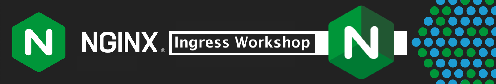
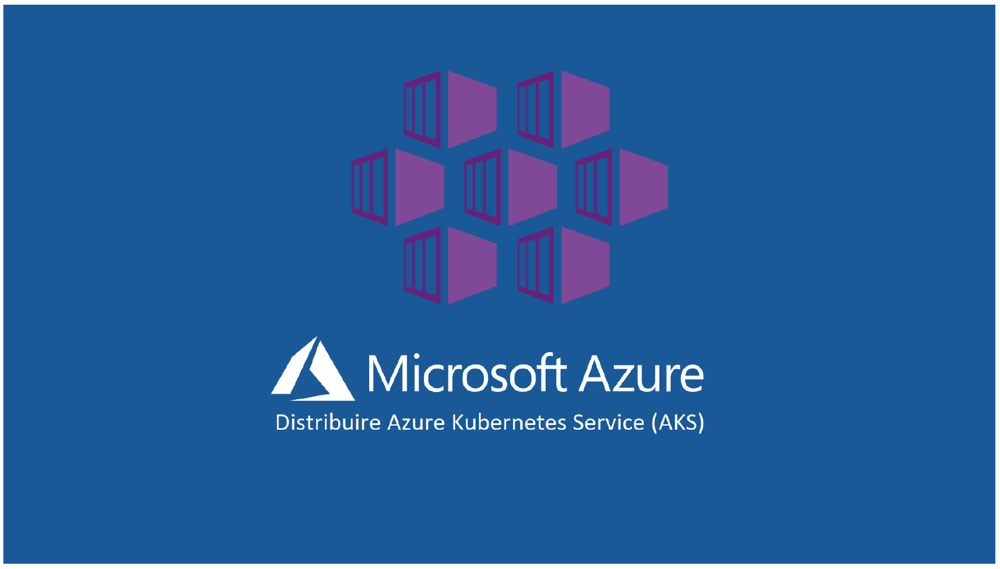
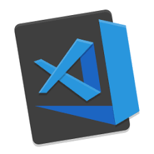

 

## NGINX Plus Ingress Controller Workshop

 

### Overview

 

> ><strong>Welcome to the NGINX Plus Workshop for NGINX Ingress Controller (NIC)!</strong>

 

This Workshop will introduce NGINX Plus Ingress Controller with hands-on practice through self-paced lab exercises.  You will learn how to deploy an **`NGINX Plus Ingress Controller`** on an Azure AKS cluster, configure basic and advanced NGINX Plus features, test it with demo applications, and monitor it in real time. 

 

NGINX Plus Ingress  |  Hands-On Labs
:-------------------------:|:-------------------------:
  |  

 

The Hands-On Lab Exercises are designed to build upon each other, adding additional services and features as you progress through them.  `It is important to complete the lab exercises in sequential order.`

By the end of this Workshop, you will have a working, operational NGINX Plus Ingress Controller, with the skills to deploy and operate one for your Modern Application Kubernetes projects.

 

### Prerequisites

- Students:  Personal Azure account that can provision AKS clusters.

### ** Prerequisite Knowledge **

It is `highly recommended` that Students attending this Workshop be familiar with NGINX and have some experience with Kubernetes administration, networking tools, and Load Balancing concepts.  Previous experience with VisualStudio Code is also helpful.

 

VisualStudio Code  |  Kubernetes  |  NGINX Plus
:-------------------------:|:-------------------------:|:-------------------------:
  |     |  

 

An excellent Prerequisite for taking this Workshop is the NGINX Basics Workshop, also available from F5 Inc., as it provides the fundamental basics of NGINX Plus, on which the NGINX Plus Ingress Controller is built.  Please contact your NGINX Event Marketing team for information on additional Workshops.

 

## Lab Outline

#### Lab 0: Azure cli, AKS and ACR Setup guide
- [Lab 0: Azure cli, AKS and ACR Setup guide](lab0/readme.md)

#### Lab 1: Deploying NGINX Ingress Controller to AKS cluster
- [Lab 1: Deploy NGINX Ingress Controller to AKS cluster](lab1/readme.md)

#### Lab 2: Deploy Cafe Demo Application to AKS cluster
- [Lab 2: Deploy Cafe Demo Application to AKS cluster](lab2/readme.md)

#### Lab 3: Configuring NGINX Ingress Controller with AzureAD 
- [Lab 3: Configuring NGINX Ingress Controller with AzureAD](lab3/readme.md)
  
#### Lab 4: Monitoring NGINX Ingress Controller with Prometheus and Grafana
- [Lab 4: Prometheus and Grafana](lab4/readme.md)

#### Lab 5: Deploying NGINX Ingress Controller with FIPS for AKS
- [Lab 5: Deploying NGINX Ingress Controller with FIPS for AKS](lab5/readme.md)

 

### Authors
- Chris Akker - Solutions Architect - Community and Alliances @ F5, Inc.
- Shouvik Dutta - Solutions Architect - Community and Alliances @ F5, Inc.
- Jason Williams - Principle Product Management Engineer @ F5, Inc.

 

Click [Lab0: Azure Setup Guide](lab0/readme.md) to get started! 
