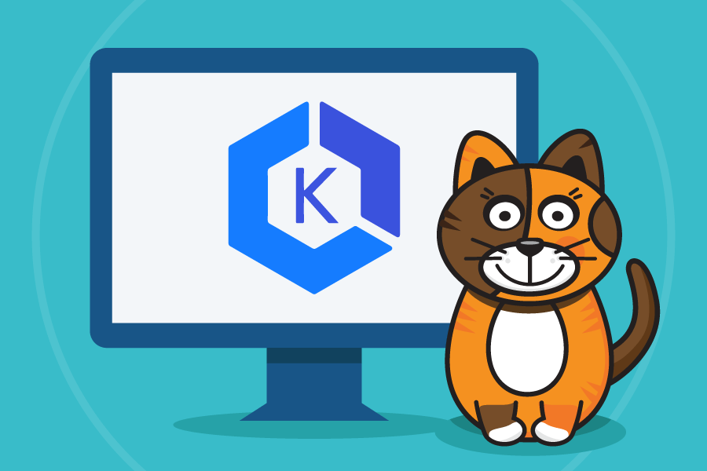

# Calico cloud workshop on AKS



## AKS Calico Cloud Workshop

The intent of this workshop is to introduce Calico Cloud(https://www.calicocloud.io/home/) to manage AKS clusters and leverage Calico features to implement the various use cases. While there are many capabilities that the Calico product provides, this workshop focuses on a subset of those that are used most often by enterprises to derive value from the Calico Product. 


## Learning Objectives

In this workshop we are going to focus on these main use cases (with links to Calico docs for further info). Note that features for policy and visibility as outlined in this workshop are identical between Calico Cloud and Calico Enterprise. Consult the [Calico Enterprise docs](https://docs.tigera.io/) for further reading:

- **Integration:** [Integrating Calico Cloud into the AKS clusters.](https://docs.calicocloud.io/install/system-requirements)
- **East-West security:** [leveraging zero-trust security approach.](https://docs.tigera.io/security/adopt-zero-trust)
- **Egress access controls:** [using DNS policy to access external resources by their fully qualified domain names (FQDN).](https://docs.calicocloud.io/use-cases/security-controls/global-egress)
- **Observability:** [exploring various logs and application level metrics collected by Calico.](https://docs.calicocloud.io/use-cases/troubleshoot-apps)
- **Compliance:** [providing proof of security compliance.](https://docs.tigera.io/compliance/)

## Join the Slack Channel

[Calico User Group Slack](https://slack.projectcalico.org/) is a great resource to ask any questions about Calico. If you are not a part of this Slack group yet, we highly recommend [joining it](https://slack.projectcalico.org/) to participate in discussions or ask questions. For example, you can ask questions specific to EKS and other managed Kubernetes services in the `#eks-aks-gke-iks` channel.

## Who should take this workshop?
- Developers
- DevOps Engineers
- Solutions Architects
- Anyone that is interested in Security, Observability and Network policy for Kubernetes.


## Workshop prerequisites

>It is recommended to follow the AKS creation step outlined in [Module 0](modules/creating-aks-cluster.md) and to keep the resources isolated from any existing deployments. If you are using a corporate Azure account for the workshop, make sure to check with account administrator to provide you with sufficient permissions to create and manage AkS clusters and Load Balancer resources.

- [Azure Kubernetes Service](https://github.com/Azure/kubernetes-hackfest/blob/master/labs/networking/network-policy/)
- [Calico Cloud trial account](https://www.calicocloud.io/home)
- Terminal or Command Line console to work with Azure resources and AKS cluster
 
- `Git`
- `netcat`

## Modules

- [Module 0: Creating an AKS compatible cluster for Calico Cloud](modules/creating-aks-cluster.md)
- [Module 1: Joining AKS cluster to Calico Cloud](modules/joining-aks-to-calico-cloud.md)
- [Module 2: Configuring demo applications](modules/configuring-demo-apps.md)
- [Module 3: Using security controls](modules/using-security-controls.md)
- [Module 4: Using egress access controls](modules/using-egress-access-controls.md)
- [Module 5: Using observability tools](modules/using-observability-tools.md)
- [Module 6: Using compliance reports](modules/using-compliance-reports.md)
- [Module 7: Using alerts](modules/using-alerts.md)


## Cleanup

1. Delete application stack to clean up any `loadbalancer` services.

    ```bash
    kubectl delete -f demo/dev/app.manifests.yaml
    kubectl delete -f https://raw.githubusercontent.com/GoogleCloudPlatform/microservices-demo/master/release/kubernetes-manifests.yaml
    ```

2. Delete AKS cluster.

    ```bash
    az aks delete --name $CLUSTERNAME
    ```

3. Delete the azure resource group. 

    ```bash
    az group delete --resource-group $RGNAME
    ```


