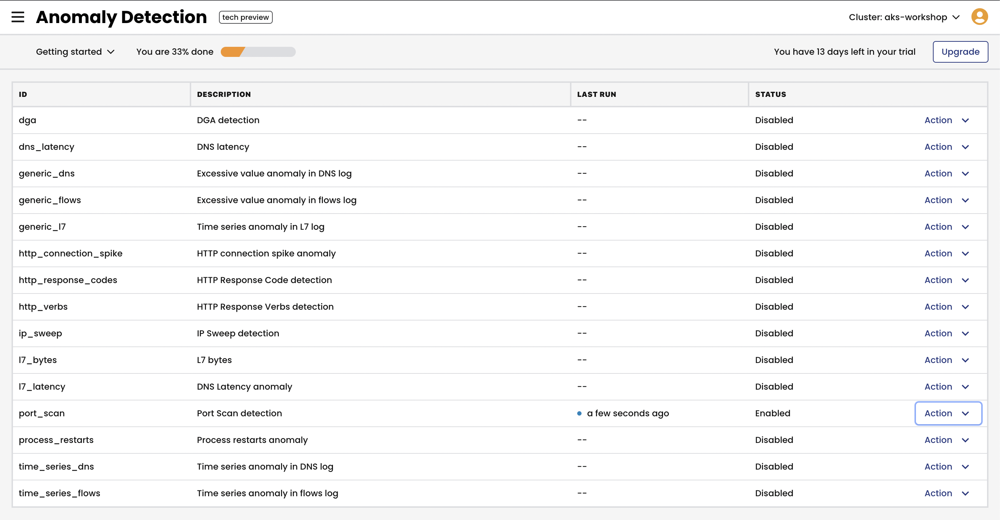

# Module 7: Anomaly Detection

**Goal:** Configure Anomaly Detection to alert upon abnormal/suspicious traffic
---

Calico offers [Anomaly Detection](https://docs.tigera.io/threat/security-anomalies) (AD) as a part of its [threat defense](https://docs.tigera.io/threat/) capabilities. Calico's Machine Learning software is able to baseline "normal" traffic patterns and subsequently detect abnormal or suspicious behavior. This may resemble an Indicator of Compromise and will generate an Alert in the UI.

## Steps

1. Configure the Anomaly Detection alerts.

    Instructions below are for a Managed cluster of version 3.14+. Follow the [Anomaly Detection doc](https://docs.calicocloud.io/threat/security-anomalies) to configure AD jobs in management and standalone clusters.

    Navigate to `Activity -> Anomaly Detection` view in the Calico Cloud UI and enable `Port Scan detection` alert.

    

    Or use CLI command below to enable this alert.

    ```bash
    # example to enable AD alert via CLI command
    kubectl apply -f demo/90-anomaly-detection/ad-alerts.yaml
    ```

2. Confirm the AD jobs are running before simulating anomaly behavior.

    ```bash
    kubectl get globalalerts | grep -i tigera.io.detector 
    ```

    The output should look similar to this:

    ```bash
    tigera.io.detector.port-scan   2022-10-27T16:59:11Z
    ```		

3. Simulate a port scan anomaly by using an NMAP utility.

    ```bash
    # simulate port scan
    POD_IP=$(kubectl -n dev get po --selector app=nginx -o jsonpath='{.items[0].status.podIP}')
    kubectl -n dev exec netshoot -- nmap -Pn -r -p 1-600 $POD_IP
    ```

    ```text
    # expected output
    Starting Nmap 7.92 ( https://nmap.org ) at 2022-10-27 17:36 UTC
    Nmap scan report for 10-224-0-67.nginx-svc.dev.svc.cluster.local (10.224.0.67)
    Host is up (0.0010s latency).
    Not shown: 899 closed tcp ports (reset)
    PORT   STATE SERVICE
    80/tcp open  http

    Nmap done: 1 IP address (1 host up) scanned in 0.24 seconds
    ```

4. Confirm the ad job is running before simulating anomaly behaviour
    ```bash
	kubectl get pods -n tigera-intrusion-detection
	```
    Output will be like:
	```bash
	NAME                                              READY   STATUS    RESTARTS   AGE
    ad-jobs-deployment-86684f644c-xjht8               1/1     Running   0          19m
    intrusion-detection-controller-6f5986ff6f-tg2zq   1/1     Running   0          47m
    ```

5. After a few minutes we can see the Alert generated in the Web UI


[Next -> Module 8](../calicocloud/using-compliance-reports.md)

