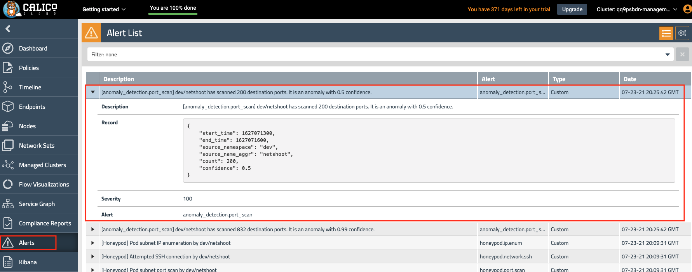

# Module 7: Anomaly Detection

**Goal:** Configure Anomaly Detection to alert upon abnormal/suspicious traffic
---

Calico offers [Anomaly Detection](https://docs.tigera.io/threat/security-anomalies) (AD) as a part of its [threat defense](https://docs.tigera.io/threat/) capabilities. Calico's Machine Learning software is able to baseline "normal" traffic patterns and subsequently detect abnormal or suspicious behavior. This may resemble an Indicator of Compromise and will generate an Alert in the UI.

## Steps

1. Review and apply the Anomaly Detection jobs for the managed cluster.

Instructions below for a Managed cluster only. Follow [installation doc](https://docs.tigera.io/v3.12/threat/security-anomalies#install-anomaly-detection) to configure AD jobs for management and standalone clusters.

```bash
## Use :q for exiting from the file

less ./demo/90-anomaly-detection/ad-jobs-deployment-managed.yaml


# The following AD jobs and thresholds have been configured as env vars in the ad-jobs-deployment.yaml. 
# In production these values may trigger more alerts than required
	# - name: AD_max_docs
	#   value: "100000"
	# - name: AD_train_interval_minutes
	#   value: "20"
	# - name: AD_search_interval_minutes
	#   value: "5"
	# - name: AD_DnsLatency_IsolationForest_score_threshold
	#   value: "-0.886"
	# - name: AD_ProcessRestarts_threshold
	#   value: "5"
	# - name: AD_port_scan_threshold
	#   value: "200"
	# - name: AD_ip_sweep_threshold
	#   value: "32"
	# - name: AD_BytesInModel_min_size_for_train
	#   value: "1000"
	# - name: AD_SeasonalAD_c
	#   value: "500"
	# - name: AD_BytesOutModel_min_size_for_train
	#   value: "1000"
	# - name: AD_debug
	#   value: "True"
```

2. We need to substitute the Cluster Name in the YAML file with the correct cluster name index. We can obtain this value and set as a variable `CALICOCLUSTERNAME`. 

	```bash
    # obtain ElasticSearch index and set as variable
    CALICOCLUSTERNAME=$(kubectl get deployment -n tigera-intrusion-detection intrusion-detection-controller -ojson | \
    jq -r '.spec.template.spec.containers[0].env[] | select(.name == "CLUSTER_NAME").value')
    ```

	```bash
    # Set correct index in manifest This enables the Machine Learning jobs to target the correct indices in Elastic Search
	sed -i "s/\$CALICOCLUSTERNAME/${CALICOCLUSTERNAME}/g" ./demo/90-anomaly-detection/ad-jobs-deployment-managed.yaml
	```

	For other variations/shells the following syntax may be required
	```bash
	sed -i "" "s/\$CALICOCLUSTERNAME/${CALICOCLUSTERNAME}/g" ./demo/90-anomaly-detection/ad-jobs-deployment-managed.yaml
	```

    Validate the change by cat the variable 
    ```bash
	cat ./demo/90-anomaly-detection/ad-jobs-deployment-managed.yaml |grep -B 2 -A 0 $CALICOCLUSTERNAME
	```
    
	Output will be like:
	```bash
	        value: "tigera-secure-es-gateway-http.tigera-elasticsearch.svc"
          - name: CLUSTER_NAME
            value: "cd8i1cf9.aks-calicocloud-repo"
	```		

3. Now apply the Anomaly Detection deployment YAML
	```bash
	kubectl apply -f ./demo/90-anomaly-detection/ad-jobs-deployment-managed.yaml
	```

4. Confirm the ad job is running before simulating anomaly behaviour
    ```bash
	kubectl get pods -n tigera-intrusion-detection
	```
    Output will be like:
	```bash
	NAME                                              READY   STATUS    RESTARTS   AGE
    ad-jobs-deployment-86684f644c-xjht8               1/1     Running   0          19m
    intrusion-detection-controller-6f5986ff6f-tg2zq   1/1     Running   0          47m
    ```


5. Simulate anomaly by using an NMAP port scan above the threshold set in our Deployment env vars listed in Step 1.

	```bash
	# mock port scan
	POD_IP=$(kubectl -n dev get po --selector app=centos -o jsonpath='{.items[0].status.podIP}')
	kubectl -n dev exec netshoot -- nmap -Pn -r -p 1-600 $POD_IP
	```
	```
	# expected output
	Host discovery disabled (-Pn). All addresses will be marked 'up' and scan times will be slower.
	Starting Nmap 7.91 ( https://nmap.org ) at 2021-07-23 20:20 UTC
	Nmap scan report for 10.240.0.89
	Host is up.
	All 600 scanned ports on 10.240.0.89 are filtered

	Nmap done: 1 IP address (1 host up) scanned in 201.37 seconds
	```
6. After a few minutes we can see the Alert generated in the Web UI



[Next -> Module 8](../calicocloud/using-compliance-reports.md)

