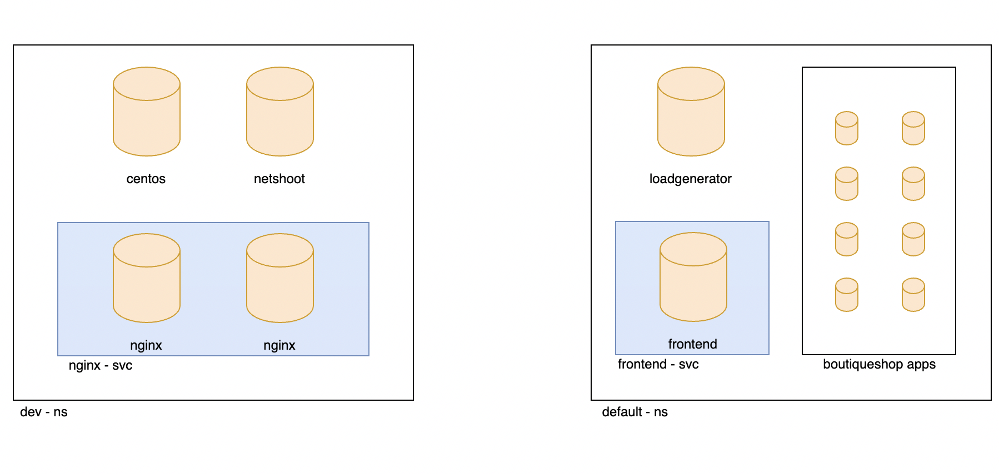

# Module 2: Configuring demo applications

**Goal:** Deploy and configure demo applications.

## Steps

1. Download this repo and browse to this lab environment:

    ```bash
    git clone https://github.com/Azure/kubernetes-hackfest.git
 
    cd kubernetes-hackfest/labs/networking/calico-lab-exercise/
    ```

2. Deploy demo applications.
    This is app we will use for next modules.
      

    ```bash
    # deploy dev app stack
    kubectl apply -f demo/dev/app.manifests.yaml

    # deploy boutiqueshop app stack.
    kubectl apply -f https://raw.githubusercontent.com/GoogleCloudPlatform/microservices-demo/master/release/kubernetes-manifests.yaml

    ```
    
    ```bash
    #confirm the pod/deployments are running. Note the loadgenerator pod waits for the frontend pod to respond to http calls before coming up and can take a few minutes. Eventually, the status of the pods in the default namespace will look as follows: 
    
    kubectl get pods
    sleep 10
    kubectl get pods -n dev
    
    ```

    Output will be similar as below:
    ```bash

    NAME                                     READY   STATUS    RESTARTS   AGE
    adservice-7cbc9bd9-jkjhq                 1/1     Running   0          86s
    cartservice-d7db78c66-4rw8p              1/1     Running   0          87s
    checkoutservice-784bfc794f-7np5p         1/1     Running   0          87s
    currencyservice-5898885559-74s5z         1/1     Running   0          86s
    emailservice-6bd8b47657-s4drk            1/1     Running   0          87s
    frontend-764c5c755f-8xjcs                1/1     Running   0          87s
    loadgenerator-84cbcd768c-6tcx5           1/1     Running   0          87s
    paymentservice-6c676df669-m5j6g          1/1     Running   0          87s
    productcatalogservice-7fcf4f8cc-nkvnd    1/1     Running   0          87s
    recommendationservice-79f5f4bbf5-qgqfv   1/1     Running   0          87s
    redis-cart-74594bd569-l4kt9              1/1     Running   0          86s
    shippingservice-b5879cdbf-r8xqb          1/1     Running   0          86s


    NAME                         READY   STATUS    RESTARTS   AGE
    centos                       1/1     Running   0          48s
    dev-nginx-754f647b8b-99fsn   1/1     Running   0          48s
    dev-nginx-754f647b8b-hlrw8   1/1     Running   0          48s
    netshoot                     1/1     Running   0          48s
    ```


3. Install curl on loadgenerator pod
 
    > Before we implement network secruity rules we need to install curl on the loadgenerator pod for testing purposes later in the workshop. Note the installation will not survive a reboot so repeat this installation as necessary

    ```bash
    kubectl exec -it $(kubectl get po -l app=loadgenerator -ojsonpath='{.items[0].metadata.name}') -- sh -c 'apt-get update && sleep 10;apt install curl -y'
    ```

4. Deploy basic DNS policy as global allow.

    In order to explicitly allow workloads to connect to the Kubernetes DNS component, we are going to implement a policy that controls such traffic.
    We are going to deploy a few policies into policy tier to take advantage of hierarcical policy management.
    For more on tiers: https://docs.calicocloud.io/policy-design/overview


    This will add tiers `security` and `platform` to the aks cluster. 

    ```bash
    kubectl apply -f demo/tiers/tiers.yaml
    ```
    
    
    This will add `allow-kube-dns` policy to your `platform` tier. 
    ```bash
    kubectl apply -f demo/10-security-controls/allow-kube-dns.yaml
    ```
    

    This will add network policy to control the connection between different micro service of boutique app and `default-deny` policy to your `default` tier. 
    ```bash
    kubectl apply -f demo/boutiqueshop/policies.yaml
    kubectl apply -f demo/10-security-controls/default-deny.yaml
    ```

    


5. Deploy compliance reports.

    >The reports will be needed for a later lab.

    ```bash
    kubectl apply -f demo/40-compliance-reports
    ```
6. Deploy global alerts.

    >The alerts will be explored in a later lab. Ignore any warning messages - these do not affect the deployment of resources.

    ```bash
    kubectl apply -f demo/50-alerts/globalnetworkset.changed.yaml
    kubectl apply -f demo/50-alerts/unsanctioned.dns.access.yaml
    kubectl apply -f demo/50-alerts/unsanctioned.lateral.access.yaml
    ```


       
[Next -> Module 3](../calicocloud/using-observability-tools.md)
