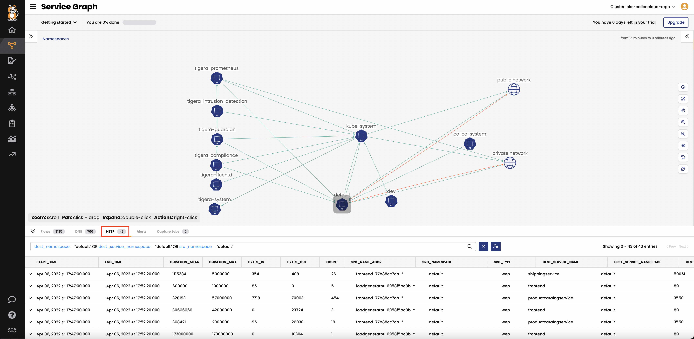

# Module 9: Enabling L7 visibility 

**Goal:** Enable L7/HTTP flow logs in hipstershop with Calico cloud. Calico cloud not only can provide L3 flow logs, but also can provide L7 visibility without service mesh headache. 

**Docs:** https://docs.tigera.io/visibility/elastic/l7/configure

## Steps


1.  Configure Felix for log data collection and patch Felix with AKS specific parameters

    >Enable the Policy Sync API in Felix - we configure this cluster-wide

    ```bash
    kubectl patch felixconfiguration default --type='merge' -p '{"spec":{"policySyncPathPrefix":"/var/run/nodeagent"}}'
    ```


2.  Since Calico Cloud v3.11 L7 visibility is deployed using an `ApplicationLayer` resource. Calico's operator will deploy the envoy and log collector containers as a daemonset. To deploy the ApplicationLayer resource:

    ```bash
    kubectl apply -f -<<EOF
    apiVersion: operator.tigera.io/v1
    kind: ApplicationLayer
    metadata:
      name: tigera-secure
    spec:
      logCollection:
        collectLogs: Enabled
        logIntervalSeconds: 5
        logRequestsPerInterval: -1
    EOF
    ```

3.  If successfully deployed an `l7-log-collector` pod will be deployed on each node. To verify:
    ```bash
    kubectl get pod -n calico-system
    ```
    >Output will look similar to:
    ```
    NAME                                       READY   STATUS    RESTARTS   AGE
    calico-kube-controllers-6b4dccd6c5-579s8   1/1     Running   0          120m
    calico-node-b26qh                          1/1     Running   0          120m
    calico-node-pl646                          1/1     Running   0          2m2s
    calico-node-rmx2q                          1/1     Running   0          120m
    calico-typha-6f7f966d4-28n9j               1/1     Running   0          122m
    calico-typha-6f7f966d4-8nx5f               1/1     Running   0          2m1s
    calico-typha-6f7f966d4-g7b69               1/1     Running   0          122m
    l7-log-collector-627qf                     2/2     Running   0          91s
    l7-log-collector-6b6cx                     2/2     Running   0          3m52s
    l7-log-collector-jxzjq                     2/2     Running   0          15m
    ```

4.  Annotate the Boutiqueshop Services

    ```bash
    kubectl annotate svc -n default adservice projectcalico.org/l7-logging=true
    kubectl annotate svc -n default cartservice projectcalico.org/l7-logging=true
    kubectl annotate svc -n default checkoutservice projectcalico.org/l7-logging=true
    kubectl annotate svc -n default currencyservice projectcalico.org/l7-logging=true
    kubectl annotate svc -n default emailservice projectcalico.org/l7-logging=true
    kubectl annotate svc -n default frontend projectcalico.org/l7-logging=true
    kubectl annotate svc -n default paymentservice projectcalico.org/l7-logging=true
    kubectl annotate svc -n default productcatalogservice projectcalico.org/l7-logging=true
    kubectl annotate svc -n default recommendationservice projectcalico.org/l7-logging=true
    kubectl annotate svc -n default redis-cart projectcalico.org/l7-logging=true
    kubectl annotate svc -n default shippingservice projectcalico.org/l7-logging=true
    ```
 
   
5. *[Optional]* restart the pods of `boutiqueshop` if you want to see l7 logs right away.    
    >L7 flow logs will require a few minutes to generate, you can also restart pods which will lead l7 logs pop up quicker.  

    ```bash
    kubectl delete pods --all 
    ``` 

  Now view the L7 logs in Kibana by selecting the `L7 HTTP Dashboard`. You should also see the relevant HTTP log from service graph.

   
   

[Next -> Module 10](../calicocloud/host-end-point.md)

