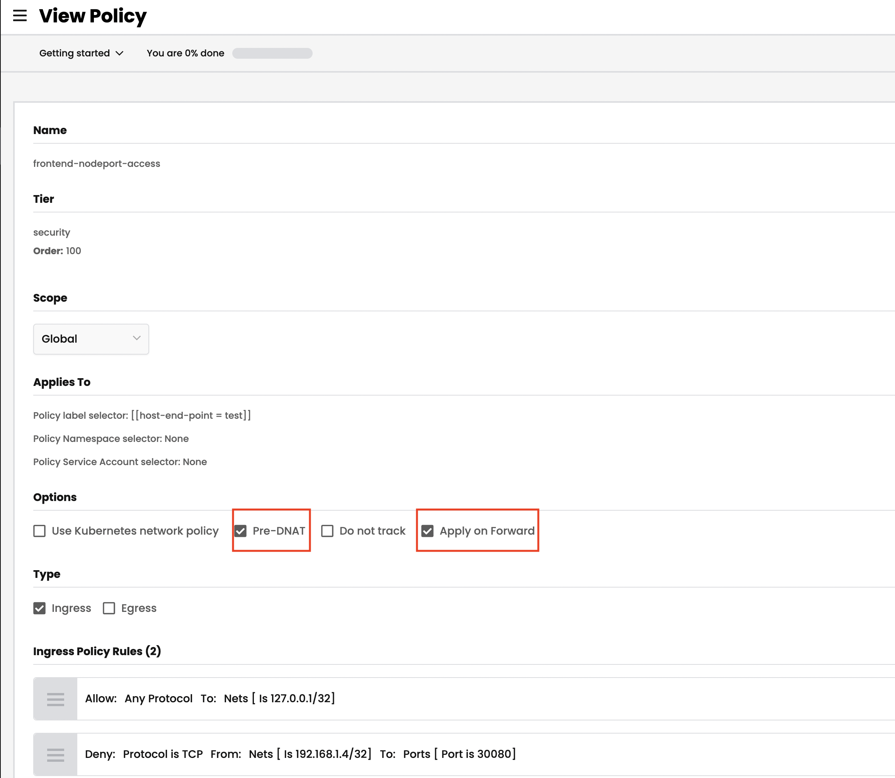
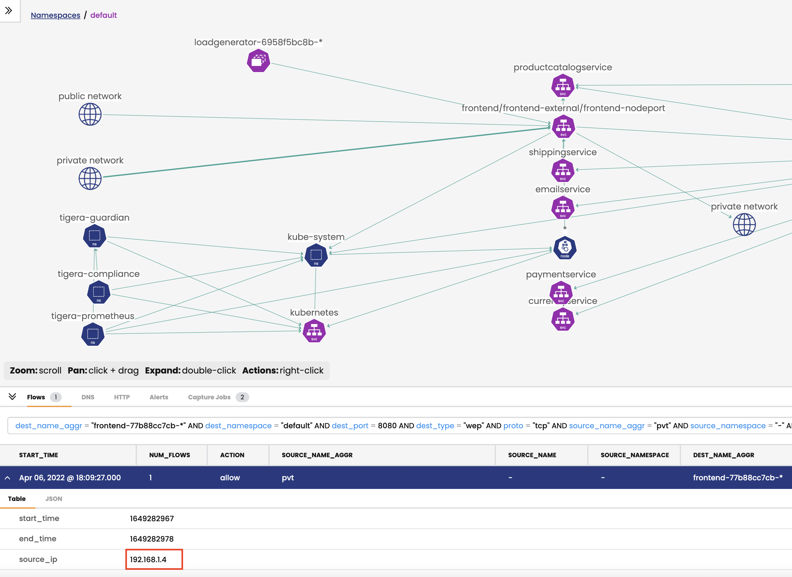

# Module 10: Host Endpoints

>Calico can automatically create host endpoints for your Kubernetes nodes. This means you can manage the lifecycle of host endpoints as your cluster evolves, ensuring nodes are always protected by policy.

**Goal:** Secure hosts ports with network policies.

**Docs:** https://docs.tigera.io/security/kubernetes-nodes


## Steps
1. Create a VM instance in your resource group. You can customize your vm by follow this [doc](https://docs.microsoft.com/en-us/azure/virtual-machines/linux/create-cli-complete)
   ```bash
   az network vnet create -g $RGNAME -n MyVnet --address-prefix 192.168.0.0/16 --subnet-name MySubnet --subnet-prefix 192.168.1.0/24 --location eastus
   az network public-ip create -g $RGNAME  -n myPublicIP  --location eastus 
   az network nsg create -g $RGNAME --name myNetworkSecurityGroup
   az network nsg rule create -g $RGNAME --nsg-name myNetworkSecurityGroup --name AllowRuleSSH --protocol tcp --priority 1000 --destination-port-range 22 --access allow
   az network nic create -g $RGNAME --name myNic --vnet-name myVnet --subnet mySubnet --public-ip-address myPublicIP --network-security-group myNetworkSecurityGroup
   az vm create -g $RGNAME --name myVM --location eastus --nics myNic --image UbuntuLTS --admin-username azureuser --generate-ssh-keys
   VM_IP=$(az network public-ip show -g $RGNAME -n myPublicIP --query ipAddress -o tsv)

   ```
   
   ```bash
   #You should be able ssh to your vm with public IP
   ssh -i /.ssh/id_rsa azureuser@$VM_IP
   ```

2. Peer your vm vnet with aks cluster vnet. You can customize your vm by follow this [doc](https://docs.microsoft.com/en-us/azure/virtual-network/tutorial-connect-virtual-networks-cli)


   ```bash
   #vNet1Id is your vnet id for aks cluster, vNet2Id is your vnet for VM.
   CLUSTER_RESOURCE_GROUP=$(az aks show -g $RGNAME --n $CLUSTERNAME --query nodeResourceGroup -o tsv)
   VNET=$(az network vnet list -g $CLUSTER_RESOURCE_GROUP -o tsv --query '[0].name') 
   vNet1Id=$(az network vnet show -g $CLUSTER_RESOURCE_GROUP -n $VNET --query id --out tsv) 
   vNet2Id=$(az network vnet show -g $RGNAME -n myVnet --query id --out tsv) 
   ```
   
   ```bash
   #Create vnet1 to vnet2 peering and vnet2 to vnet1 peering 
   az network vnet peering create -g $CLUSTER_RESOURCE_GROUP --name vnet1vnet2peer --vnet-name $VNET --remote-vnet-id $vNet2Id --allow-vnet-access
   az network vnet peering create -g $RGNAME --name vnet2vnet1peer --vnet-name myVnet --remote-vnet-id $vNet1Id --allow-vnet-access
   ```

   ```bash
   #Confirm vnet1 to vnet2 peering and vnet2 to vnet1 peering status
   az network vnet peering show --name vnet1vnet2peer -g $CLUSTER_RESOURCE_GROUP --vnet-name $VNET --query peeringState
   az network vnet peering show --name vnet2vnet1peer -g $RGNAME --vnet-name myVnet --query peeringState
   ```

3. Enable automatic host endpoints in your AKS cluster
   ```bash
   # check whether auto-creation for HEPs is enabled. Default: Disabled
   kubectl get kubecontrollersconfiguration.p default -ojsonpath='{.status.runningConfig.controllers.node.hostEndpoint.autoCreate}'
   ```

   ```bash
   kubectl patch kubecontrollersconfiguration default --patch='{"spec": {"controllers": {"node": {"hostEndpoint": {"autoCreate": "Enabled"}}}}}'

   ```

   ```bash
   kubectl get heps -o wide
   ```
   >Output is similar as 

   ```bash
   NAME                                         CREATED AT
   aks-nodepool1-18852703-vmss000000-auto-hep   2022-02-11T01:46:39Z
   aks-nodepool1-18852703-vmss000001-auto-hep   2022-02-11T01:46:39Z
   aks-nodepool1-18852703-vmss000002-auto-hep   2022-02-11T01:46:39Z
   ```

4. Enable automatic host endpoints flow logs.   
   
   ```bash
   kubectl patch felixconfiguration default -p '{"spec":{"flowLogsEnableHostEndpoint":true}}'
   ```  

5.  Expose the frontend service via the NodePort service type, we use `30080` port as example.
   ```bash
   kubectl expose deployment frontend --type=NodePort --name=frontend-nodeport --overrides='{"apiVersion":"v1","spec":{"ports":[{"nodePort":30080,"port":80,"targetPort":8080}]}}'
   ```

6. Get internal IP of node and test the exposed port of `30080` from your vm.
   ```bash
   JPIP='{range .items[*]}{@.status.addresses[?(@.type == "InternalIP")].address}{"\n"}{end}'
   NODE_IP1=$(kubectl get nodes --output jsonpath="$JPIP" | awk 'NR==1{print $1 }')
   NODE_IP2=$(kubectl get nodes --output jsonpath="$JPIP" | awk 'NR==2{print $1 }')
   echo $NODE_IP1
   echo $NODE_IP2
   ```

   ssh to your vm from local shell and test the NodePort `30080`, the expecting result would be 'Connection to 10.240.0.4 30080 port [tcp/*] succeeded!'
   ```bash
   ssh -i /.ssh/id_rsa azureuser@$VM_IP
   sudo apt-get install netcat
   nc -zv $NODE_IP1 30080
   nc -zv $NODE_IP2 30080
   exit
   ```

7. Label the node for HEP testing.
   ```bash
   JPNAME='{range .items[*]}{@.metadata.name}{"\t"}{@.status.addresses[?(@.type == "InternalIP")].address}{"\n"}{end}'
   NODE_NAME1=$(kubectl get nodes --output jsonpath="$JPNAME" | awk 'NR==1{print $1 }')
   NODE_NAME2=$(kubectl get nodes --output jsonpath="$JPNAME" | awk 'NR==2{print $1 }')
   kubectl label nodes $NODE_NAME1 host-end-point=test
   ```

8. Implement a Calico policy to control access to the service of NodePort type, which will deny `VM` with port `30080` to frontend service.

    get private IP of vm instance. 
    ```bash
    PRV_IP=$(az vm show -g $RGNAME -n myVM --query privateIps -d --out tsv)
    
    # deploy HEP policy
    sed -i "s/\${PRV_IP}/${PRV_IP}\/32/g" ./demo/60-host-end-point/frontend-nodeport-access.yaml

    #For other variations/shells the following syntax may be required
    sed -i "" "s/\${PRV_IP}/${PRV_IP}\/32/g" ./demo/60-host-end-point/frontend-nodeport-access.yaml
    ```

    Confirm the change in yaml file and apply the policy.
    ```bash
    cat ./demo/60-host-end-point/frontend-nodeport-access.yaml |grep -B 2 -A 0 $PRV_IP

    kubectl apply -f demo/60-host-end-point/frontend-nodeport-access.yaml
    ```

    Test access from vm shell again, the expected result is 30080 Operation timed out
    ```bash
    ssh -i /.ssh/id_rsa azureuser@$VM_IP

    # test access from vm shell to node1 (10.240.0.4), the expected result will be port 30080 (tcp) timed out
    nc -zv $NODE_IP1 30080 -w 10

    # test access from vm shell to node2 (10.240.0.35), the expected result will be 30080 port [tcp/*] succeeded!
    nc -zv $NODE_IP2 30080 -w 10
    ```
    > Note that in order to control access to the NodePort service, you need to enable `preDNAT` and `applyOnForward` policy settings.

     

    


9. *[Optional]* Test another node in your node group. 

   > Once you label another node with `host-end-point=test`, you should not be able to access the frontend service i.e the node port `30080` from your VM shell
   ```bash
   kubectl label nodes $NODE_NAME2 host-end-point=test
   ssh -i /.ssh/id_rsa azureuser@$VM_IP
   ```

   ```bash
   #test from your VM again, the expected result will be port 30080 (tcp) timed out
   nc -zv $NODE_IP2 30080 -w 10
   ```
   

*Congratulations on completing this workshop!*
Follow the [clean up](../calicocloud/workshop-cleanup.md) instruction if required.


