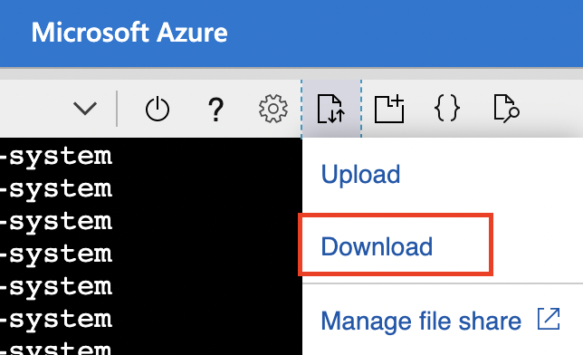
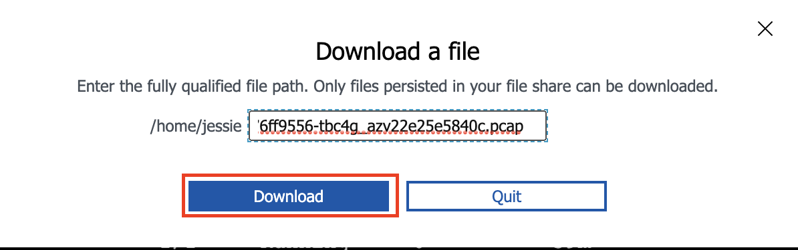

# Module 6: Packet Capture

**Goal:** Configure packet capture for specific pods and review captured payload.

## Steps

1. Confirm `calicoctl` binary is installed. Follow instructions in [Module 0 Step 7](./creating-aks-cluster.md) if installation is required

    The easiest way to retrieve captured `*.pcap` files is to use [calicoctl](https://docs.tigera.io/maintenance/clis/calicoctl/) CLI.

    ```bash
    # confirm calicoctl is executable
    calicoctl version
    ```
    
    ```bash
    # confirm calicoctl is executable from CloudShell
    ./calicoctl version
    ```


2. Configure packet capture.

    Review YAML manifests that represent packet capture definition. Each packet capture is configured by deploying a `PacketCapture` resource that targets endpoints using `selector` and `labels`.

    ```bash
    cat demo/80-packet-capture/packet-capture.yaml
    ```
    
    Deploy packet capture definition to capture packets for `default/frontend` pods.

    ```bash
    kubectl apply -f demo/80-packet-capture/packet-capture.yaml
    ```

    >Once the `PacketCapture` resource is deployed, Calico starts capturing packets for all endpoints configured in the `selector` field.


3. Fetch and review captured payload.

    >The captured `*.pcap` files are stored on the hosts where pods are running at the time the `PacketCapture` resource is active.

    Retrieve captured `*.pcap` files and review the content.

    ```bash
    # get pcap files, the command below will retrieve file in your current folder, you can also use the "--dest=PATH" for choosing a different folder.
    ./calicoctl captured-packets copy packet-capture-frontend --namespace default

    #Results indicate that capture files generated by default/my-capture were successfully copied to the current directory.
    Copy capture files for default/packet-capture-frontend to .
    ```

    ```bash
    #Results will show the absolute path of this pcap file, for example "/home/jessie/test/calico-oss-aks/frontend-76ff9556-tbc4g_azv22e25e5840c.pcap".
    find "$(pwd)" -name frontend-*
    ```
    
    Use Cloudshell to download this pcap file and view the content locally.

    
    
    
    

4. Stop packet capture

    Stop packet capture by deleteing the `packet-capture` yaml.

    ```bash
    kubectl delete -f demo/80-packet-capture/packet-capture.yaml
    ```

[Next -> Module 7](../calicocloud/anomaly-detection.md)
