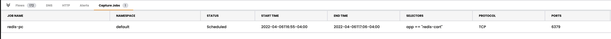

# Module 6: Packet Capture

**Goal:** Configure packet capture for specific pods and review captured payload.

Packet captures are Kubernetes Custom Resources and thus native Kubernetes RBAC can be used to control which users/groups can run and access Packet Captures; this may be useful if Compliance or Governance policies mandate strict controls on running Packet Captures for specific workloads. This demo is simplified without RBAC but further details can be found [here](https://docs.tigera.io/v3.10/visibility/packetcapture).

## Steps

1. Initial packet capture job from manager UI. 

   


2. Schedule the packet capture job with specific port.

   


3. You will see the job scheduled in service graph.


   


4. Download the pcap file once the job is `Capturing` or `Finished`. 
   
   
   

5. create packet capture from yaml file with label selector.
   
   Navigate to `demo/80-packet-capture` and review YAML manifests that represent packet capture definition. Each packet capture is configured by deploying a `PacketCapture` resource that targets endpoints using `selector` and `labels`.

    Deploy packet capture definition to capture packets for `default/frontend` pods.


    ```bash
    kubectl apply -f demo/80-packet-capture/packet-capture.yaml
    ```

    Once the `PacketCapture` resource is deployed, Calico starts capturing packets for endpoints configured in the `selector` field. You can see this job in service graph as well. 

    


[Next -> Module 7](../calicocloud/anomaly-detection.md)
