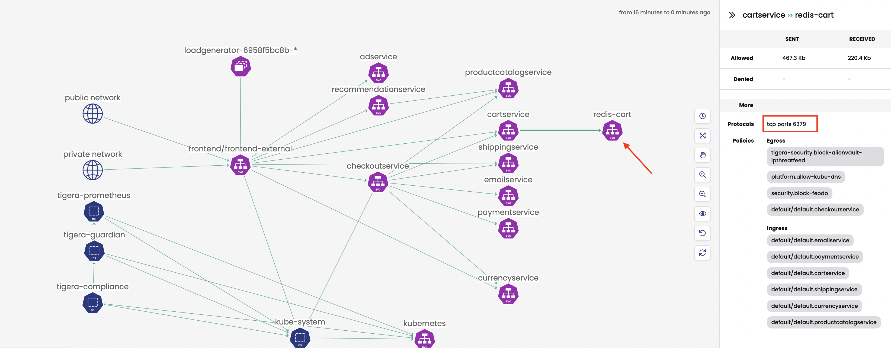
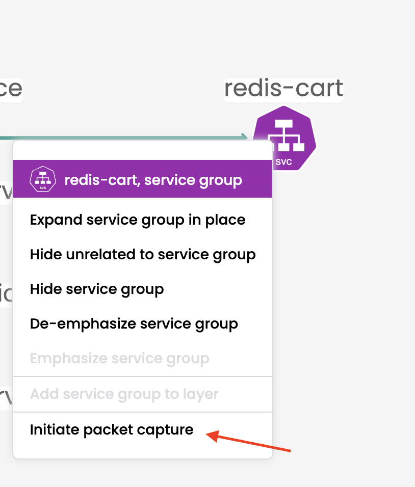
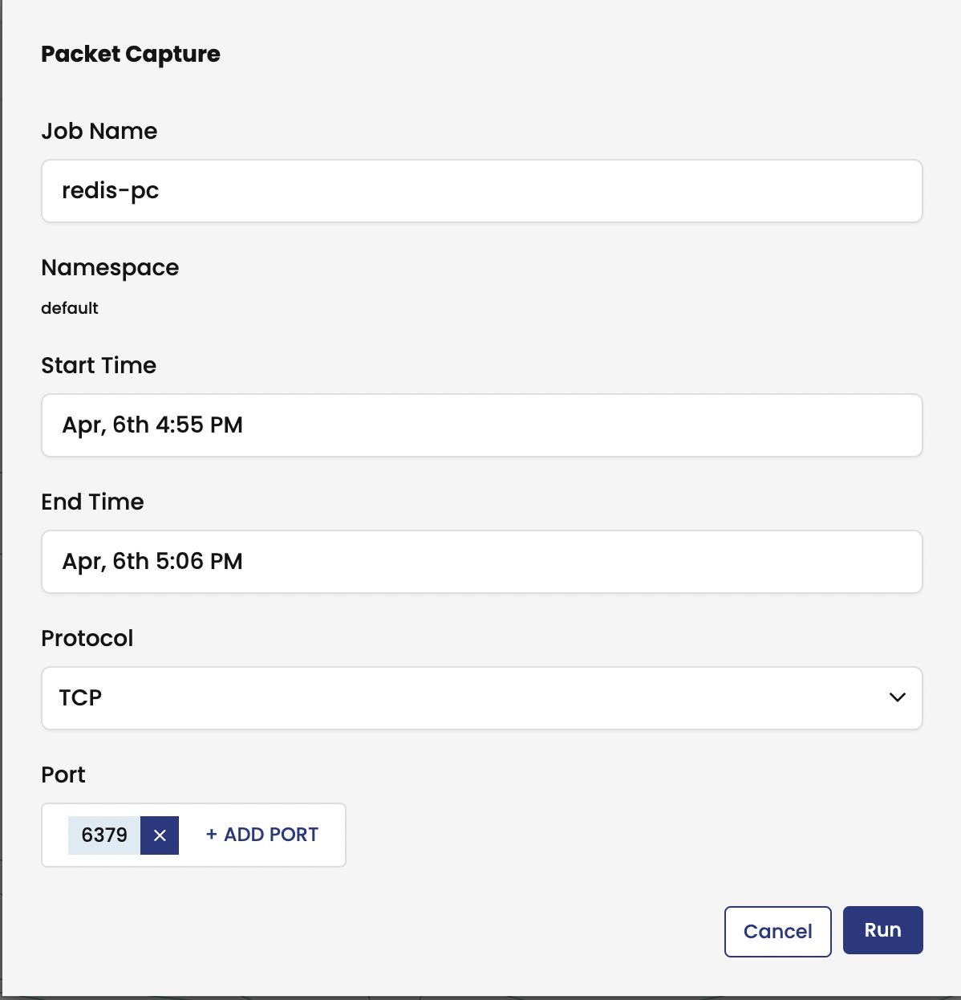
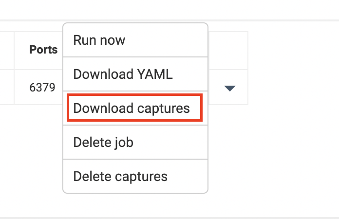

# Module 6: Packet Capture

**Goal:** Configure packet capture for specific pods and review captured payload.

Packet captures are Kubernetes Custom Resources and thus native Kubernetes RBAC can be used to control which users/groups can run and access Packet Captures; this may be useful if Compliance or Governance policies mandate strict controls on running Packet Captures for specific workloads. This demo is simplified without RBAC but further details can be found [here](https://docs.tigera.io/visibility/packetcapture#enforce-rbac-for-packet-capture).

## Steps

1. Choose an endpoint you want to capture from from manager UI, we will use `Redis` as example.

  > Note: You can see the endpoint details from UI, and we choose the service port `6379` for capture the traffic.

   

   

2. Schedule the packet capture job with specific port and time.

   

3. You will see the job scheduled in service graph.

   

4. Download the pcap file once the job is `Capturing` or `Finished`. 
   
   
   

5. Open the pcap file with wireshark or other utilis, you will see the ingress and egress traffic associate with `redis` pods i.e `10.240.0.72`
   
   
    

[Next -> Module 7](../calicocloud/anomaly-detection.md)
