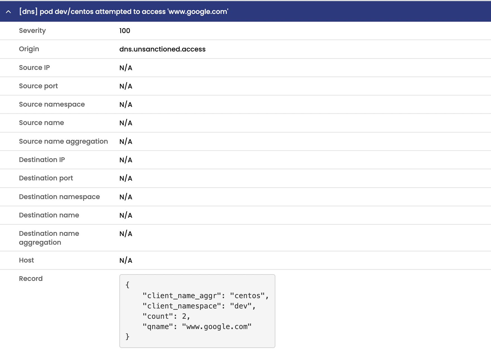

# Module 5: Using alerts

**Goal:** Use global alerts to notify security and operations teams about unsanctioned or suspicious activity.

## Steps

1. Review alerts manifests.

    Navigate to `demo/50-alerts` and review YAML manifests that represent alerts definitions. Each file contains an alert template and alert definition. Alerts templates can be used to quickly create an alert definition in the UI.

2. View triggered alerts.

    >We implemented alerts in one of the first labs in order to see how our activity can trigger them.

    ```bash
    kubectl get globalalert        
    ```

    output will be like this:
    ```bash
    NAME                      CREATED AT
    dns.unsanctioned.access   2021-06-10T03:24:41Z
    network.lateral.access    2021-06-10T03:24:43Z
    policy.globalnetworkset   2021-06-10T03:24:41Z
        
    ```

    Open `Alerts` view to see all triggered alerts in the cluster. Review the generated alerts.

    

    You can also review the alerts configuration and templates by navigating to alerts configuration in the top right corner.
<br>

3. Trigger dns alert by sending a curl request to www.google.com as defined in dns alert. **Note:** You need remove namespace `dev` from `default-deny` policy for trigger this alert, and it may take a minute or two to be visible in the 'Alerts' tab.

   ```bash
   kubectl -n dev exec -t centos -- sh -c 'curl -m3 -skI https://www.google.com 2>/dev/null | grep -i http'
   ```
   

[Next -> Module 6](../calicocloud/packet-capture.md)
