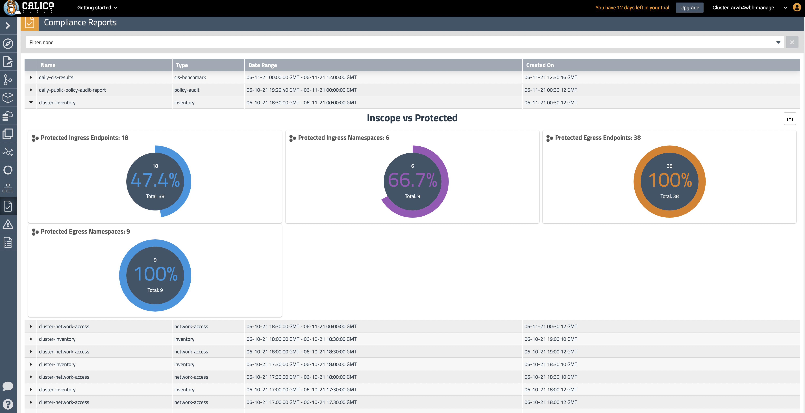

# Module 8: Using compliance reports

**Goal:** Use global reports to satisfy compliance requirementes.

## Steps

1. Use `Compliance Reports` view to see all generated reports.

    >We have deployed a few compliance reports in one of the first labs and by this time a few reports should have been already generated. 
    ```bash
    kubectl get globalreport        
    ```

    ```text                                                   
    NAME                          CREATED AT
    boutiqueshop-inventory        2021-11-08T23:19:42Z
    boutiqueshop-network-access   2021-11-08T23:19:42Z
    boutiqueshop-policy-audit     2021-11-08T23:19:42Z
    cluster-inventory             2021-11-08T23:18:52Z
    cluster-network-access        2021-11-08T23:18:52Z
    daily-cis-results             2021-11-08T23:18:51Z
    ```


    Calico provides `GlobalReport` resource to offer [Compliance reports](https://docs.tigera.io/compliance/overview) capability. There are several types of reports that you can configure:

    - CIS benchmarks
    - Inventory
    - Network access
    - Policy audit


    A compliance report could be configured to include only specific endpoints leveraging endpoint labels and selectors. Each report has the `schedule` field that determines how often the report is going to be generated and sets the time frame for the data to be included into the report.

    Compliance reports organize data in a CSV format which can be downloaded and moved to a long term data storage to meet compliance requirements.

    

2. Reports are generated 30 minutes after the end of the report as [documented](https://docs.tigera.io/compliance/overview#change-the-default-report-generation-time). As the compliance reports deployed in the [manifests](https://github.com/Azure/kubernetes-hackfest/tree/master/labs/networking/calico-lab-exercise/demo/40-compliance-reports) are scheduled to run every 15 minutes the generation of reports will take between 30-60 mins depending when the manifests were deloyed.
<br>

[Next -> Module 9](../calicocloud/enable-l7-visibility.md)
