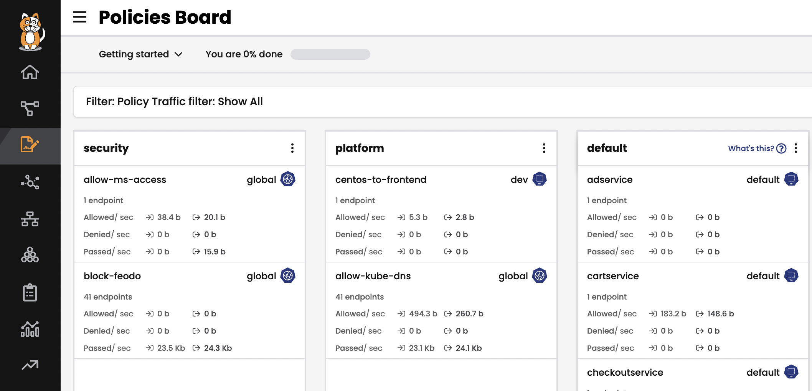
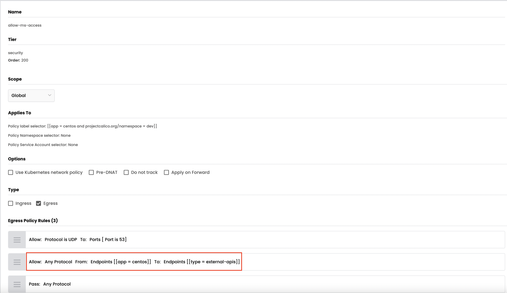
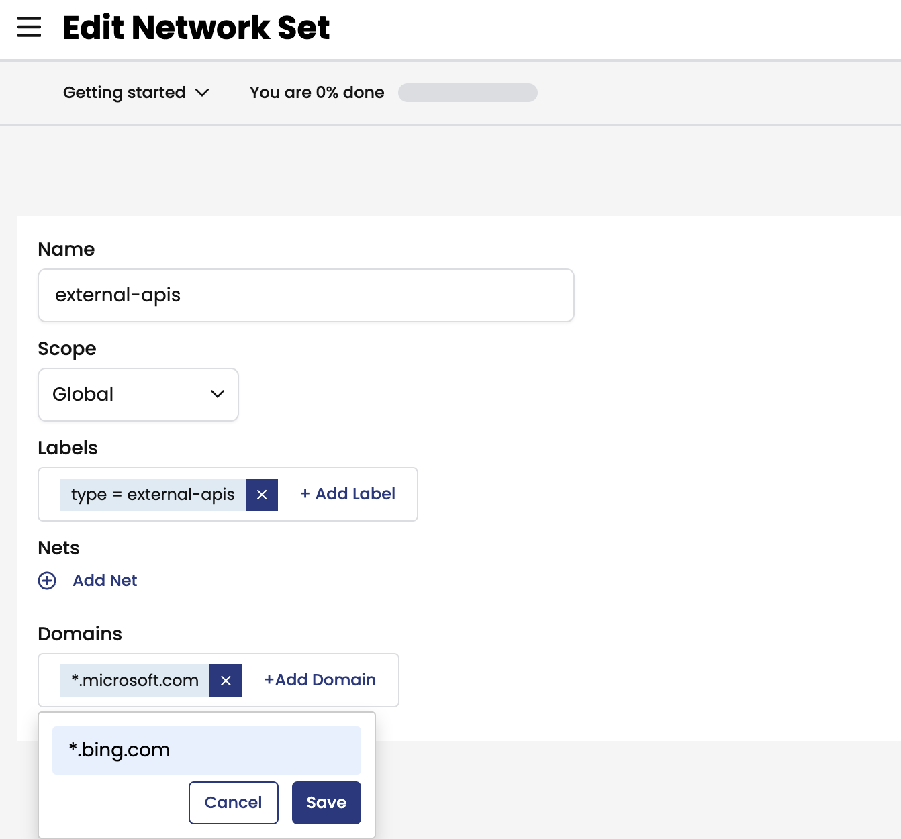

# Module 4: Using DNS egress access controls with global networkset 

**Goal:** Calico Cloud & Calico EE offer a DNS policy which leverages `Network Sets` to whitelist external access. Configure egress access for specific workloads.

**Docs:** https://projectcalico.docs.tigera.io/reference/resources/globalnetworkset

## Steps

1. Add the `allow-ms-access` DNS policy to security tier.

    ```bash
    kubectl apply -f demo/20-egress-access-controls/netset.external-apis.yaml

    kubectl apply -f demo/20-egress-access-controls/dns-policy.netset.yaml
    ```

    This will add `allow-ms-access` policy to your `security` tier. 

    
    
    

   

    By leveraging stats controls you can toggle additional metrics to be listed for each shown policy.

   


2. View the details for `external-apis` in the `Network Sets` view. You can add or delete the Domain name with your calico cloud manager UI.


    ```bash
    # test egress access to www.bing.com, it will be deny with "exit code 1".
    kubectl -n dev exec -t centos -- sh -c 'curl -m3 -skI https://www.bing.com 2>/dev/null | grep -i http'
    # test egress access to www.microsoft.com, it will be allowed with "HTTP/1.1 200".
    kubectl -n dev exec -t centos -- sh -c 'curl -m3 -skI https://www.microsoft.com 2>/dev/null | grep -i http'

    ```
    As access to `*.microsoft.com` is permitted and access to `*.bing.com` is denied, we are able to whitelist domains as described next, you can also try to add `*.bing.com` in `external-apis` and test the connectivity again.

    


    ```bash
    # test egress access to www.bing.com, it will be allowed with "HTTP/1.1 200".
    kubectl -n dev exec -t centos -- sh -c 'curl -m3 -skI https://www.bing.com 2>/dev/null | grep -i http'
    ```

    

[Next -> Module 5](../calicocloud/using-alerts.md)
