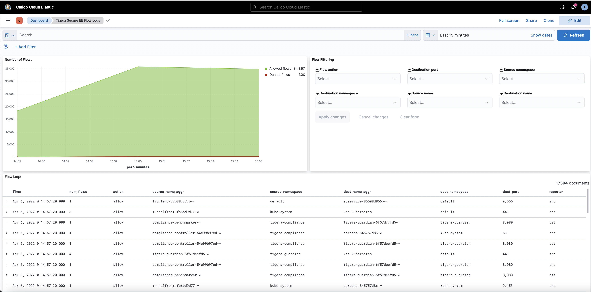

# Calico cloud workshop on AKS




## Workshop cleanup

1. Delete application stack to clean up any `loadbalancer` services.

    ```bash
    kubectl delete -f demo/dev/app.manifests.yaml
    kubectl delete -f demo/boutiqueshop/boutique-app.manifests.yaml
   
    ```

2. Delete AKS cluster.

    ```bash
    az aks delete --name $CLUSTERNAME --resource-group $RGNAME
    az aks delete --name $OSSCLUSTERNAME --resource-group $RGNAME
    ```

3. Delete the azure resource group. 

    ```bash
    az group delete --resource-group $RGNAME
    ```
