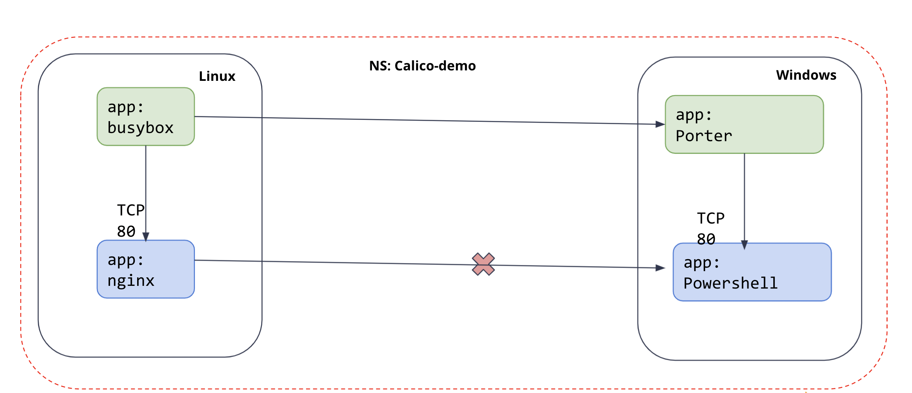

# Module 3: Adding windows node in your AKS and protect them with Calico policy
>Calico for Windows is a hybrid implementation that requires a Linux cluster for Calico components and Linux workloads, and Windows nodes for Windows workloads.


**Goal:** Create client and server pods on Linux and Windows nodes, verify connectivity between the pods, and then isolate pod traffic.

**Docs:** https://docs.projectcalico.org/getting-started/windows-calico/quickstart

## Steps

1. Enable AKS windows Calico feature and register the service in your cluster. **Note:** This may take several minutes to complete, so it could be a good time for a coffee or lunch break.

    
    ```bash
    az feature register --namespace "Microsoft.ContainerService" --name "EnableAKSWindowsCalico"
    ```

    Output will be like this:
    ```text
    {
      "id": "/subscriptions/03cfb895-358d-4ad4-8aba-aeede8dbfc30/providers/Microsoft.Features/providers/Microsoft.ContainerService/features/EnableAKSWindowsCalico",
      "name": "Microsoft.ContainerService/EnableAKSWindowsCalico",
      "properties": {
        "state": "Registered"
      },
      "type": "Microsoft.Features/providers/features"
    }
    ```


   Verify that the feature is registered. 

    ```bash
    az feature list -o table --query "[?contains(name, 'Microsoft.ContainerService/EnableAKSWindowsCalico')].{Name:name,State:properties.state}"
    ```
    
    Output will be
    ```bash
    Name                                               State
    -------------------------------------------------  ----------
    Microsoft.ContainerService/EnableAKSWindowsCalico  Registered
    ```


2. Refresh the registration of the Microsoft.ContainerService resource provider.

   ```bash
   az provider register --namespace Microsoft.ContainerService
   ```


3. Add a Windows node in your pool, and confirm the result.
   ```bash
   az aks nodepool add \
   --resource-group $RGNAME \
   --cluster-name $OSSCLUSTERNAME \
   --os-type Windows \
   --name npwin  \
   --node-count 1 \
   --kubernetes-version $K8SVERSION \
   --node-vm-size Standard_D2s_v3
   ```
   
   ```bash
   kubectl get nodes
   ```

   ```bash
   ### The output is like:
   NAME                                STATUS   ROLES   AGE     VERSION
   aks-nodepool1-40984214-vmss000000   Ready    agent   48m     v1.22.4
   aks-nodepool1-40984214-vmss000001   Ready    agent   48m     v1.22.4
   aks-nodepool1-40984214-vmss000002   Ready    agent   47m     v1.22.4
   aksnpwin000000                      Ready    agent   3m16s   v1.22.4
   ```

4. Create demo pods in Linux and Windows nodes. Expected Outcome:
   - Create a client (busybox) and server (nginx) pod on the Linux nodes:
   - Create a client pod (powershell) and a server (porter) pod on the Windows nodes

    ```bash
    kubectl apply -f demo/win-demo/
    ```
    
    ```bash
    # Windows images are large and can take some time to start, run a watch and wait for the pods to be in running state
    kubectl get pods -n calico-demo -w
    ```

    ```bash
    ### The output is like when ready:
    NAME      READY   STATUS    RESTARTS   AGE
    busybox   1/1     Running   0          5m30s
    nginx     1/1     Running   0          5m30s
    porter    1/1     Running   0          4m50s
    pwsh      1/1     Running   0          5m1s
    ```

5. Check the connectivities between pods. Expected Outcome:  

   - The traffic between `busybox` in Linux node and `porter` in Windows node is allowed. 
   - The traffic between `powershell` in Windows node and `nginx` in Linux node is allowed. 
   - The traffic between `busybox` in Linux node and `nginx` in Linux node is allowed. 
   - The traffic between `powershell` in Windows node and `porter` in Windows node is allowed. 

   ```bash
   kubectl exec -n calico-demo busybox -- nc -vz $(kubectl get po porter -n calico-demo -o 'jsonpath={.status.podIP}') 80

   sleep 10

   kubectl exec -n calico-demo pwsh -- powershell Invoke-WebRequest -Uri http://$(kubectl get po nginx -n calico-demo -o 'jsonpath={.status.podIP}') -UseBasicParsing -TimeoutSec 5

   sleep 10

   kubectl exec -n calico-demo busybox -- nc -vz $(kubectl get po nginx -n calico-demo -o 'jsonpath={.status.podIP}') 80

   sleep 10

   kubectl exec -n calico-demo pwsh -- powershell Invoke-WebRequest -Uri http://$(kubectl get po porter -n calico-demo -o 'jsonpath={.status.podIP}') -UseBasicParsing -TimeoutSec 5

   ```
  
   The output will be like:
   ```bash
   ##nc command output
   10.240.0.115 (10.240.0.115:80) open

   ##powershell command output
   StatusCode        : 200
   StatusDescription : OK
   
   ```

6. Create policy to explicitly allow the `busybox` pod in Linux node to reach the `porter` pod in Windows node, and deny the `powershell` pod in Windows node to reach the `nginx` pod in Linux node
   ```bash
   calicoctl --allow-version-mismatch apply -f demo/20-egress-access-controls/allow-busybox.yaml
   calicoctl --allow-version-mismatch apply -f demo/20-egress-access-controls/deny-nginx.yaml
   ```

7. Check the connectivities between pods. Expected Outcome:  
   - The traffic between `busybox` in Linux node and `porter` in Windows node is allowed. 
   - The traffic between `powershell` in Windows node and `nginx` in Linux node is denied. 

      

   ```bash
   kubectl exec -n calico-demo busybox -- nc -vz $(kubectl get po porter -n calico-demo -o 'jsonpath={.status.podIP}') 80

   kubectl exec -n calico-demo pwsh -- powershell Invoke-WebRequest -Uri http://$(kubectl get po nginx -n calico-demo -o 'jsonpath={.status.podIP}') -UseBasicParsing -TimeoutSec 5
   ```
   
   The output will be like:
   ```bash
   ##nc command output
   10.240.0.115 (10.240.0.115:80) open
 
   ##powershell command output 
   Invoke-WebRequest : The operation has timed out.


[Next -> Module 4](../calicooss/wireguard-encryption.md)
