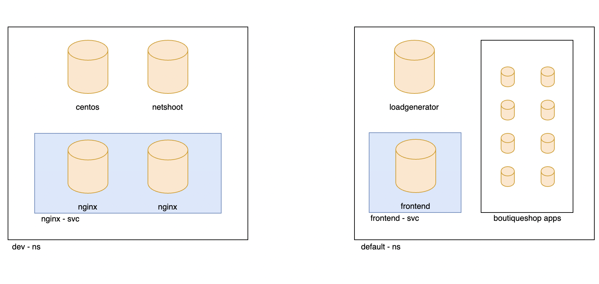

# Module 1: Configuring demo applications

**Goal:** Deploy and configure demo applications.

## Steps

1. Download this repo and browse to this lab environment:

    ```bash
    git clone https://github.com/Azure/kubernetes-hackfest.git
 
    cd kubernetes-hackfest/labs/networking/calico-lab-exercise/
    ```

2. Deploy demo applications.
    This is app we will use for next modules.
      

    ```bash
    # Deploy dev app stack
    kubectl apply -f demo/dev/app.manifests.yaml

    # Deploy boutiqueshop app stack
    kubectl apply -f https://raw.githubusercontent.com/googlecloudplatform/microservices-demo/v0.3.8/release/kubernetes-manifests.yaml
    ```

    ```bash
    # Confirm that the pod/deployments are running. Note the loadgenerator pod waits for the frontend pod to respond to http calls before coming up and can take a few minutes. Eventually, the status of the pods in the dev and default namespaces will look as follows: 
    kubectl get pods -n dev
    sleep 10
    kubectl get pods
    ```

    Output will be similar as below:

    ```bash
    NAME                         READY   STATUS    RESTARTS   AGE
    centos                       1/1     Running   0          5m26s
    dev-nginx-5498d94786-8bmpt   1/1     Running   0          5m26s
    dev-nginx-5498d94786-cc964   1/1     Running   0          5m26s
    netshoot                     1/1     Running   0          5m26s


    NAME                                    READY   STATUS    RESTARTS   AGE
    adservice-54578dbcfb-42hg2              1/1     Running   0          5m45s
    cartservice-85d54d696d-jj7fr            1/1     Running   0          5m46s
    checkoutservice-6fd87dd456-l9w4j        1/1     Running   0          5m47s
    currencyservice-fb9c8b978-5tqcg         1/1     Running   0          5m46s
    emailservice-76f595bc6-vwnj2            1/1     Running   0          5m47s
    frontend-65f74c4c88-h289h               1/1     Running   0          5m47s
    loadgenerator-66854bfb8-8fdmc           1/1     Running   0          5m46s
    paymentservice-7b8546ccb4-hh8td         1/1     Running   0          5m47s
    productcatalogservice-c8cf68d4d-fbcwp   1/1     Running   0          5m46s
    recommendationservice-d6dddb6b-b5zdz    1/1     Running   0          5m47s
    redis-cart-7667674fc7-p2456             1/1     Running   0          5m46s
    shippingservice-6f7446bc4b-xsjh2        1/1     Running   0          5m46s
    ```

3. Install curl on loadgenerator pod

    > Before we implement network secruity rules we need to install curl on the loadgenerator pod for testing purposes later in the workshop. Note the installation will not survive a reboot so repeat this installation as necessary

    ```bash
    kubectl exec -it $(kubectl get po -l app=loadgenerator -ojsonpath='{.items[0].metadata.name}') -- sh -c 'apt-get update && apt install curl -y'
    ```

[Next -> Module 2](../calicooss/using-security-controls.md)
