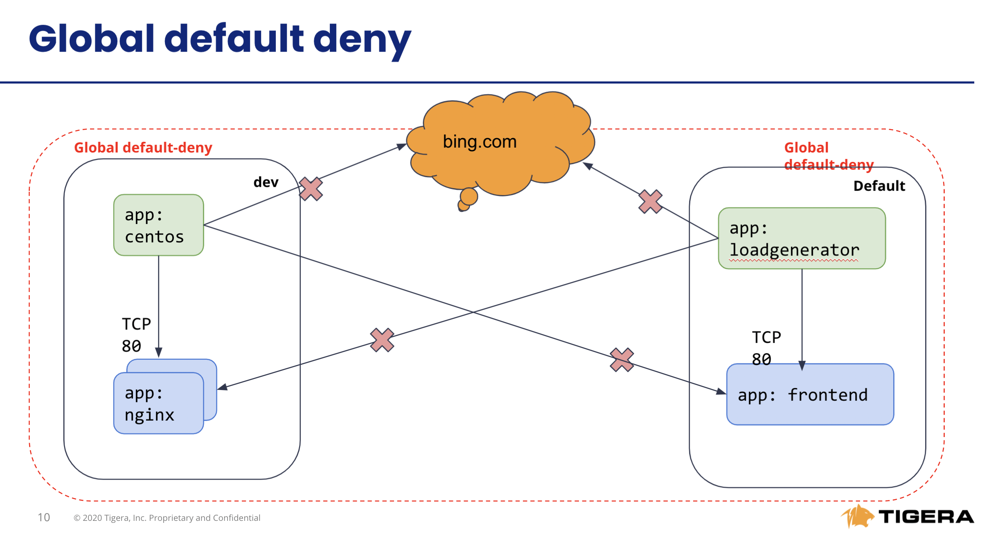
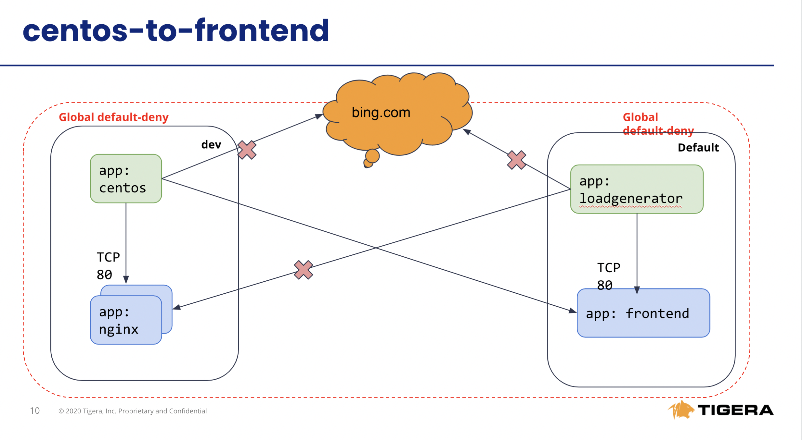

# Module 2: Using global network policies for security controls

**Goal:** Leverage global network policies to segment connections within the AKS cluster.

**Docs:** https://projectcalico.docs.tigera.io/reference/resources/globalnetworkpolicy

## Steps


1. Test connectivity between application components and across application stacks to establish the baseline behavior; all of these tests should succeed since there are no network policies configured at this stage to govern the traffic for `dev` and `default` namespaces.

    a. Test connectivity between workloads within each namespace.

    ```bash
    # test connectivity within dev namespace
    kubectl -n dev exec -t centos -- sh -c 'curl -m3 -sI http://nginx-svc 2>/dev/null | grep -i http'

    # test connectivity within default namespace
    kubectl exec -it $(kubectl get po -l app=loadgenerator -ojsonpath='{.items[0].metadata.name}') -- sh -c 'curl -m3 -sI frontend 2>/dev/null | grep -i http'

    kubectl exec -it $(kubectl get po -l app=frontend -ojsonpath='{.items[0].metadata.name}') -c server -- sh -c 'nc -zv productcatalogservice 3550'
    ```

    b. Test connectivity across namespaces.

    ```bash
    # test connectivity from dev namespace to default namespace
    kubectl -n dev exec -t centos -- sh -c 'curl -m3 -sI http://frontend.default 2>/dev/null | grep -i http'

    # test connectivity from default namespace to dev namespace
    kubectl exec -it $(kubectl get po -l app=loadgenerator -ojsonpath='{.items[0].metadata.name}') -- sh -c 'curl -m3 -sI http://nginx-svc.dev 2>/dev/null | grep -i http'
    ```

    c. Test connectivity from each namespace to the Internet.

    ```bash
    # test connectivity from dev namespace to the Internet
    kubectl -n dev exec -t centos -- sh -c 'curl -m3 -sI http://www.bing.com 2>/dev/null | grep -i http'

    # test connectivity from default namespace to the Internet
    kubectl exec -it $(kubectl get po -l app=loadgenerator -ojsonpath='{.items[0].metadata.name}') -- sh -c 'curl -m3 -sI www.bing.com 2>/dev/null | grep -i http'
    ```


2. Apply network policies to control East-West traffic, including kubernetes policies for demo pods in `dev` namespace and calico policies for mircoservices of boutiqueshop in `default` namespaces.

    ```bash
    # deploy dev policies
    kubectl apply -f demo/dev/policies.yaml

    # deploy boutiqueshop policies, you will need use --allow-version-mismatch to override if client/cluster version mismatch.
    calicoctl --allow-version-mismatch apply -f demo/boutiqueshop/policies.yaml
    ```
    
    Now as we have proper policies in place, we can deploy `default-deny` as global network policy moving closer to zero-trust security approach. 

    ```bash
    # apply enforcing default-deny policy manifest
    calicoctl --allow-version-mismatch apply -f demo/10-security-controls/default-deny.yaml
    ```
    Note: The `default-deny` policy includes global egress policy which allow all namespaces to communicate to kube-dns pods.

3. Test connectivity with policies in place. Expected Outcome:
   - Connections between components in a single namespace should be allowed
   - Cross-namespace and Internet connections should be denied

    This is the connection after we have network policy in place.
      


    a. The only connections between components within each namespaces should be allowed as configured by the policies.

    ```bash
    # test connectivity within dev namespace
    kubectl -n dev exec -t centos -- sh -c 'curl -m3 -sI http://nginx-svc 2>/dev/null | grep -i http'

    # test connectivity within default namespace
    kubectl exec -it $(kubectl get po -l app=loadgenerator -ojsonpath='{.items[0].metadata.name}') -- sh -c 'curl -m3 -sI frontend 2>/dev/null | grep -i http'
    ```

    b. The connections across `dev` and `default` namespaces should be blocked `with exit code 1` by the global `default-deny` policy.

    ```bash
    # test connectivity from dev namespace to default namespace
    kubectl -n dev exec -t centos -- sh -c 'curl -m3 -sI http://frontend.default 2>/dev/null | grep -i http'

    # test connectivity from default namespace to dev namespace
    kubectl exec -it $(kubectl get po -l app=loadgenerator -ojsonpath='{.items[0].metadata.name}') -- sh -c 'curl -m3 -sI http://nginx-svc.dev 2>/dev/null | grep -i http'
    ```

    c. The connections to the Internet should be blocked `with exit code 1` by the configured policies.

    ```bash
    # test connectivity from dev namespace to the Internet
    kubectl -n dev exec -t centos -- sh -c 'curl -m3 -sI http://www.bing.com 2>/dev/null | grep -i http'

    # test connectivity from default namespace to the Internet
    kubectl exec -it $(kubectl get po -l app=loadgenerator -ojsonpath='{.items[0].metadata.name}') -- sh -c 'curl -m3 -sI www.bing.com 2>/dev/null | grep -i http'
    ```


4. Implement egress policy to allow egress access from a workload in one namespace, e.g. `dev/centos`, to a service in another namespace, e.g. `default/frontend`. Expected Outcome: 
   - Connections between components in a single namespace should be allowed
   - Cross-namespace `dev/centos` to `default/frontend`should be allow,
   - Internet connections should be denied

    a. Deploy egress policy.

    ```bash
    calicoctl --allow-version-mismatch create -f demo/20-egress-access-controls/default-centos-to-frontend.yaml
    ```

    b. Test connectivity between `dev/centos` pod and `default/frontend` service. The access should be allowed once the egress policy is in place.

    ```bash
    kubectl -n dev exec -t centos -- sh -c 'curl -m3 -sI http://frontend.default 2>/dev/null | grep -i http'
    ```

    Output will be like this:
    ```bash
    HTTP/1.1 200 OK
    ```
    
    c. Test the connectivity to the Internet, should be same as blocked `with exit code 1` by default deny policy.

    ```bash
    # test connectivity from dev namespace to the Internet
    kubectl -n dev exec -t centos -- sh -c 'curl -m3 -sI http://www.bing.com 2>/dev/null | grep -i http'

    # test connectivity from default namespace to the Internet
    kubectl exec -it $(kubectl get po -l app=loadgenerator -ojsonpath='{.items[0].metadata.name}') -- sh -c 'curl -m3 -sI www.bing.com 2>/dev/null | grep -i http'
    ```
   

    


>Calico Cloud & Calico EE offer a DNS policy feature, which can whitelist DNS domains, such as www.bing.com, we will test this feature in next Chapter.   


[Next -> Module 3](../calicooss/calico-for-windows.md)
