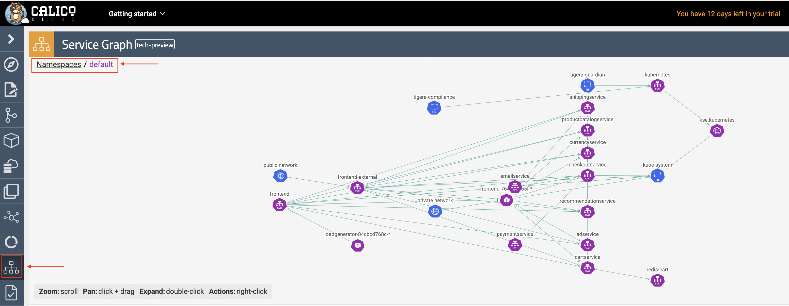

# Module 2: Configuring demo applications

**Goal:** Deploy and configure demo applications.

## Steps

1. Download this repo into your environment:

    ```bash
    git clone https://github.com/tigera-solutions/calicocloud-aks-workshop.git 
    ```
    
    ```bash
    cd calicocloud-aks-workshop
    ```


2. Deploy policy tiers.

    We are going to deploy some policies into policy tier to take advantage of hierarcical policy management.

    ```bash
    kubectl apply -f demo/tiers/tiers.yaml
    ```

    This will add tiers `security` and `platform` to the aks cluster. 


3. Deploy base policy.

    In order to explicitly allow workloads to connect to the Kubernetes DNS component, we are going to implement a policy that controls such traffic.

    ```bash
    kubectl apply -f demo/10-security-controls/allow-kube-dns.yaml
    ```

    This will add `allow-kube-dns` policy to your `platform` tier.
    

4. Deploy demo applications.

    ```bash
    # deploy dev app stack
    kubectl apply -f demo/dev/app.manifests.yaml

    # deploy boutiqueshop app stack
    kubectl apply -f https://raw.githubusercontent.com/GoogleCloudPlatform/microservices-demo/master/release/kubernetes-manifests.yaml
    ```
    
    ```bash
    #confirm the pod/deployments are running
    kubectl get pods
    NAME                                     READY   STATUS    RESTARTS   AGE
    adservice-7cbc9bd9-jkjhq                 1/1     Running   0          86s
    cartservice-d7db78c66-4rw8p              1/1     Running   0          87s
    checkoutservice-784bfc794f-7np5p         1/1     Running   0          87s
    currencyservice-5898885559-74s5z         1/1     Running   0          86s
    emailservice-6bd8b47657-s4drk            1/1     Running   0          87s
    frontend-764c5c755f-8xjcs                1/1     Running   0          87s
    loadgenerator-84cbcd768c-6tcx5           1/1     Running   0          87s
    paymentservice-6c676df669-m5j6g          1/1     Running   0          87s
    productcatalogservice-7fcf4f8cc-nkvnd    1/1     Running   0          87s
    recommendationservice-79f5f4bbf5-qgqfv   1/1     Running   0          87s
    redis-cart-74594bd569-l4kt9              1/1     Running   0          86s
    shippingservice-b5879cdbf-r8xqb          1/1     Running   0          86s

    kubectl get pods -n dev
    NAME                         READY   STATUS    RESTARTS   AGE
    centos                       1/1     Running   0          6m
    dev-nginx-754f647b8b-g8sbn   1/1     Running   0          6m
    dev-nginx-754f647b8b-h65kk   1/1     Running   0          6m
    ```

    The pods will be visible in "service graph", for example in `default` namespace. This may take 1-2 mins to update in Service Graph:
      

    Note that pod/resource limits on your nodes may prevent pods from deploying. Ensure the nodes in the cluster are scaled appropriately

5. Deploy compliance reports.

    >The reports will be needed for one of a later lab.

    ```bash
    kubectl apply -f demo/40-compliance-reports/daily-cis-results.yaml
    kubectl apply -f demo/40-compliance-reports/cluster-reports.yaml
    ```

6. Deploy global alerts.

    >The alerts will be explored in a later lab.

    ```bash
    kubectl apply -f demo/50-alerts/globalnetworkset.changed.yaml
    kubectl apply -f demo/50-alerts/unsanctioned.dns.access.yaml
    kubectl apply -f demo/50-alerts/unsanctioned.lateral.access.yaml
    ```

7. Install curl on loadgenerator pod
 
    > Before we implement network secruity rules we need to install curl on the loadgenerator pod for testing purposes later in the workshop. Note the installation will not survive a reboot so repeat this installation as necessary

    ```bash
    kubectl exec -it $(kubectl get po -l app=loadgenerator -ojsonpath='{.items[0].metadata.name}') -- sh -c 'apt-get update && apt install curl -y'
    ```

[Next -> Module 3](../modules/using-security-controls.md)
