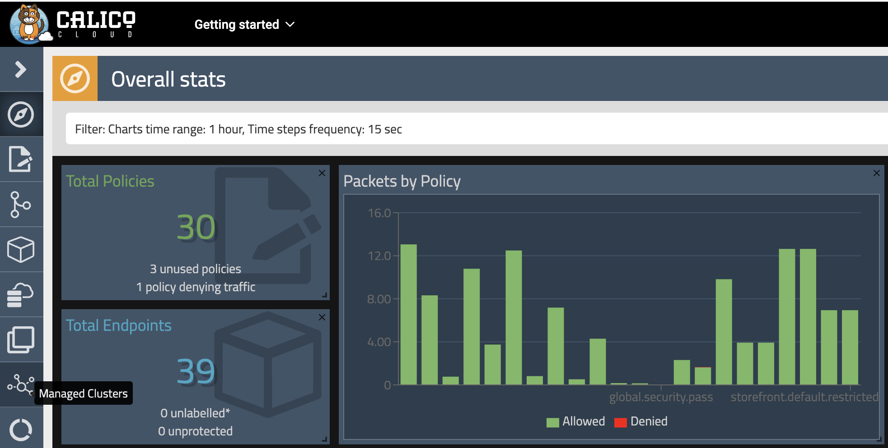
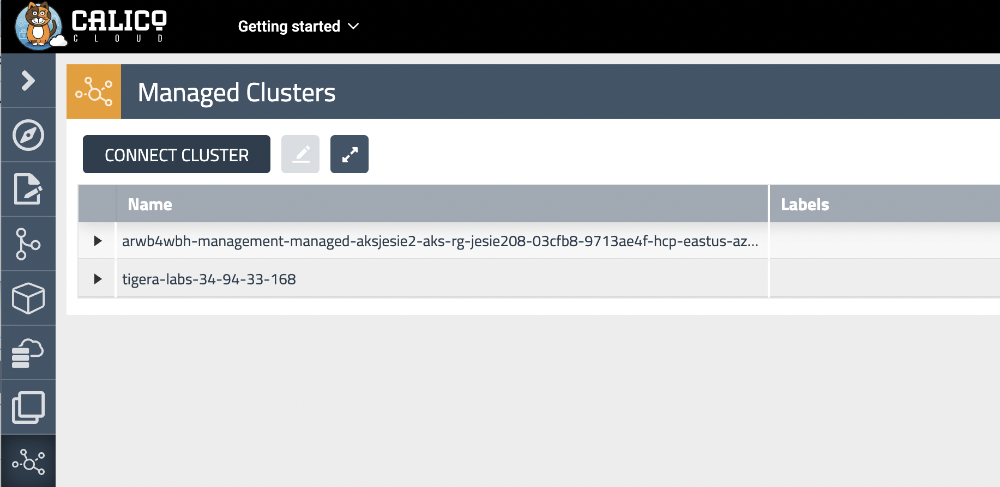
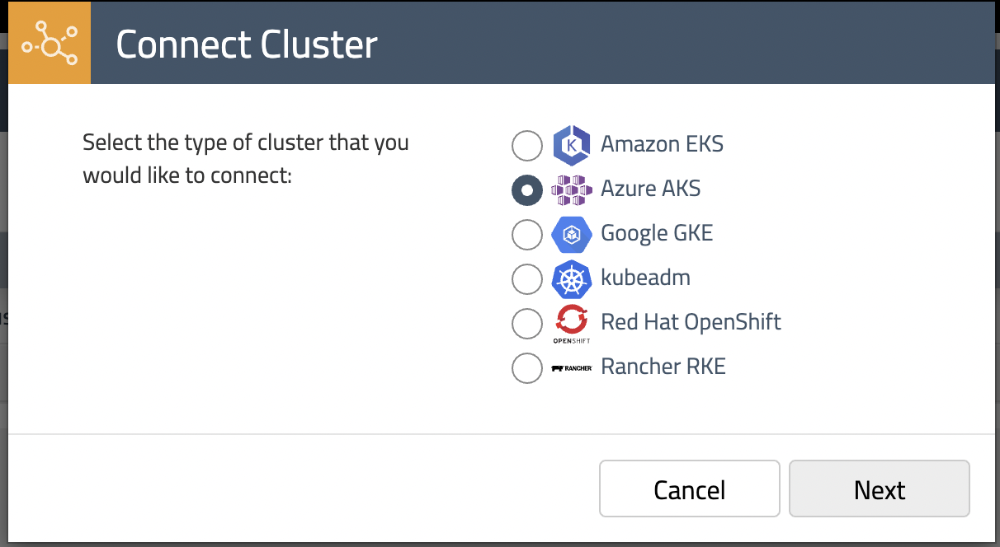

# Module 1: Joining AKS cluster to Calico Cloud

**Goal:** Join AKS cluster to Calico Cloud management plane.

>In order to complete this module, you must have [Calico Cloud trial account](https://www.calicocloud.io/home).

## Steps

1. Join AKS cluster to Calico Cloud management plane.
    
    Use your Calico Cloud account to login Calico Cloud management UI. Click the "Managed Cluster" in your left side of browser.
    
    
    Click on "connect cluster"
     

    choose AKS and click next
      


    run installation script in your aks cluster. 
    ```bash
    # script should look similar to this
    curl https://installer.calicocloud.io/xxxxxx_yyyyyyy-saay-management_install.sh | bash
    ```

    Joining the cluster to Calico Cloud can take a few minutes. Wait for the installation script to finish before you proceed to the next step.

    ```bash
    # output once your cluster join the calico cloud
    Install Successful

    Your Connected Cluster Name is arwb4wbh-management-managed-aksjesie2-aks-rg-jesie208-03cfb8-9713ae4f-hcp-eastus-azmk8s-io  
    ```
    
    In calico cloud management UI, you can see your own aks cluster added in "managed cluster", you can also confirm by
    ```bash
    kubectl get tigerastatus
    ```
    
    ```bash
    #make sure all customer resources are "AVAILABLE=True" 
    NAME                            AVAILABLE   PROGRESSING   DEGRADED   SINCE
    apiserver                       True        False         False      5m38s
    calico                          True        False         False      4m44s
    compliance                      True        False         False      4m34s
    intrusion-detection             True        False         False      4m49s
    log-collector                   True        False         False      4m19s
    management-cluster-connection   True        False         False      4m54s


2. Configure log aggregation and flush intervals in aks cluster, we will use 60s instead of default value 300s for lab testing only.   

    ```bash
    kubectl patch felixconfiguration.p default -p '{"spec":{"flowLogsFlushInterval":"60s"}}'
    kubectl patch felixconfiguration.p default -p '{"spec":{"dnsLogsFlushInterval":"60s"}}'
    kubectl patch felixconfiguration.p default -p '{"spec":{"flowLogsFileAggregationKindForAllowed":1}}'
    ```

3. Configure Felix for log data collection in aks cluster

    ```bash
    kubectl patch felixconfiguration default --type='merge' -p '{"spec":{"policySyncPathPrefix":"/var/run/nodeagent","l7LogsFileEnabled":true}}'

    ```

4. Configure Felix to collect TCP stats - this uses eBPF TC program and requires miniumum Kernel version of v5.3.0. Further [documentation](https://docs.tigera.io/visibility/elastic/flow/tcpstats)

    ```bash
    kubectl patch felixconfiguration default -p '{"spec":{"flowLogsCollectTcpStats":true}}'
    ```

[Next -> Module 2](../modules/configuring-demo-apps.md)
