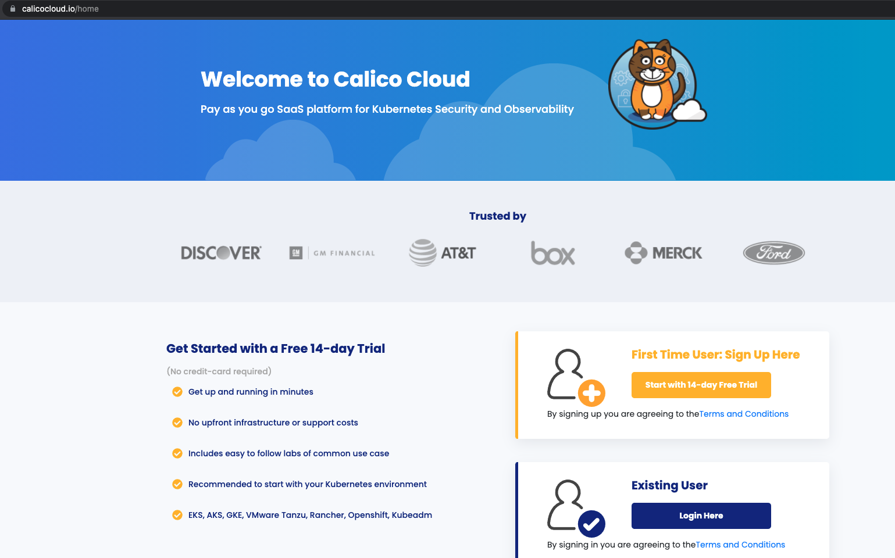
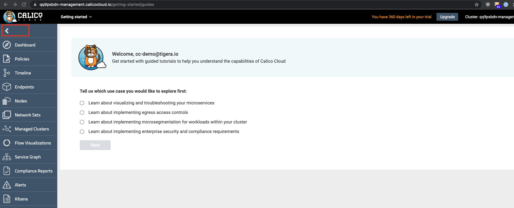

# Module 1: Joining AKS cluster to Calico Cloud

**Goal:** Join AKS cluster to Calico Cloud management plane.

IMPORTANT: In order to complete this module, you must have [Calico Cloud trial account](https://www.calicocloud.io/home). Issues with being unable to navigate menus in the UI are often due to browsers blocking scripts - please ensure you disable any script blockers.

## Steps

1. Navigate to [calicocloud](https://www.calicocloud.io/?utm_campaign=calicocloud&utm_medium=digital&utm_source=microsoft) and sign up for a 14 day trial account - no credit cards required. Returning users can login.

   

2. Upon signing into the Calico Cloud UI the Welcome screen shows four use cases which will give a quick tour for learning more. This step can be skipped. Tip: the menu icons on the left can be expanded to display the worded menu as shown:

   


3. Join AKS cluster to Calico Cloud management plane.
    
    Click the "Managed Cluster" in your left side of browser.
    
    
    Click on "connect cluster"
     

    choose AKS and click next
      


    run installation script in your aks cluster. 
    ```bash
    # script should look similar to this
    curl https://installer.calicocloud.io/xxxxxx_yyyyyyy-saay-management_install.sh | bash
    ```

    Joining the cluster to Calico Cloud can take a few minutes. Wait for the installation script to finish before you proceed to the next step.

    ```bash
    # output once your cluster join the calico cloud
    Install Successful

    Your Connected Cluster Name is arwb4wbh-management-managed-aksjesie2-aks-rg-jesie208-03cfb8-9713ae4f-hcp-eastus-azmk8s-io  
    ```
    Set the Calico Cluster Name as a variable to use later in this workshop. The Cluster Name can also be obtained from the Calico Cloud Web UI at a later date. For the example above `CALICOCLUSTERNAME` should be set to __arwb4wbh-management-managed-aksjesie2-aks-rg-jesie208-03cfb8-9713ae4f-hcp-eastus-azmk8s-io__
    
    ```bash
    export CALICOCLUSTERNAME=<Cluster Name>
    echo export CALICOCLUSTERNAME=$CALICOCLUSTERNAME >> ~/.bashrc
    ```
    

4. Configure log aggregation and flush intervals in aks cluster, we will use 60s instead of default value 300s for lab testing only.   

    ```bash
    kubectl patch felixconfiguration.p default -p '{"spec":{"flowLogsFlushInterval":"10s"}}'
    kubectl patch felixconfiguration.p default -p '{"spec":{"dnsLogsFlushInterval":"10s"}}'
    kubectl patch felixconfiguration.p default -p '{"spec":{"flowLogsFileAggregationKindForAllowed":1}}'
    ```

5. Configure Felix for log data collection in aks cluster

    ```bash
    kubectl patch felixconfiguration default --type='merge' -p '{"spec":{"policySyncPathPrefix":"/var/run/nodeagent","l7LogsFileEnabled":true}}'

    ```

6. Configure Felix to collect TCP stats - this uses eBPF TC program and requires miniumum Kernel version of v5.3.0. Further [documentation](https://docs.tigera.io/visibility/elastic/flow/tcpstats)

    ```bash
    kubectl patch felixconfiguration default -p '{"spec":{"flowLogsCollectTcpStats":true}}'
    ```

[Next -> Module 2](../modules/configuring-demo-apps.md)
