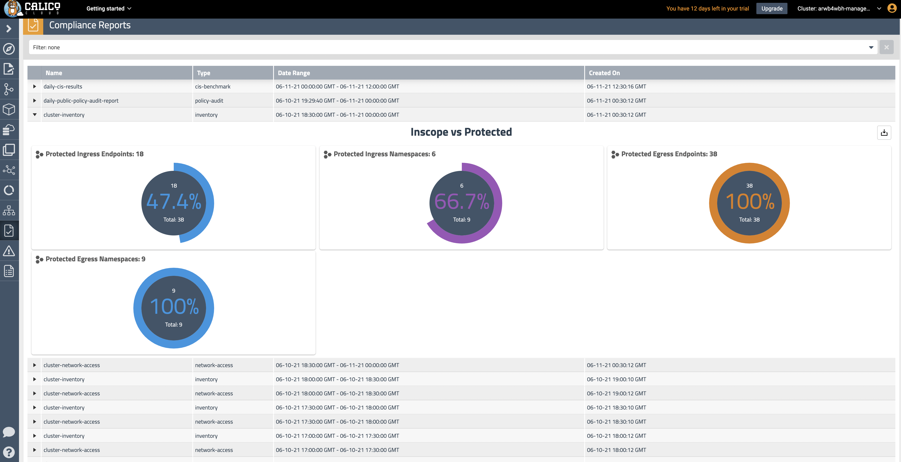

# Module 9: Using compliance reports

**Goal:** Use global reports to satisfy compliance requirementes.

## Steps

1. Use `Compliance Reports` view to see all generated reports.

    >We have deployed a few compliance reports in one of the first labs and by this time a few reports should have been already generated. 
    ```bash
    kubectl get globalreport                                                          
    NAME                     CREATED AT
    cluster-inventory        2021-06-10T03:24:07Z
    cluster-network-access   2021-06-10T03:24:07Z
    daily-cis-results        2021-06-10T03:24:05Z
    ```

    >If you don't see any reports, you can manually kick off report generation task. Follow the steps below if you need to do so.

    Calico provides `GlobalReport` resource to offer [Compliance reports](https://docs.tigera.io/compliance/compliance-reports/) capability. There are several types of reports that you can configure:

    - CIS benchmarks
    - Inventory
    - Network access
    - Policy audit


    A compliance report could be configured to include only specific endpoints leveraging endpoint labels and selectors. Each report has the `schedule` field that determines how often the report is going to be generated and sets the timeframe for the data to be included into the report.

    Compliance reports organize data in a CSV format which can be downloaded and moved to a long term data storage to meet compliance requirements.

    

2. Reports are generated 30 minutes after the end of the report as [documented](https://docs.tigera.io/v3.8/compliance/overview#change-the-default-report-generation-time). As the compliance reports deployed in the [manifests](https://github.com/tigera-solutions/calicocloud-aks-workshop/tree/main/demo/40-compliance-reports) are scheduled to run every 30 minutes the generation of reports will take between 30-60 mins depending when the manifests were deloyed.
<br>

*Congratulations on completing this workshop!*
Follow the cleanup instructions on the [main page](../README.md) if required
