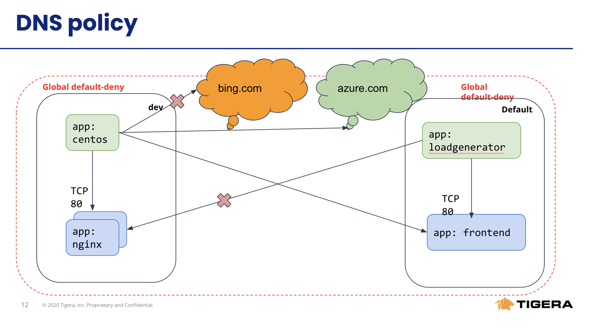

# Module 4: Using egress access controls with global networkset 

**Goal:** Configure egress access for specific workloads.

**Docs:** https://docs.projectcalico.org/archive/v3.20/reference/resources/globalnetworkset

## Steps

1. Test connectivity within the cluster and to the external endpoint.

    a. Test connectivity between `dev/centos` pod and `default/frontend` pod.

    ```bash
    # test connectivity from dev namespace to default namespace
    kubectl -n dev exec -t centos -- sh -c 'curl -m3 -sI http://frontend.default 2>/dev/null | grep -i http'
    ```

    b. Test connectivity from `dev/centos` to the external endpoint.

    ```bash
    # test connectivity from dev namespace to the Internet
    kubectl -n dev exec -t centos -- sh -c 'curl -m3 -sI http://www.bing.com 2>/dev/null | grep -i http'
    ```
    The access should be denied as the policies configured in previous module do not allow it.
   

2. Implement egress policy to allow egress access from a workload in one namespace, e.g. `dev/centos`, to a service in another namespace, e.g. `default/frontend`. A

    a. Deploy egress policy.

    ```bash
    kubectl apply -f demo/20-egress-access-controls/default-centos-to-frontend.yaml
    ```

    b. Test connectivity between `dev/centos` pod and `default/frontend` service.

    ```bash
    kubectl -n dev exec -t centos -- sh -c 'curl -m3 -sI http://frontend.default 2>/dev/null | grep -i http'
    ```

    The access should be allowed once the egress policy is in place.

    


3. Implement DNS policy to allow the external endpoint access from a specific workload, e.g. `dev/centos`.

    a. create a `GlobalNetworkSet` to allow external access to `*.azure.com` and apply it in `GlobalNetworkPolicy`.

    

    ```bash
    # deploy network set
    kubectl apply -f demo/20-egress-access-controls/netset.external-apis.yaml
    # deploy DNS policy using the network set
    kubectl apply -f demo/20-egress-access-controls/dns-policy.netset.yaml
    ```

   
    ```bash
    # test egress access to www.azure.com
    kubectl -n dev exec -t centos -- sh -c 'curl -m3 -skI https://www.azure.com 2>/dev/null | grep -i http'
    # test egress access to www.bing.com
    kubectl -n dev exec -t centos -- sh -c 'curl -m3 -skI https://www.bing.com 2>/dev/null | grep -i http'
    ```
    As access to `*.azure.com` is permitted and access to `*.bing.com` is denied we are able to whitelist domains as described next

     


[Next -> Module 5](../modules/using-observability-tools.md)
