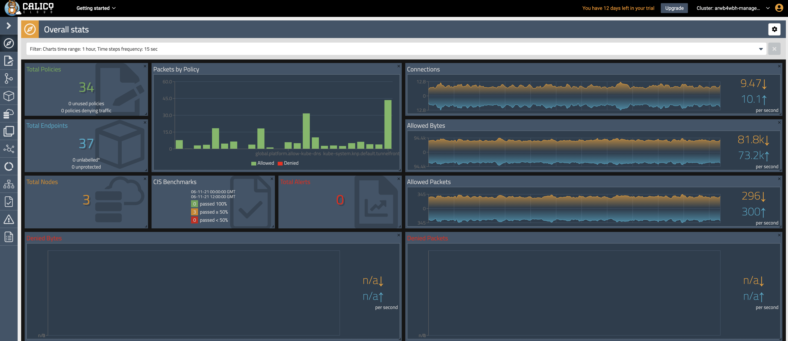
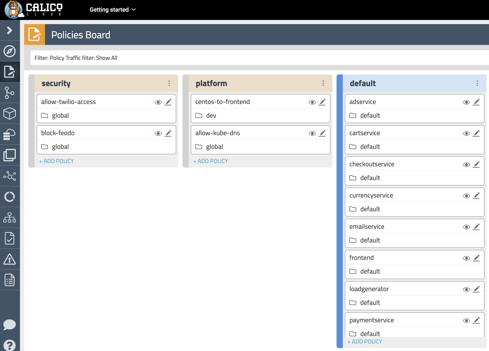
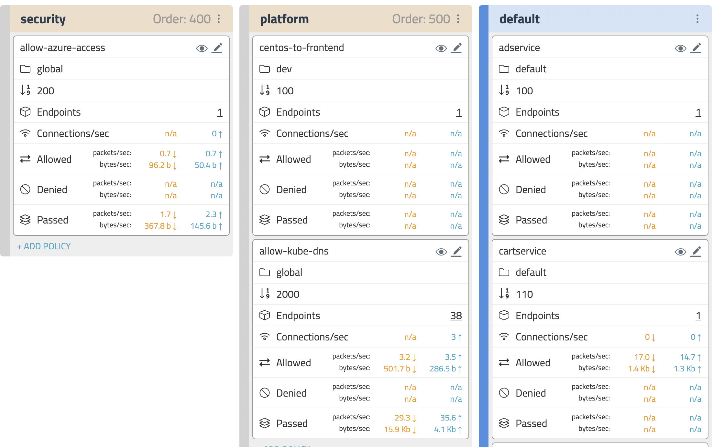
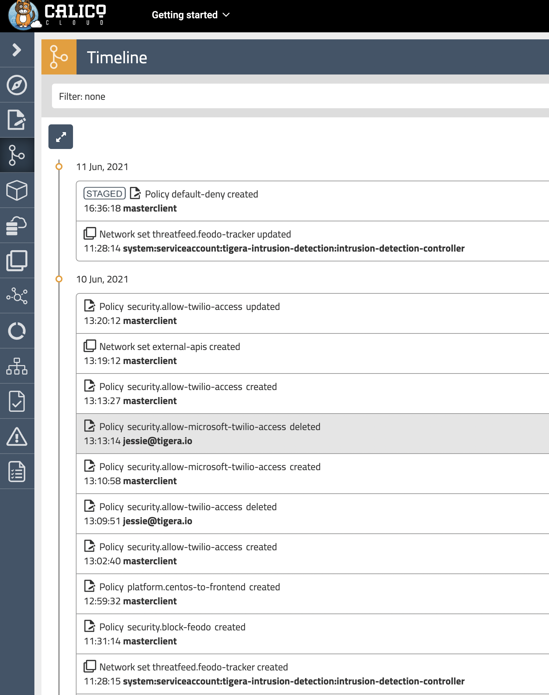
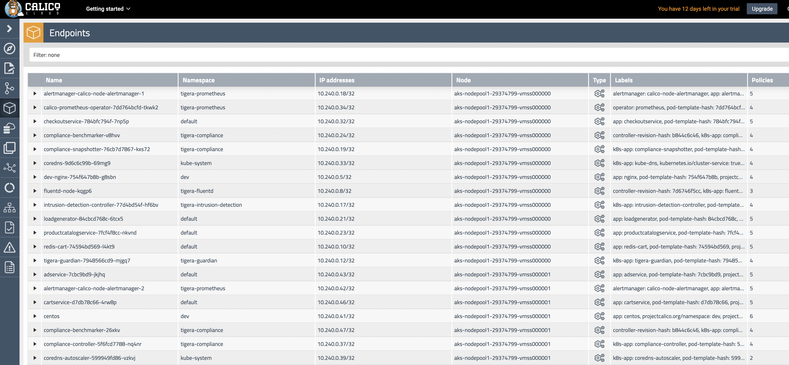
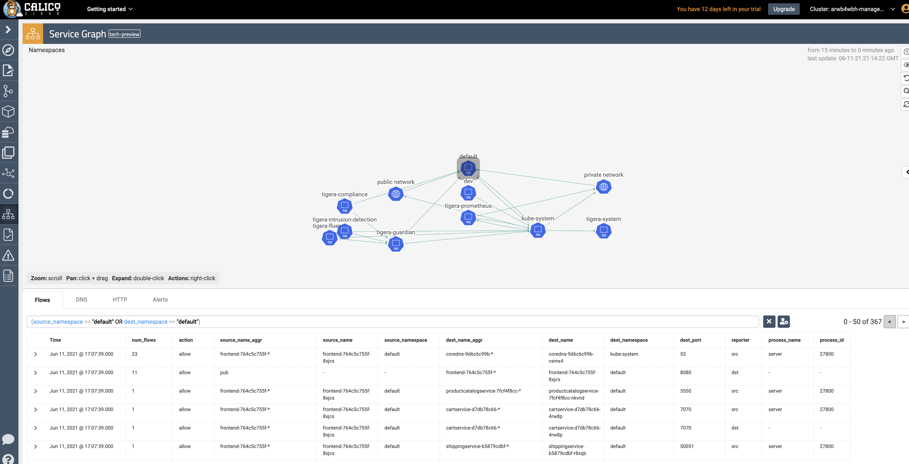
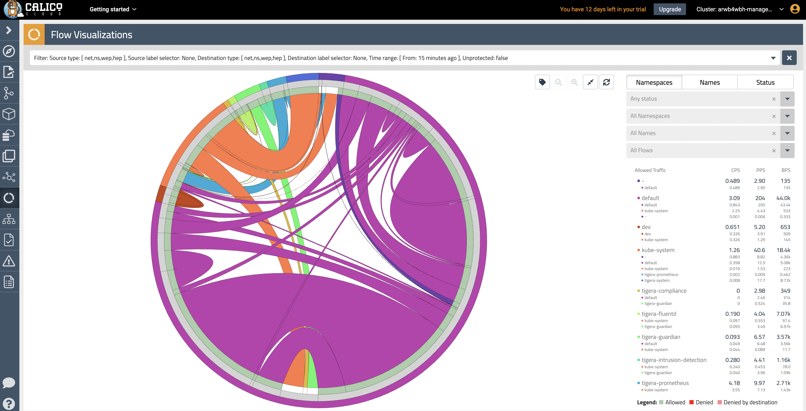
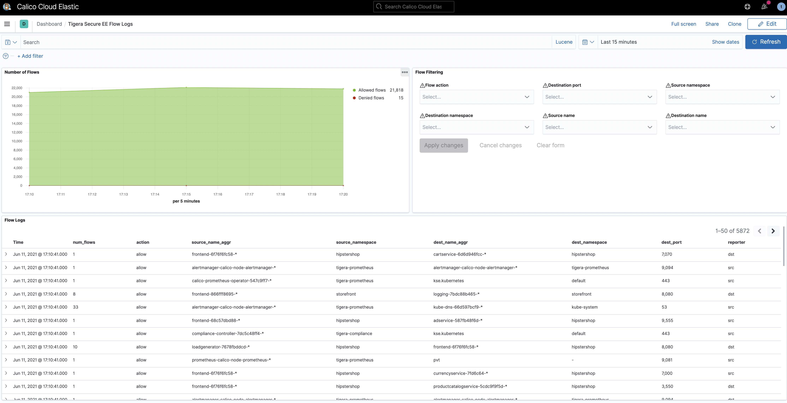

# Module 5: Using observability tools

**Goal:** Explore Calico observability tools.

## Calico observability tools

>If you are interested in enabling collection of application layer metrics for your workloads, refer to [Configure L7 logs](https://docs.tigera.io/visibility/elastic/l7/configure) documentation to enable application layer metrics collection.

1. Dashboard

    The `Dashboard` view in the Calicocloud Manager UI presents high level overview of what's going on in your cluster. The view shows the following information:

    - Connections, Allowed Bytes and Packets
    - Denied Bytes and Packets
    - Total number of Policies, Endpoints and Nodes
    - Summary of CIS benchmarks
    - Count of triggered alerts
    - Packets by Policy histogram that shows allowed and denied traffic as it is being evaluated by network policies

    

2. Policies Board

    The `Policies Board` shows all policies deployed in the cluster and organized into `policy tiers`. You can control what a user can see and do by configuring Kubernetes RBAC roles which determine what the user can see in this view. You can also use controls to hide away tiers you're not interested in at any given time.

    

    By leveraging stats controls you can toggle additional metrics to be listed for each shown policy.

    

3. Audit timeline

    The `Timeline` view shows audit trail of created, deleted, or modified resources.

    

4. Endpoints

    The `Endpoints` view lists all endpoints known to Calico. It includes all Kubernetes endpoints, such as Pods, as well as Host endpoints that can represent a Kubernetes host or an external VM or bare metal machine.

    

5. Service Graph

    The dynamic `Service Graph` presents network flows from service level perspective. Top level view shows how traffic flows between namespaces as well as external and internal endpoints.

    

    - When you select any node representing a namespace, you will get additional details about the namespace, such as incoming and outgoing traffic, policies evaluating each flow, and DNS metrics.
    - When you select any edge, you will get details about the flows representing that edge.
    - If you expand a namespace by double-clicking on it, you will get the view of all components of the namespace.

6. Flow Visualizations

    The `Flow Visualizations` view shows all point-to-point flows in the cluster. It allows you to see the cluster traffic from the network point of view.

    

7. Kibana dashboards

    The `Kibana` components comes with Calico cloud offerings and provides you access to raw flow, audit, and dns logs, as well as ability to visualize the collected data in various dashboards.

    When you login Kibana, you can choose a predefined dashboard or create your own, below is "Tigera Flow Logs" dashboard.

    

    Some of the default dashboards you get access to are DNS Logs, Flow Logs, Audit Logs, Kuernetes API calls, L7 HTTP metrics, and others.

[Next -> Module 6](../modules/using-compliance-reports.md)
