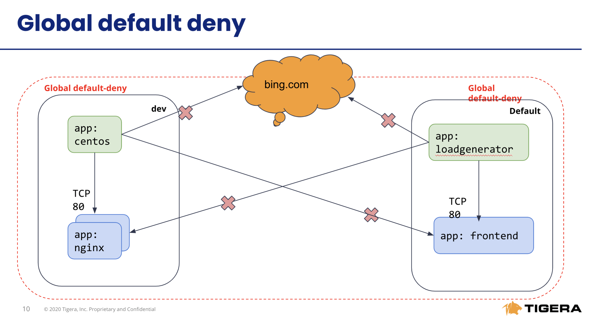

# Module 3: Using security controls with global network policies ( Calico OSS resource )

**Goal:** Leverage global network policies to segment connections within the AKS cluster.

**Docs:** https://docs.projectcalico.org/archive/v3.20/reference/resources/globalnetworkpolicy

## Steps


1. Test connectivity between application components and across application stacks, since we don't have network policy in place, the pods are reachable from any endpoints.

    a. Test connectivity between workloads within each namespace.

    ```bash
    # test connectivity within dev namespace
    kubectl -n dev exec -t centos -- sh -c 'curl -m3 -sI http://nginx-svc 2>/dev/null | grep -i http'

    # test connectivity within default namespace
    kubectl exec -it $(kubectl get po -l app=loadgenerator -ojsonpath='{.items[0].metadata.name}') -- sh -c 'curl -m3 -sI frontend 2>/dev/null | grep -i http'

    kubectl exec -it $(kubectl get po -l app=frontend -ojsonpath='{.items[0].metadata.name}') -c server -- sh -c 'nc -zv productcatalogservice 3550'
    ```

    b. Test connectivity across namespaces.

    ```bash
    # test connectivity from dev namespace to default namespace
    kubectl -n dev exec -t centos -- sh -c 'curl -m3 -sI http://frontend.default 2>/dev/null | grep -i http'

    # test connectivity from default namespace to dev namespace
    kubectl exec -it $(kubectl get po -l app=loadgenerator -ojsonpath='{.items[0].metadata.name}') -- sh -c 'curl -m3 -sI http://nginx-svc.dev 2>/dev/null | grep -i http'
    ```

    c. Test connectivity from each namespace to the Internet.

    ```bash
    # test connectivity from dev namespace to the Internet
    kubectl -n dev exec -t centos -- sh -c 'curl -m3 -sI http://www.bing.com 2>/dev/null | grep -i http'

    # test connectivity from default namespace to the Internet
    kubectl exec -it $(kubectl get po -l app=loadgenerator -ojsonpath='{.items[0].metadata.name}') -- sh -c 'curl -m3 -sI www.bing.com 2>/dev/null | grep -i http'
    ```

    All of these tests should succeed if there are no policies in place to govern the traffic for `dev` and `default` namespaces.


2. Apply network policies to control East-West traffic.

    ```bash
    # deploy dev policies
    kubectl apply -f demo/dev/policies.yaml

    # deploy boutiqueshop policies
    kubectl apply -f demo/boutiqueshop/policies.yaml
    ```
    
    Now as we have proper policies in place, we can deploy `default-deny` as global network policy moving closer to zero-trust security approach. 

    ```bash
    # apply enforcing default-deny policy manifest
    kubectl apply -f demo/10-security-controls/default-deny.yaml
    ```
    

3. Test connectivity with policies in place.

    This is the connection after we have network policy in place.
      


    a. The only connections between the components within each namespaces should be allowed as configured by the policies.

    ```bash
    # test connectivity within dev namespace
    kubectl -n dev exec -t centos -- sh -c 'curl -m3 -sI http://nginx-svc 2>/dev/null | grep -i http'

    # test connectivity within default namespace
    kubectl exec -it $(kubectl get po -l app=loadgenerator -ojsonpath='{.items[0].metadata.name}') -- sh -c 'curl -m3 -sI frontend 2>/dev/null | grep -i http'
    ```

    b. The connections across `dev` and `default` namespaces should be blocked by the global `default-deny` policy.

    ```bash
    # test connectivity from dev namespace to default namespace
    kubectl -n dev exec -t centos -- sh -c 'curl -m3 -sI http://frontend.default 2>/dev/null | grep -i http'

    # test connectivity from default namespace to dev namespace
    kubectl exec -it $(kubectl get po -l app=loadgenerator -ojsonpath='{.items[0].metadata.name}') -- sh -c 'curl -m3 -sI http://nginx-svc.dev 2>/dev/null | grep -i http'
    ```

    c. The connections to the Internet should be blocked by the configured policies.

    ```bash
    # test connectivity from dev namespace to the Internet
    kubectl -n dev exec -t centos -- sh -c 'curl -m3 -sI http://www.bing.com 2>/dev/null | grep -i http'

    # test connectivity from default namespace to the Internet
    kubectl exec -it $(kubectl get po -l app=loadgenerator -ojsonpath='{.items[0].metadata.name}') -- sh -c 'curl -m3 -sI www.bing.com 2>/dev/null | grep -i http'
    ```


    
[Next -> Module 4](../modules/using-egress-access-controls.md)
