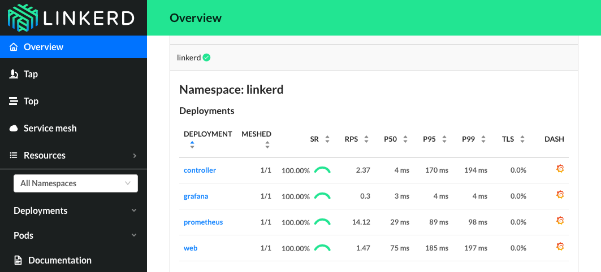

# Lab: Linkerd

Linkerd is a service sidecar designed to give service owners automatic observability, reliability, and runtime diagnostics for their service without requiring configuration or code changes. Linkerd is also a service mesh, running across an entire cluster to provide platform-wide telemetry, security, and reliability.

Linkerd is a graduated Cloud Native Computing Foundation (CNCF) project.

**This lab will focus on the v2 release of Linkerd**

## Prerequisites

* Complete previous labs:
    * [Azure Kubernetes Service](../../create-aks-cluster/README.md)
    * [Build Application Components in Azure Container Registry](../../build-application/README.md)
    * [Helm Setup and Deploy Application](../../helm-setup-deploy/README.md)

## Instructions

> Note: This lab uses a CLI tools that must be installed on your local machine. You will need to connect to your cluster from a local bash shell on your machine. (hint: use `az aks get-credentials` to setup access locally)

1. Remove the application pods/services from the cluster. We will re-deploy with linkerd.

    ```bash
    helm uninstall service-tracker-ui -n hackfest
    helm uninstall weather-api -n hackfest
    helm uninstall quakes-api -n hackfest
    helm uninstall flights-api -n hackfest
    helm uninstall data-api -n hackfest
    ```

1. Install linkerd CLI on your machine

    ```bash
    curl -sL https://run.linkerd.io/install | sh

    export PATH=$PATH:$HOME/.linkerd2/bin
    ```

    ```bash
    # verify CLI (ignore that the server version is unavailable)
    linkerd version
    
    Client version: stable-2.11.0
    Server version: unavailable
    ```

1. Validate your Kubernetes cluster

    ```bash
    linkerd check --pre

    ...

    Status check results are [ok]
    ```

1. Install linkerd server components into AKS

    ```bash
    linkerd install | kubectl apply -f -
    ```

1. Validate

    ```bash
    linkerd check

    ...

    Status check results are [ok]
    ```

1. Install viz extension

    ```bash
    linkerd viz install | kubectl apply -f - # install the on-cluster metrics stack
    ```

1. Open the Dashboard

    ```bash
    linkerd viz dashboard
    ```

    Browse the dashboard:

    

1. Use `helm template` to create manifest for injection

    ```bash
    helm template ./kubernetes-hackfest/charts/data-api > ./kubernetes-hackfest/data-api.yaml
    helm template ./kubernetes-hackfest/charts/flights-api > ./kubernetes-hackfest/flights-api.yaml
    helm template ./kubernetes-hackfest/charts/quakes-api > ./kubernetes-hackfest/quakes-api.yaml
    helm template ./kubernetes-hackfest/charts/weather-api > ./kubernetes-hackfest/weather-api.yaml
    helm template ./kubernetes-hackfest/charts/service-tracker-ui > ./kubernetes-hackfest/service-tracker-ui.yaml
    ```

1. Re-deploy application using `linkerd inject`

    ```bash
    linkerd inject ./kubernetes-hackfest/data-api.yaml | kubectl apply -n hackfest -f -
    linkerd inject ./kubernetes-hackfest/flights-api.yaml | kubectl apply -n hackfest -f -
    linkerd inject ./kubernetes-hackfest/quakes-api.yaml | kubectl apply -n hackfest -f -
    linkerd inject ./kubernetes-hackfest/weather-api.yaml | kubectl apply -n hackfest -f -
    linkerd inject ./kubernetes-hackfest/service-tracker-ui.yaml | kubectl apply -n hackfest -f -
    ```

1. Load test and review traffic in Dashboard

    > Note: There are a few ways we could create traffic on the API layer. You could create a load test pod in the cluster that hits the API's on internal IP addresses. Below is a simple setup just for lab purposes.

    * Expose one of the API's as a public IP

        ```bash
        kubectl patch svc flights-api -n hackfest -p '{"spec":{"type":"LoadBalancer"}}'
        ```

    * Get the IP address of one of your API's

        ```bash
        kubectl get svc flights-api -n hackfest
        
        NAME          TYPE        CLUSTER-IP    EXTERNAL-IP   PORT(S)    AGE
        flights-api   ClusterIP   10.0.75.165   13.10.293.100 3003/TCP   100s
        ```

    * Create a variable with the URL

        ```bash
        export APP_URL=http://<your_ip_address>:3003/status
        while true; do curl -o /dev/null -s -w "%{http_code}\n" $APP_URL; sleep 1; done
        ```

1. Try some other Linkerd features

* [Automating injection.](https://linkerd.io/2/tasks/automating-injection)
* [Setup mTLS encryption.](https://linkerd.io/2/features/automatic-mtls)
* [Routing and Service Profiles.](https://linkerd.io/2/features/service-profiles)
* [Server policy.](https://linkerd.io/2.11/features/server-policy/)

## Troubleshooting / Debugging

### Finding the bad path with Emojivoto

In this section you'll have to work out the solution on your own. Some steps have been provided but ultimately you'll need to use Linkerd to determine what's going wrong with your application.

1. Install emojivoto

    ```bash
    curl -sL https://run.linkerd.io/emojivoto.yml | linkerd inject - | kubectl apply -f -
    ```

2. Launch the Linkerd dashboard

    ```bash
    linkerd viz dashboard
    ```

    Browse the dashboard:

    

3. Figure out what's breaking emojivoto!

    * Sort namespaces by success rate
    * Go into the emojivoto namespace
    * Look at the application graph
    * Sort deployments by success rate
    * Browse to a deployment and view the live api calls
    * Can you see which component is the root of the issue?
    * Can you see which specific path is failing?

Still having trouble? View the step by step cli commands [here](debug-emojivoto.sh).

### Mitigate an issue with retries

In this section we will diagnose and repair an issue with a sample application using Linkerd's service profile resource.

1. Install Booksapp

    ```bash
    kubectl create ns booksapp

    curl -sL https://run.linkerd.io/booksapp.yml | kubectl -n booksapp apply -f -
    ```

2. Access the app
  
    You can do this a number of different ways, expose it via a load balancer, add a mapping for your ingress, or port-forward it via the cli. We will show how to get to it from the cli.

    ```bash
    kubectl -n booksapp port-forward svc/webapp 7000
    ```

   * Browse to localhost:7000
   * try adding a new book a few times and see if you run into an issue

3. Make some service profiles

    ```bash
    # Create our first service profile using a swagger file
    
    curl -sL https://run.linkerd.io/booksapp/webapp.swagger | linkerd -n booksapp profile --open-api - webapp

    # Inspect the resulting yaml

    # Begin applying service profiles

    curl -sL https://run.linkerd.io/booksapp/webapp.swagger | linkerd -n booksapp profile --open-api - webapp | kubectl -n booksapp apply -f -

    curl -sL https://run.linkerd.io/booksapp/authors.swagger | linkerd -n booksapp profile --open-api - authors | kubectl -n booksapp apply -f -

    curl -sL https://run.linkerd.io/booksapp/books.swagger | linkerd -n booksapp profile --open-api - books | kubectl -n booksapp apply -f -

    # Check out the new service profile objects

    kubectl get serviceprofile

    ```

4. Diagnose our app using serviceprofiles

    We're going to use the linkerd cli to inspect our routes. Routes come from service profiles and allow us to instrument things like retries.

    ```bash
    linkerd viz -n booksapp routes svc/webapp

    linkerd viz -n booksapp routes deploy/webapp --to svc/books

    linkerd viz -n booksapp routes deploy/books --to svc/authors
    ```

    * Those commands will show you the current status on the booksapp routes
    * Can you diagnose the issue by looking at the routes?
    * Continue to the next section once you see the problem or get bored of looking

5. Fix it with retries

    Now that we've diagnosed the issue we can repair it using serviceprofiles!

    ```bash

    # Edit the service profile for the authors service
    kubectl -n booksapp edit sp/authors.booksapp.svc.cluster.local

    # in the editor go down to the route named HEAD /authors/{id}.json and add a new value after the name.
    ## Add the following to the yaml at the same indent as name:
    ## isRetryable: true

    ```

    Now you should be able to watch booksapp begin succeeding on it's end to end calls. For more information along with a step by step video please see [this talk.](https://www.youtube.com/watch?v=YJ8zP-lqB5E)

## Docs / References

* [Linkerd on Github](https://github.com/linkerd/linkerd2)
* [Linkerd docs](https://linkerd.io/2.11/overview/)
* [Linkerd Slack community](slack.linkerd.io)
