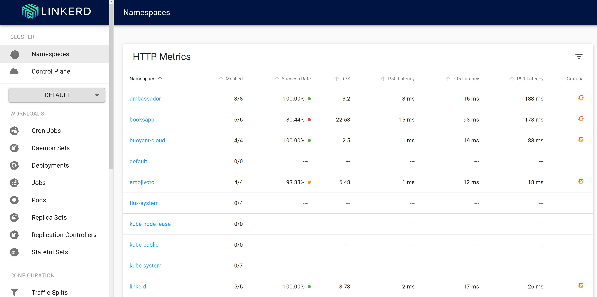

# Lab: Linkerd

Linkerd is a service sidecar designed to give service owners automatic observability, reliability, and runtime diagnostics for their service without requiring configuration or code changes. Linkerd is also a service mesh, running across an entire cluster to provide platform-wide telemetry, security, and reliability.

Linkerd is a Cloud Native Computing Foundation (CNCF) project.

**This lab will focus on the v2 release of Linkerd**

## Prerequisites

* Complete previous labs:
    * [Azure Kubernetes Service](../../create-aks-cluster/README.md)
    * [Build Application Components in Azure Container Registry](../../build-application/README.md)
    * [Helm Setup and Deploy Application](../../helm-setup-deploy/README.md)

## Instructions

> Note: This lab uses a CLI tools that must be installed on your local machine. You will need to connect to your cluster from a local bash shell on your machine. (hint: use `az aks get-credentials` to setup access locally)

1. Remove the application pods/services from the cluster. We will re-deploy with linkerd.

    ```bash
    helm delete --purge service-tracker-ui
    helm delete --purge weather-api
    helm delete --purge quakes-api
    helm delete --purge flights-api
    helm delete --purge data-api
    ```

2. Install linkerd CLI on your machine

    ```bash
    curl -sL https://run.linkerd.io/install | sh

    export PATH=$PATH:$HOME/.linkerd2/bin
    ```

    ```bash
    # verify CLI (ignore that the server version is unavailable)
    linkerd version
    
    Client version: stable-2.1.0
    Server version: unavailable
    ```

3. Validate your Kubernetes cluster

    ```bash
    linkerd check --pre

    kubernetes-api: can initialize the client..................................[ok]
    kubernetes-api: can query the Kubernetes API...............................[ok]
    kubernetes-api: is running the minimum Kubernetes API version..............[ok]
    kubernetes-setup: control plane namespace does not already exist...........[ok]
    kubernetes-setup: can create Namespaces....................................[ok]
    kubernetes-setup: can create ClusterRoles..................................[ok]
    kubernetes-setup: can create ClusterRoleBindings...........................[ok]
    kubernetes-setup: can create ServiceAccounts...............................[ok]
    kubernetes-setup: can create Services......................................[ok]
    kubernetes-setup: can create Deployments...................................[ok]
    kubernetes-setup: can create ConfigMaps....................................[ok]
    kubernetes-setup: can create CustomResourceDefinitions.....................[ok]
    linkerd-version: can determine the latest version..........................[ok]
    linkerd-version: cli is up-to-date.........................................[ok]

    Status check results are [ok]
    ```

4. Install linkerd server components into AKS

    ```bash
    linkerd install | kubectl apply -f -
    ```

5. Validate

    ```bash
    kubectl -n linkerd get deploy

    NAME                 DESIRED   CURRENT   UP-TO-DATE   AVAILABLE   AGE
    linkerd-controller   1         1         1            1           30m
    linkerd-grafana      1         1         1            1           30m
    linkerd-prometheus   1         1         1            1           30m
    linkerd-web          1         1         1            1           30m
    ```

6. Open the Dashboard

    ```bash
    linkerd dashboard
    ```

    Browse the dashboard:

    
    

7. Use `helm template` to create manifest for injection

    ```bash
    helm template ~/kubernetes-hackfest/charts/data-api > ~/kubernetes-hackfest/data-api.yaml
    helm template ~/kubernetes-hackfest/charts/flights-api > ~/kubernetes-hackfest/flights-api.yaml
    helm template ~/kubernetes-hackfest/charts/quakes-api > ~/kubernetes-hackfest/quakes-api.yaml
    helm template ~/kubernetes-hackfest/charts/weather-api > ~/kubernetes-hackfest/weather-api.yaml
    helm template ~/kubernetes-hackfest/charts/service-tracker-ui > ~/kubernetes-hackfest/service-tracker-ui.yaml
    ```

8. Re-deploy application using `linkerd inject`

    ```bash
    linkerd inject data-api.yaml | kubectl apply -n hackfest -f -
    linkerd inject flights-api.yaml | kubectl apply -n hackfest -f -
    linkerd inject quakes-api.yaml | kubectl apply -n hackfest -f -
    linkerd inject weather-api.yaml | kubectl apply -n hackfest -f -
    linkerd inject service-tracker-ui.yaml | kubectl apply -n hackfest -f -
    ```

9. Load Test and review traffic in Dashboard

    ```bash
    export APP_URL=http://168.62.169.76:3003/status
    while true; do curl -o /dev/null -s -w "%{http_code}\n" $APP_URL; sleep 1; done
    ```


## Troubleshooting / Debugging


## Docs / References

* [Linkerd on Github](https://github.com/linkerd/linkerd2)