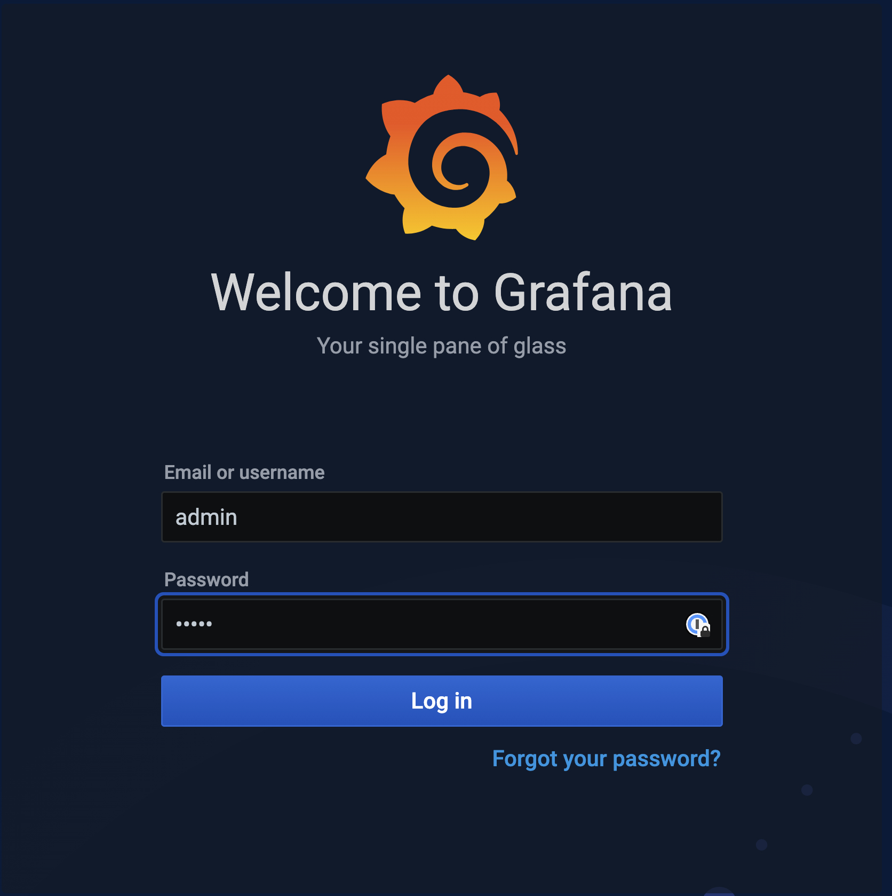
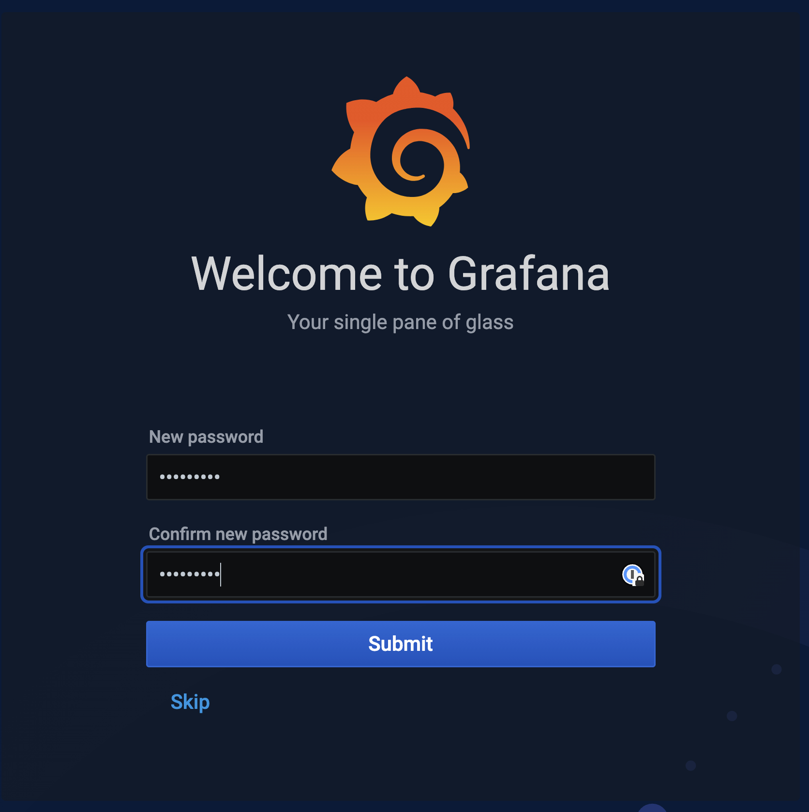
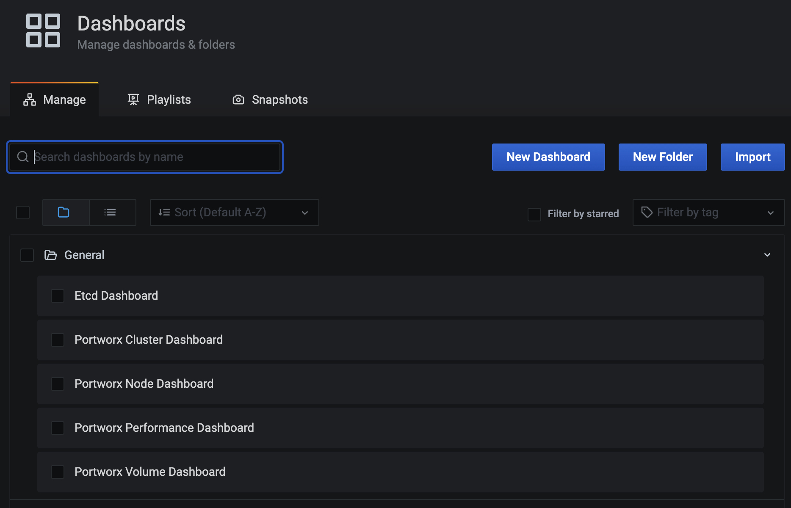
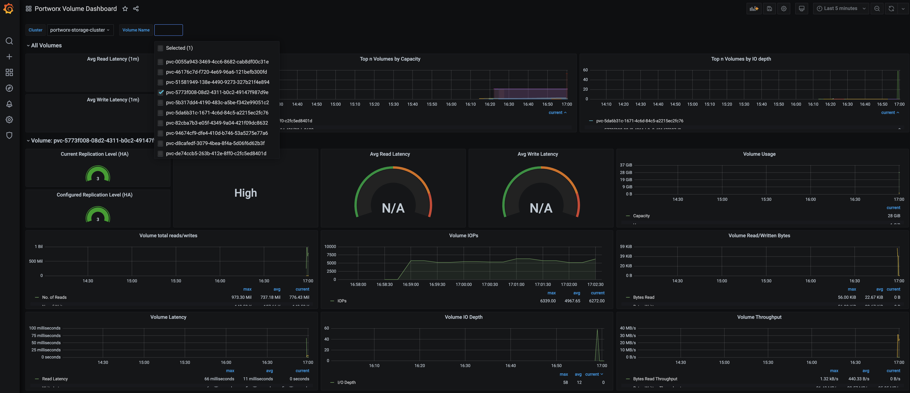
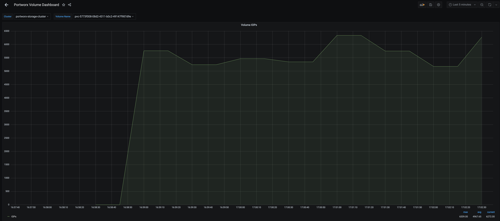
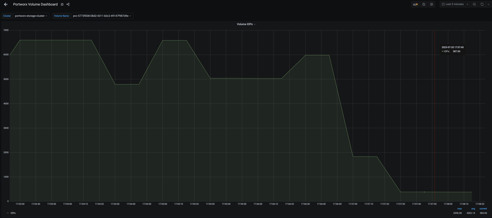

# Lab: Portworx

Portworx Enterprise is the Kubernetes storage and data platform trusted in production by the world’s leading enterprises. Portworx has been identified as the #1 Kubernetes storage solution four years in a row and provides capabilities like Kubernetes-native high availability and replication, unified storage layer for both block and file based persistent volumes, automated capacity management for stateful applications, Synchronous and Asynchronous disaster recovery solution for Kubernetes, and many more! 

**In this lab, we will use Portworx Enterprise 3.0 to walk through some of the capabilities Portworx delivers for AKS**

## Prerequisites

1. Deploy a new AKS cluster using [Azure Kubernetes Service](../../create-aks-cluster/README.md) running Kubernetes version 1.26.6. Don't need to walk through the `Namespaces Setup` section after AKS cluster creation on the create-aks-cluster page.

2. Create a custom role for Portworx. Enter the subscription ID using the subscription ID, also specify a role name:

``` bash
SUBSCRIPTIONID="$(az account show | grep id | awk '{ print $2 }' |  sed 's/\"//g' |  sed 's/\,//g')"
echo export SUBSCRIPTIONID=$SUBSCRIPTIONID >> ~/workshopvars.env
```

``` bash
az role definition create --role-definition '{
"Name": "px-role",
"Description": "Custom role for Portworx",
"AssignableScopes": [
    "/subscriptions/'$SUBSCRIPTIONID'"
],
"Actions": [
    "Microsoft.ContainerService/managedClusters/agentPools/read",
    "Microsoft.Compute/disks/delete",
    "Microsoft.Compute/disks/write",
    "Microsoft.Compute/disks/read",
    "Microsoft.Compute/virtualMachines/write",
    "Microsoft.Compute/virtualMachines/read",
    "Microsoft.Compute/virtualMachineScaleSets/virtualMachines/write",
    "Microsoft.Compute/virtualMachineScaleSets/virtualMachines/read"
],
"NotActions": [],
"DataActions": [],
"NotDataActions": []
}'
```

3. Find the AKS cluster infrastructure resource group, we will use this to create a new service principal in the next step:

``` bash
INFRARG="$(az aks show -n $CLUSTERNAME -g $RGNAME | jq -r '.nodeResourceGroup')"
echo export INFRARG=$INFRARG >> ~/workshopvars.env
```

4. Create a service principal for Portworx custom role:

``` bash
az ad sp create-for-rbac --role=px-role --scopes="/subscriptions/$SUBSCRIPTIONID/resourceGroups/$INFRARG" >> spdetails.json
```

``` bash
CLIENTID="$(cat spdetails.json | grep appId | awk '{ print $2 }' | sed 's/\"//g' |  sed 's/\,//g')"
echo export CLIENTID=$CLIENTID >> ~/workshopvars.env

CLIENTSECRET="$(cat spdetails.json | grep password | awk '{ print $2 }' | sed 's/\"//g' |  sed 's/\,//g')"
echo export CLIENTSECRET=$CLIENTSECRET >> ~/workshopvars.env

TENANTID="$(az account tenant list | grep tenantId | awk '{ print $2 }' | sed 's/\"//g' |  sed 's/\,//g')"
echo export TENANTID=$TENANTID >> ~/workshopvars.env
```

5. Create a secret called `px-azure` to give Portworx access to Azure APIs.

``` bash
kubectl create ns portworx

kubectl create secret generic -n portworx px-azure --from-literal=AZURE_TENANT_ID=$TENANTID --from-literal=AZURE_CLIENT_ID=$CLIENTID --from-literal=AZURE_CLIENT_SECRET=$CLIENTSECRET
```

## Deploying Portworx on AKS

Now that we have all the prereqs configured, we can proceed with Portworx installation. Portworx is deployed by first installing the Portworx Operator and then deploying a custom resource called the Portworx `StorageCluster`. Portworx Enterprise has a free 30 day trial that users can sign up by creating a new account on [Portworx Central](https://central.portworx.com/). For this workshop, we have a couple of `kubectl apply` commands, that will help us deploy the Operator and the Portworx StorageCluster. 

1. Deploy Portworx Operator

``` bash
kubectl apply -f 'https://install.portworx.com/3.0.0?comp=pxoperator&kbver=1.26.6&ns=portworx'
```

2. Deploy the Portworx StorageCluster

``` bash
kubectl apply -f 'https://install.portworx.com/3.0.0?operator=true&mc=false&kbver=1.26.6&ns=portworx&b=true&iop=6&s=%22type%3DPremium_LRS%2Csize%3D150%22&c=px-demo&aks=true&stork=true&csi=true&mon=true&tel=true&st=k8s&promop=true'
```

3. Monitor the deployment for Portworx

``` bash
watch kubectl get pods -n portworx -l name=portworx -o wide
```
It can take upto 5-7 mins for Portworx to be deployed. When all nodes are `Ready 2/2`, press `CTRL+C` to exit out of the watch command. 

4. Look at the Portworx status using the following command: 

``` bash
PX_POD=$(kubectl get pods -l name=portworx -n portworx -o jsonpath='{.items[0].metadata.name}')
kubectl -n portworx exec $PX_POD -c portworx -it -- /opt/pwx/bin/pxctl status
```

Now that we have Portworx installed on our AKS cluster, we will look at a few of the features that Portworx offers in the rest of the workshop. 

## Dynamic Volume provisioning for stateful applications

In this scenario, you’ll learn about Portworx Enterprise StorageClass parameters and deploy demo applications that use RWO (ReadWriteOnce) and RWX (ReadWriteMany) Persistent Volumes provisioned by Portworx Enterprise.

### Deploying Portworx Storage Classes

> Note: Change directories to the Portworx folder in your cloned repo: `cd kubernetes-hackfest/labs/storage/portworx/`

Portworx provides the ability for users to leverage a unified storage pool to dynamically provision both Block-based (ReadWriteOnce) and File-based (ReadWriteMany) volumes for applications running on your Kubernetes cluster without having to provision multiple CSI drivers/plugins, and without the need for specific backing storage devices!

#### Deploy StorageClass for Block (ReadWriteOnce) volumes

Run the following command to create a block-based StorageClass:

``` bash
kubectl create -f block-sc.yaml
```

PVCs provisioned using the above StorageClass will have a replication factor of 3, which means there will be three replicas of the PVC spread across the Kubernetes worker nodes.

#### Deploy StorageClass for File (ReadWriteMany) volumes

Let’s use the following command to apply this yaml file and deploy the StorageClass on our Kubernetes cluster:

``` bash
kubectl create -f file-sc.yaml
```

PVCs provisioned using the above StorageClass can be accessed by multiple pods at the same time (ReadWriteMany) and will have a replication factor of 2.
Use the following command to look at all the storage classes deployed on your cluster.

``` bash
kubectl get sc
```

### Deploying demo application for ReadWriteOnce volumes

1. In this step, we will deploy a demo application that provisions a MongoDB database that uses a ReadWriteOnce volume to store data.

``` bash 
kubectl create ns pxbbq
```

2.  Deploy the MongoDB backend components for our demo application. This will deploy a PersistentVolumeClaim using the `block-sc` storage class that we deployed in the previous step. 

``` bash
kubectl apply -f pxbbq-mongo.yaml
```

3. Deploy the frontend components for our demo application.

``` bash 
kubectl apply -f pxbbq-frontend.yaml
```

4. Monitor the application deployment using the following commands:

``` bash
watch kubectl get all -n pxbbq
```

When all the pods are running, use `CTRL+C` to exit the watch command. 

5. Access the demo application: 

Use the following commnad to fetch the LoadBalancer endpoint for the pxbbq-svc service in the demo namespace and navigate to it using a new browser tab.

``` bash 
kubectl get svc -n pxbbq pxbbq-svc
```

6. Interact with the Demo application
This demo application allows users to place orders that are saved in the backend MongoDB database. Use the following steps to register a new user and place a simple order.

- Click on Menu on the Top Right and select Register.


- Enter your first name, last name, email address and password. Click Register.


- Click on Menu on the Top Right and select Order.


- Select a Main Dish, Couple of Side dishes and a drink. Click Place Order.


- You can either click on the order confirmation, or navigate to Order History from the Top Right, to find your order.


Now that we have some data generated, let’s use the following command to inspect the MongoDB volume and look at the Portworx parameters configured for the volume:

``` bash 
PXBBQVOL=`kubectl get pvc -n pxbbq | grep mongodb-pvc | awk '{print $3}'`
kubectl exec -it $PX_POD -n portworx -- /opt/pwx/bin/pxctl volume inspect ${PXBBQVOL}
```

Observe how Portworx creates volume replicas, and spreads them across your Kubernetes worker nodes.
In this step, you saw how Portworx can dynamically provisions a highly available ReadWriteOnce persistent volume for your application.

### Deploying demo application for ReadWriteMany volumes

Portworx offers a sharedv4 service volume which allows applications to connect to the shared persistent volume either using a ClusterIP or a LoadBalancer endpoint. This is advantageous as even if one of the worker node goes down, the shared volume is still accessible without any interruption of the application utilizing the data on the shared volume.

1. Create the sharedservice namespace

``` bash
kubectl create ns sharedservice
```

2. Deploy the sharedv4 service PVC 

``` bash
kubectl apply -f sharedpvc.yaml -n sharedservice
```

3. Deploy the busybox pods using the following command: 

``` bash 
kubectl apply -f busyboxpod.yaml -n sharedservice
```

This creates a deployment using multiple simple busybox pods that have mounted and will constantly write to the shared persistent volume. It also deploys a single busybox pod that will constantly read from the shared persistent volume.

4. Inspect the volume

``` bash
BUSYBOXVOL=`kubectl get pvc -n sharedservice | grep px-sharedv4-pvc | awk '{print $3}'`
kubectl exec -it $PX_POD -n portworx -- /opt/pwx/bin/pxctl volume inspect ${BUSYBOXVOL}
```

Note that we have four pods accessing the RWX volume for our demo!

5. Describe the sharedv4service endpoint

``` bash
kubectl describe svc -n sharedservice
```

Applications can mount the RWX using the ClusterIP (IP) and Portworx will automatically redirect it to one of the worker nodes in your cluster. The Endpoint in the output is the current node, but in case of that node going down, Portworx will automatically route the traffic using a different node endpoint, without the user having to reboot/restart the application pods.

6. Inspect the log file to ensure that there was no application interruption due to node failure

``` bash
kubectl logs shared-demo-reader -n sharedservice
```
You’ve just deployed applications with different needs on the same Kubernetes cluster without the need to install multiple CSI drivers/plugins, and it will function exactly the same way no matter what backing storage you provide for Portworx Enterprise to use!

### Wrap up this section
Use the following commands to delete objects used for this scenario

``` bash
kubectl delete -f busyboxpod.yaml -n sharedservice
kubectl delete -f sharedpvc.yaml -n sharedservice
kubectl delete ns sharedservice
kubectl wait --for=delete ns/sharedservice --timeout=60s
```

## Protecting your data using VolumeSnapshots and GroupVolumeSnapshots

Portworx allows you to take standard snapshots of your persistent volumes on a per-volume basis, but also gives you the capability to take group snapshots if you have persistence across multiple volumes to enable application-consistent snapshots.

In this scenario, you will:

1. Perform a single volume snapshot and restore
2. Configure pre and post snapshot rules to quiesce an application
3. Perform a group volume snapshot and restore, utilizing the pre and post rules

### Working with single volume snapshots

Before we take volume snapshots, let’s navigate to the application UI that we deployed in the previous step, and verify that we can see order that we placed in the previous section. To find the LoadBalancer endpoint for our demo application, use the following command:

``` bash 
kubectl get svc -n pxbbq pxbbq-svc
```

Navigate to the application and login as the Demo user and look at the Order History


1. Create volumesnapshot for the MongoDB volume. 

``` bash 
cat mongo-snapshot.yaml

kubectl apply -f mongo-snapshot.yaml
```

And let’s look at the snapshot object:
``` bash
kubectl get stork-volumesnapshots,volumesnapshotdatas -n pxbbq
```

2. Accidently “Drop Table” in your MongoDB database

Let’s delete the data within our MongoDB DB by exec’ing into the pod:
``` bash
MONGOPOD=$(kubectl get pods -l app.kubernetes.io/name=mongo -n pxbbq | grep 1/1 | awk '{print $1}')
kubectl exec -it $MONGOPOD -n pxbbq -- mongosh --quiet
```
And then drop our table:

``` bash
use admin
db.auth('porxie','porxie')
show dbs
use porxbbq
db.dropDatabase()
```
Use the `quit` command to exit out of the mongodb pod.

3. Verify data has been deleted

Navigate to the Portworx BBQ App using the LoadBalancer endpoint, you should not see your order from order history.


4. Restore our application from snapshot by creating a new PVC from our snapshot. 

``` bash
kubectl apply -f pvc-from-snap.yaml -n pxbbq
```

``` bash 
kubectl get pvc px-mongo-snap-clone -n pxbbq
```

5. Redeploy the Demo application using the following command: 

``` bash
kubectl delete -f pxbbq-mongo.yaml
```
``` bash
kubectl apply -f pxbbq-mongo-restore.yaml
```

6. Verify the application has been completely restored

Access the application by navigating to the LoadBalancer endpoint and refreshing the page. Our original order will be back in our order history. If you need to find your LoadBalancer endpoint, use the following command:

``` bash
kubectl get svc -n pxbbq pxbbq-svc
```


In this step, we took a snapshot of the persistent volume, deleted the database table and then restored our application by restoring the persistent volume using the snapshot!

### Portworx Group Volume Snapshots

In this step, we will look at how you can use Portworx Group Volume Snapshots and 3D snapshots - to take application consistent multi-PVC snapshots for your application.

1. Create a new StorageClass for GroupVolumeSnapshots. 

``` bash 
kubectl apply -f group-sc.yaml
```

2. Create a new namespace for MySQL

``` bash 
kubectl create ns mysql
```

3. Create a pre-snap and post-snap rules for MySQL

Portworx allows users to specify pre- and post-snapshot rules to ensure that the snapshots are application consistent and not crash consistent. For this example, we are creating a pre-snapshot and a post-snapshot rule for MySQL that we will use when we take a group volume snapshot.

Review the yaml for the snapshot rule:

``` bash
cat mysql-presnap-rule.yaml

cat mysql-postsnap-rule.yaml
```

Let’s apply both the rules:

``` bash 
kubectl apply -f mysql-presnap-rule.yaml -n mysql
kubectl apply -f mysql-postsnap-rule.yaml -n mysql
``` 

4. Deploy MySQL statefulset, service, and secret in the mysql namespace

``` bash 
kubectl apply -f mysql-app.yaml -n mysql
```

Watch until you see the three mysql pods, one mysql-client pod are up and running

``` bash 
watch kubectl get pods,pvc,sts,svc,secret -n mysql
```
Note: use CTRL+C to exit out of the watch command once all the pods are running.

5. Interacting with MySQL
Let’s exec into the mysql-client pod and create a new portworx database and a new features table in that database.

``` bash
kubectl exec mysql-client -n mysql -- apk add mysql-client
```

``` bash 
oc exec mysql-client -n mysql -it -- sh
mysql -u root -p --password=password -h mysql-set-0.mysql.mysql.svc.cluster.local
create database portworx;
show databases;

use portworx;

CREATE TABLE features (id varchar(255), name varchar(255), value varchar(255));
INSERT INTO features (id, name, value) VALUES ('px-1', 'snapshots', 'point in time recovery!');
INSERT INTO features (id, name, value) VALUES ('px-2', 'cloudsnaps', 'backup/restore to/from any cloud!');
INSERT INTO features (id, name, value) VALUES ('px-3', 'STORK', 'convergence, scale, and high availability!');
INSERT INTO features (id, name, value) VALUES ('px-4', 'share-volumes', 'better than NFS, run wordpress on k8s!');
INSERT INTO features (id, name, value) VALUES ('px-5', 'DevOps', 'your data needs to be automated too!');

SELECT * FROM features;

quit
exit
```

6. Create and deploy a GroupVolumeSnapshot for MySQL

``` bash 
cat mysql-groupsnapshot.yaml

kubectl apply -f mysql-groupsnapshot.yaml -n mysql
```

Note that once the snapshots have completed successfully, you should see Snapshot created successfully and it is ready for all mysql volumes in the kubectl describe output:

``` bash 
kubectl get groupvolumesnapshot -n mysql
kubectl describe groupvolumesnapshot mysql-group-snapshot -n mysql
``` 

7. Drop the Portworx database from MySQL

Let’s drop our Portworx database, and see if we can recover it from our group volume snapshots.

``` bash 
kubectl exec mysql-client -n mysql -it -- sh
mysql -u root -p --password=password -h mysql-set-0.mysql.mysql.svc.cluster.local

DROP database portworx;
quit

exit
```

Now, that we have dropped the Portworx database, let’s see how we can restore our data.

We will start by deleting the mysql statefulset, Creating new PVCs using the snapshots we created earlier, and then redeploying the mysql statefulset.

``` bash 
kubectl delete sts mysql-set -n mysql
```

And let’s get the snapshot names and assign them into variables

``` bash
SNAP0=$(kubectl get volumesnapshotdatas.volumesnapshot.external-storage.k8s.io -n mysql | grep mysql-group-snapshot-mysql-store-mysql-set-0 | awk '{print $1}')
SNAP1=$(kubectl get volumesnapshotdatas.volumesnapshot.external-storage.k8s.io -n mysql | grep mysql-group-snapshot-mysql-store-mysql-set-1 | awk '{print $1}')
SNAP2=$(kubectl get volumesnapshotdatas.volumesnapshot.external-storage.k8s.io -n mysql | grep mysql-group-snapshot-mysql-store-mysql-set-2 | awk '{print $1}')
```

Now let’s create a new yaml file for our PVC objects that will be deployed from our snapshots:

``` bash
kubectl apply -f restoregrouppvc.yaml -n mysql
```

Inspect the PVCs deployed from the snapshots

``` bash
kubectl get pvc -n mysql
```

Once you have these PVCs deployed, you can redeploy the MySQL statefulset.

``` bash
kubectl apply -f mysql-restore-app.yaml -n mysql
```

Inspect the Pods and PVCs deployed to restore our mysql instance:

``` bash
watch kubectl get pods,pvc -n mysql
```

8. Inspect the MySQL instance

Let’s verify that all of our data was restored:

``` bash
kubectl exec mysql-client -n mysql -it -- sh
mysql -u root -p --password=password -h mysql-set-0.mysql.mysql.svc.cluster.local
use portworx;
select * from features;

quit

exit
```

As you can see, our data has been successfully restored and is consistent due to our pre-snapshot and post-snapshot commands executed prior and post the group volume snapshot!

That’s how easy it is to use Portworx snapshots, groupsnapshots and 3Dsnapshots to create application consistent snapshots for your applications running on Kubernetes.

### Wrap up this section
Use the following commands to delete objects used for this specific scenario:

``` bash 
kubectl delete -f mysql-app.yaml -n mysql
kubectl delete -f restoregrouppvc.yaml -n mysql
kubectl delete -f mysql-groupsnapshot.yaml -n mysql
kubectl delete -f mysql-restore-app.yaml -n mysql
kubectl delete -f mongo-snapshot.yaml
kubectl delete -f pxbbq-mongo-restore.yaml -n pxbbq
kubectl delete -f pxbbq-frontend.yaml -n pxbbq
kubectl delete ns pxbbq
kubectl delete ns mysql
kubectl wait --for=delete ns/pxbbq --timeout=60s
kubectl wait --for=delete ns/mysql --timeout=60s
```

## No More Noisy Neighbors on OpenShift using Portworx Application IO Control

In this module, we will use Portworx Application I/O control to dynamically update Read and Write IOPS limits to avoid noisy neighbor scenarios where applications sharing a Kubernetes cluster starve for storage resources. Keep in mind you can also limit bandwidth to a persistent volume using Application I/O Control with Portworx, not just IOPS!

1. Configuring Grafana Dashboards for Portworx
Enter the following commands to download the Grafana dashboard and datasource configuration files

``` bash
curl -O https://docs.portworx.com/samples/k8s/pxc/grafana-dashboard-config.yaml
sleep 3
curl -O https://docs.portworx.com/samples/k8s/pxc/grafana-datasource.yaml
```

Create a configmap for the dashboard and data source:

``` bash
kubectl -n portworx create configmap grafana-dashboard-config --from-file=grafana-dashboard-config.yaml
kubectl -n portworx create configmap grafana-source-config --from-file=grafana-datasource.yaml
```

Download and install Grafana dashboards using the following commands:

``` bash
curl "https://docs.portworx.com/samples/k8s/pxc/portworx-cluster-dashboard.json" -o portworx-cluster-dashboard.json && \
curl "https://docs.portworx.com/samples/k8s/pxc/portworx-node-dashboard.json" -o portworx-node-dashboard.json && \
curl "https://docs.portworx.com/samples/k8s/pxc/portworx-volume-dashboard.json" -o portworx-volume-dashboard.json && \
curl "https://docs.portworx.com/samples/k8s/pxc/portworx-performance-dashboard.json" -o portworx-performance-dashboard.json && \
curl "https://docs.portworx.com/samples/k8s/pxc/portworx-etcd-dashboard.json" -o portworx-etcd-dashboard.json
```

``` bash
kubectl -n portworx create configmap grafana-dashboards \
--from-file=portworx-cluster-dashboard.json \
--from-file=portworx-performance-dashboard.json \
--from-file=portworx-node-dashboard.json \
--from-file=portworx-volume-dashboard.json \
--from-file=portworx-etcd-dashboard.json
```

Deploy Grafana components using the following command: 

``` bash
kubectl apply -f grafana.yaml
```

Wait till Grafana is up and running

``` bash
watch kubectl get pods -n portworx -l app=grafana
``` 
Use `CTRL+C` to exit out of the watch command.

2. Downloading Kubestr and generating I/O using Kubestr

``` bash 
wget https://github.com/kastenhq/kubestr/releases/download/v0.4.36/kubestr_0.4.36_Linux_amd64.tar.gz
sleep 5
tar -xvf kubestr_0.4.36_Linux_amd64.tar.gz
```

``` bash
./kubestr fio -z 30G -s block-sc -f /tmp/rand-write.fio -o json -e /tmp/rand-RW-WL.json >& /dev/null &
```

3. Inpect PVC
``` bash
kubectl get pvc
```

4. Portworx Volume Dashboard using Grafana

Use the following command to access the LoadBalancer endpoint for the Grafana instance we deployed earlier.

``` bash 
kubectl get svc -n portworx grafana-svc
```

Navigate to the LoadBalancer endpoint and append :3000 at the end. Log in using admin/admin credentials. You will be prompted to set a new password for Grafana. You can set it to Password!. If you use anything else as a password, please remember it - or you may not be able to access Grafana in upcoming modules if desired!



Once logged in, find the Portworx Volume Dashboard by navigating to left pane –> Dashboards –> Manage –> Portworx Volume Dashboard



On the Volume Dashboard, find your persistent volume using the PVC ID from Step 3 above in the Volume Name drop down.


After you have selected the right volume, find the Volume IOPS pane, click View from the dropdown, and then change the timeline view to last 5 mins (defaults to last 3 hours) using the drop down box in the upper right corner of Grafana.

You should see the current IOPS load on the volume is more than 5000.


5. Update the IOPS limits for the PVC
Let’s get our volume ID:

``` bash
KubestrVol=$(kubectl exec -it $PX_POD -n portworx -- /opt/pwx/bin/pxctl volume list | grep "28 GiB" | awk '{print $2}' )
```
Then inspect the volume using the command:
``` bash
kubectl exec -it $PX_POD -n portworx -- /opt/pwx/bin/pxctl volume inspect ${KubestrVol}
```

Next, let’s update the MAX Read and Write IOPS for the volume to 750 IOPS:

``` bash
kubectl exec -it $PX_POD -n portworx -- /opt/pwx/bin/pxctl volume update --max_iops 750,750 ${KubestrVol}
```

After updating the volume, we can observe the new IOPS settings via pxctl:

``` bash
kubectl exec -it $PX_POD -n portworx -- /opt/pwx/bin/pxctl volume inspect ${KubestrVol}
```

6. Monitor the updated IOPS numbers using Portworx Volume Dashboard
Navigate back to the Grafana UI and find the Volume IOPS pane for our volume again. You should see the current IOPS number is now set to below 750.


Note: Grafana takes a couple of minute to reflect the changes, so if you dont see the drop in IOPS right away, wait a couple of minutes and refresh the page again.

That’s how you can use Portworx Application IO control to ensure a single application doesn’t consume all the resources available to the cluster and cause a noisy neighbor issue!

### Wrap up this section
Use the following commands to delete objects used for this specific scenario:

``` bash 
kubectl delete pods --all
kubectl delete pvc --all
kubectl wait --for=delete pvc/all --timeout=60s
rm grafana-dashboard-config.yaml
rm grafana-datasource.yaml
rm portworx-cluster-dashboard.json
rm portworx-node-dashboard.json
rm portworx-volume-dashboard.json
rm portworx-performance-dashboard.json
rm portworx-etcd-dashboard.json
rm /tmp/grafana.yaml
```

## Automated storage capacity management using Portworx Autopilot

Portworx Autopilot is a rule-based engine that responds to changes from a monitoring source. Autopilot allows you to specify monitoring conditions along with actions it should take when those conditions occur.

1. Configure Autopilot Rule

Autopilot rules allow users to create IFTTT (IF This Then That) rules, where Autopilot will monitor for a condition and then perform an action on your behalf. 

Let’s create a simple rule that will monitor persistent volumes associated with objects that have the app: postgres label and in namespaces that have the label `type: db`. If capacity usage grows to or above 20%, it will automatically grow the persistent volume and underlying filesystem by 20% of the current volume size, up to a maximum volume size of 50Gi:

Keep in mind, an AutoPilot Rule has 4 main parts.
* Selector Matches labels on the objects that the rule should monitor.
* Namespace Selector Matches labels on the Kubernetes namespaces the rule should monitor. This is optional, and the default is all namespaces.
* Conditions The metrics for the objects to monitor.
* Actions to perform once the metric conditions are met.

``` bash 
cat autopilotrule.yaml
```

``` bash 
kubectl create -f autopilotrule.yaml
```

2. Create a namespace for demo application

Since our Portworx Autopilot rule only targets namespaces that have the label type: db, let’s create the yaml for the namespace:

``` bash
kubectl apply -f namespaces.yaml
```

3. Deploy Postgres App for testing Portworx Autopilot

Let's deploy PVCs for our Postgres deployment:

``` bash
kubectl apply -f autopilot-postgres.yaml -n pg1
```

Next, let’s deploy our Postgres and pgbench pods:

``` bash 
kubectl apply -f autopilot-app.yaml -n pg1
```

Verify that the application is deployed and pgbench is writing data to the postgres database.

``` bash 
kubectl get pods,pvc -n pg1
```

``` bash
POSTGRES_POD=$(kubectl get pods -n pg1 | grep 2/2 | awk '{print $1}')

kubectl logs $POSTGRES_POD -n pg1 pgbench
```

4. Observe the Portworx Autopilot events

Wait for a couple of minutes and run the following command to observe the state changes for Portworx Autopilot:

``` bash
watch kubectl get events --field-selector involvedObject.kind=AutopilotRule,involvedObject.name=volume-resize --all-namespaces --sort-by .lastTimestamp
```

You will see Portworx Autopilot move through the following states as it monitors volumes and takes actions defined in Portworx Autopilot rules:
1. Initializing (Detected a volume to monitor via applied rule conditions)
2. Normal (Volume is within defined conditions and no action is necessary)
3. Triggered (Volume is no longer within defined conditions and action is necessary)
4. ActiveActionsPending (Corrective action is necessary but not executed yet)
5. ActiveActionsInProgress (Corrective action is under execution)
6. ActiveActionsTaken (Corrective action is complete)

Once you see ActiveActionsTaken in the event output, click CTRL+C to exit the watch command.

5. Verify the Volume Expansion
Now let’s take a look at our PVCs - note the automatic expansion of the volume occurred with no human interaction and no application interruption:

``` bash
kubectl get pvc -n pg1
```

You’ve just configured Portworx Autopilot and observed how it can perform automated capacity management based on rules you configure, and be able to “right size” your underlying persistent storage as it is needed!

### Wrap up this module
Use the following commands to delete objects used for this specific scenario:

``` bash
kubectl delete -f autopilot-app.yaml -n pg1
kubectl delete -f autopilot-postgres.yaml -n pg1
kubectl delete -f autopilotrule.yaml
kubectl delete -f namespaces.yaml
kubectl wait --for=delete ns/pg1 --timeout=60s
```


> Note: This lab uses a CLI tools that must be installed on your local machine. You will need to connect to your cluster from a local bash shell on your machine. (hint: use `az aks get-credentials` to setup access locally)

1. Remove the application pods/services from the cluster. We will re-deploy with linkerd.

    ```bash
    helm uninstall service-tracker-ui -n hackfest
    helm uninstall weather-api -n hackfest
    helm uninstall quakes-api -n hackfest
    helm uninstall flights-api -n hackfest
    helm uninstall data-api -n hackfest
    ```

1. Install linkerd CLI on your machine

    ```bash
    curl -sL https://run.linkerd.io/install | sh

    export PATH=$PATH:$HOME/.linkerd2/bin
    ```

    ```bash
    # verify CLI (ignore that the server version is unavailable)
    linkerd version
    
    Client version: stable-2.11.0
    Server version: unavailable
    ```

1. Validate your Kubernetes cluster

    ```bash
    linkerd check --pre

    ...

    Status check results are [ok]
    ```

1. Install linkerd server components into AKS

    ```bash
    linkerd install | kubectl apply -f -
    ```

1. Validate

    ```bash
    linkerd check

    ...

    Status check results are [ok]
    ```

1. Install viz extension

    ```bash
    linkerd viz install | kubectl apply -f - # install the on-cluster metrics stack
    ```

1. Open the Dashboard

    ```bash
    linkerd viz dashboard
    ```

    Browse the dashboard:

    

1. Use `helm template` to create manifest for injection

    ```bash
    helm template ./kubernetes-hackfest/charts/data-api > ./kubernetes-hackfest/data-api.yaml
    helm template ./kubernetes-hackfest/charts/flights-api > ./kubernetes-hackfest/flights-api.yaml
    helm template ./kubernetes-hackfest/charts/quakes-api > ./kubernetes-hackfest/quakes-api.yaml
    helm template ./kubernetes-hackfest/charts/weather-api > ./kubernetes-hackfest/weather-api.yaml
    helm template ./kubernetes-hackfest/charts/service-tracker-ui > ./kubernetes-hackfest/service-tracker-ui.yaml
    ```

1. Re-deploy application using `linkerd inject`

    ```bash
    linkerd inject ./kubernetes-hackfest/data-api.yaml | kubectl apply -n hackfest -f -
    linkerd inject ./kubernetes-hackfest/flights-api.yaml | kubectl apply -n hackfest -f -
    linkerd inject ./kubernetes-hackfest/quakes-api.yaml | kubectl apply -n hackfest -f -
    linkerd inject ./kubernetes-hackfest/weather-api.yaml | kubectl apply -n hackfest -f -
    linkerd inject ./kubernetes-hackfest/service-tracker-ui.yaml | kubectl apply -n hackfest -f -
    ```

1. Load test and review traffic in Dashboard

    > Note: There are a few ways we could create traffic on the API layer. You could create a load test pod in the cluster that hits the API's on internal IP addresses. Below is a simple setup just for lab purposes.

    * Expose one of the API's as a public IP

        ```bash
        kubectl patch svc flights-api -n hackfest -p '{"spec":{"type":"LoadBalancer"}}'
        ```

    * Get the IP address of one of your API's

        ```bash
        kubectl get svc flights-api -n hackfest
        
        NAME          TYPE        CLUSTER-IP    EXTERNAL-IP   PORT(S)    AGE
        flights-api   ClusterIP   10.0.75.165   13.10.293.100 3003/TCP   100s
        ```

    * Create a variable with the URL

        ```bash
        export APP_URL=http://<your_ip_address>:3003/status
        while true; do curl -o /dev/null -s -w "%{http_code}\n" $APP_URL; sleep 1; done
        ```

1. Try some other Linkerd features

* [Automating injection.](https://linkerd.io/2/tasks/automating-injection)
* [Setup mTLS encryption.](https://linkerd.io/2/features/automatic-mtls)
* [Routing and Service Profiles.](https://linkerd.io/2/features/service-profiles)
* [Server policy.](https://linkerd.io/2.11/features/server-policy/)

## Troubleshooting / Debugging

### Finding the bad path with Emojivoto

In this section you'll have to work out the solution on your own. Some steps have been provided but ultimately you'll need to use Linkerd to determine what's going wrong with your application.

1. Install emojivoto

    ```bash
    curl -sL https://run.linkerd.io/emojivoto.yml | linkerd inject - | kubectl apply -f -
    ```

2. Launch the Linkerd dashboard

    ```bash
    linkerd viz dashboard
    ```

    Browse the dashboard:

    

3. Figure out what's breaking emojivoto!

    * Sort namespaces by success rate
    * Go into the emojivoto namespace
    * Look at the application graph
    * Sort deployments by success rate
    * Browse to a deployment and view the live api calls
    * Can you see which component is the root of the issue?
    * Can you see which specific path is failing?

Still having trouble? View the step by step cli commands [here](debug-emojivoto.sh).

### Mitigate an issue with retries

In this section we will diagnose and repair an issue with a sample application using Linkerd's service profile resource.

1. Install Booksapp

    ```bash
    kubectl create ns booksapp

    curl -sL https://run.linkerd.io/booksapp.yml | kubectl -n booksapp apply -f -
    ```

2. Access the app
  
    You can do this a number of different ways, expose it via a load balancer, add a mapping for your ingress, or port-forward it via the cli. We will show how to get to it from the cli.

    ```bash
    kubectl -n booksapp port-forward svc/webapp 7000
    ```

   * Browse to localhost:7000
   * try adding a new book a few times and see if you run into an issue

3. Make some service profiles

    ```bash
    # Create our first service profile using a swagger file
    
    curl -sL https://run.linkerd.io/booksapp/webapp.swagger | linkerd -n booksapp profile --open-api - webapp

    # Inspect the resulting yaml

    # Begin applying service profiles

    curl -sL https://run.linkerd.io/booksapp/webapp.swagger | linkerd -n booksapp profile --open-api - webapp | kubectl -n booksapp apply -f -

    curl -sL https://run.linkerd.io/booksapp/authors.swagger | linkerd -n booksapp profile --open-api - authors | kubectl -n booksapp apply -f -

    curl -sL https://run.linkerd.io/booksapp/books.swagger | linkerd -n booksapp profile --open-api - books | kubectl -n booksapp apply -f -

    # Check out the new service profile objects

    kubectl get serviceprofile

    ```

4. Diagnose our app using serviceprofiles

    We're going to use the linkerd cli to inspect our routes. Routes come from service profiles and allow us to instrument things like retries.

    ```bash
    linkerd viz -n booksapp routes svc/webapp

    linkerd viz -n booksapp routes deploy/webapp --to svc/books

    linkerd viz -n booksapp routes deploy/books --to svc/authors
    ```

    * Those commands will show you the current status on the booksapp routes
    * Can you diagnose the issue by looking at the routes?
    * Continue to the next section once you see the problem or get bored of looking

5. Fix it with retries

    Now that we've diagnosed the issue we can repair it using serviceprofiles!

    ```bash

    # Edit the service profile for the authors service
    kubectl -n booksapp edit sp/authors.booksapp.svc.cluster.local

    # in the editor go down to the route named HEAD /authors/{id}.json and add a new value after the name.
    ## Add the following to the yaml at the same indent as name:
    ## isRetryable: true

    ```

    Now you should be able to watch booksapp begin succeeding on it's end to end calls. For more information along with a step by step video please see [this talk.](https://www.youtube.com/watch?v=YJ8zP-lqB5E)

## Docs / References

* [Linkerd on Github](https://github.com/linkerd/linkerd2)
* [Linkerd docs](https://linkerd.io/2.11/overview/)
* [Linkerd Slack community](slack.linkerd.io)
