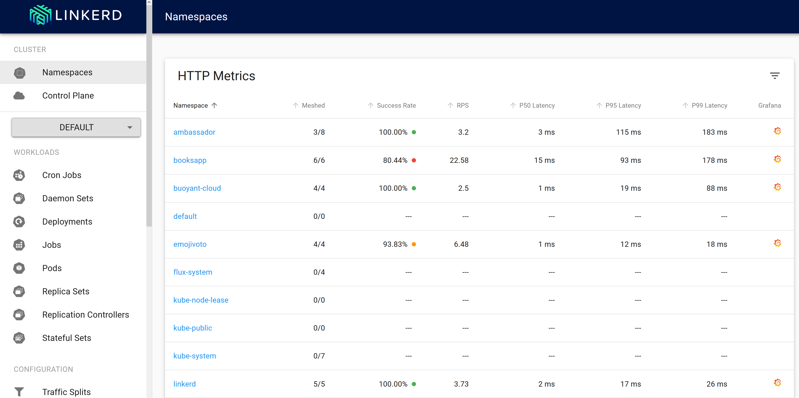

# Lab: Portworx

Portworx Enterprise is the Kubernetes storage and data platform trusted in production by the world’s leading enterprises. Portworx has been identified as the #1 Kubernetes storage solution four years in a row and provides capabilities like Kubernetes-native high availability and replication, unified storage layer for both block and file based persistent volumes, automated capacity management for stateful applications, Synchronous and Asynchronous disaster recovery solution for Kubernetes, and many more! 

**In this lab, we will use Portworx Enterprise 3.0 to walk through some of the capabilities Portworx delivers for AKS**

## Prerequisites

1. Deploy a new AKS cluster using [Azure Kubernetes Service](../../create-aks-cluster/README.md) running Kubernetes version 1.26.6. Don't need to walk through the `Namespaces Setup` section after AKS cluster creation on the create-aks-cluster page.

2. Create a custom role for Portworx. Enter the subscription ID using the subscription ID, also specify a role name:

``` bash
SUBSCRIPTIONID="$(az account show | grep id | awk '{ print $2 }' |  sed 's/\"//g' |  sed 's/\,//g')"
echo export SUBSCRIPTIONID=$SUBSCRIPTIONID >> ~/workshopvars.env
```

``` bash
az role definition create --role-definition '{
"Name": "px-role",
"Description": "Custom role for Portworx",
"AssignableScopes": [
    "/subscriptions/'$SUBSCRIPTIONID'"
],
"Actions": [
    "Microsoft.ContainerService/managedClusters/agentPools/read",
    "Microsoft.Compute/disks/delete",
    "Microsoft.Compute/disks/write",
    "Microsoft.Compute/disks/read",
    "Microsoft.Compute/virtualMachines/write",
    "Microsoft.Compute/virtualMachines/read",
    "Microsoft.Compute/virtualMachineScaleSets/virtualMachines/write",
    "Microsoft.Compute/virtualMachineScaleSets/virtualMachines/read"
],
"NotActions": [],
"DataActions": [],
"NotDataActions": []
}'
```

3. Find the AKS cluster infrastructure resource group, we will use this to create a new service principal in the next step:

``` bash
INFRARG="$(az aks show -n $CLUSTERNAME -g $RGNAME | jq -r '.nodeResourceGroup')"
echo export INFRARG=$INFRARG >> ~/workshopvars.env
```

4. Create a service principal for Portworx custom role:

``` bash
az ad sp create-for-rbac --role=px-role --scopes="/subscriptions/$SUBSCRIPTIONID/resourceGroups/$INFRARG" >> spdetails.json
```

``` bash
CLIENTID="$(cat spdetails.json | grep appId | awk '{ print $2 }' | sed 's/\"//g' |  sed 's/\,//g')"
echo export CLIENTID=$CLIENTID >> ~/workshopvars.env

CLIENTSECRET="$(cat spdetails.json | grep password | awk '{ print $2 }' | sed 's/\"//g' |  sed 's/\,//g')"
echo export CLIENTSECRET=$CLIENTSECRET >> ~/workshopvars.env

TENANTID="$(az account tenant list | grep tenantId | awk '{ print $2 }' | sed 's/\"//g' |  sed 's/\,//g')"
echo export TENANTID=$TENANTID >> ~/workshopvars.env
```

5. Create a secret called `px-azure` to give Portworx access to Azure APIs.

``` bash
kubectl create ns portworx

kubectl create secret generic -n portworx px-azure --from-literal=AZURE_TENANT_ID=$TENANTID --from-literal=AZURE_CLIENT_ID=$CLIENTID --from-literal=AZURE_CLIENT_SECRET=$CLIENTSECRET
```

## Deploying Portworx on AKS

Now that we have all the prereqs configured, we can proceed with Portworx installation. Portworx is deployed by first installing the Portworx Operator and then deploying a custom resource called the Portworx `StorageCluster`. Portworx Enterprise has a free 30 day trial that users can sign up by creating a new account on [Portworx Central](https://central.portworx.com/). For this workshop, we have a couple of `kubectl apply` commands, that will help us deploy the Operator and the Portworx StorageCluster. 

1. Deploy Portworx Operator

``` bash
kubectl apply -f 'https://install.portworx.com/3.0.0?comp=pxoperator&kbver=1.26.6&ns=portworx'
```

2. Deploy the Portworx StorageCluster

``` bash
kubectl apply -f 'https://install.portworx.com/3.0.0?operator=true&mc=false&kbver=1.26.6&ns=portworx&b=true&iop=6&s=%22type%3DPremium_LRS%2Csize%3D150%22&c=px-demo&aks=true&stork=true&csi=true&mon=true&tel=true&st=k8s&promop=true'
```

3. Monitor the deployment for Portworx

``` bash
watch kubectl get pods -n portworx -l name=portworx -o wide
```
It can take upto 5-7 mins for Portworx to be deployed. When all nodes are `Ready 2/2`, press `CTRL+C` to exit out of the watch command. 

4. Look at the Portworx status using the following command: 

``` bash
PX_POD=$(kubectl get pods -l name=portworx -n portworx -o jsonpath='{.items[0].metadata.name}')
kubectl -n portworx exec $PX_POD -c portworx -it -- /opt/pwx/bin/pxctl status
```

Now that we have Portworx installed on our AKS cluster, we will look at a few of the features that Portworx offers in the rest of the workshop. 

## Dynamic Volume provisioning for stateful applications

In this scenario, you’ll learn about Portworx Enterprise StorageClass parameters and deploy demo applications that use RWO (ReadWriteOnce) and RWX (ReadWriteMany) Persistent Volumes provisioned by Portworx Enterprise.

### Deploying Portworx Storage Classes

> Note: Change directories to the Portworx folder in your cloned repo: `cd kubernetes-hackfest/labs/storage/portworx/`

Portworx provides the ability for users to leverage a unified storage pool to dynamically provision both Block-based (ReadWriteOnce) and File-based (ReadWriteMany) volumes for applications running on your Kubernetes cluster without having to provision multiple CSI drivers/plugins, and without the need for specific backing storage devices!

#### Deploy StorageClass for Block (ReadWriteOnce) volumes

Run the following command to create a block-based StorageClass:

``` bash
kubectl create -f block-sc.yaml
```

PVCs provisioned using the above StorageClass will have a replication factor of 3, which means there will be three replicas of the PVC spread across the Kubernetes worker nodes.

#### Deploy StorageClass for File (ReadWriteMany) volumes

Let’s use the following command to apply this yaml file and deploy the StorageClass on our Kubernetes cluster:

``` bash
kubectl create -f file-sc.yaml
```

PVCs provisioned using the above StorageClass can be accessed by multiple pods at the same time (ReadWriteMany) and will have a replication factor of 2.
Use the following command to look at all the storage classes deployed on your cluster.

``` bash
kubectl get sc
```

### Deploying demo application for ReadWriteOnce volumes

1. In this step, we will deploy a demo application that provisions a MongoDB database that uses a ReadWriteOnce volume to store data.

``` bash 
kubectl create ns pxbbq
```

2.  Deploy the MongoDB backend components for our demo application. This will deploy a PersistentVolumeClaim using the `block-sc` storage class that we deployed in the previous step. 

``` bash
kubectl apply -f pxbbq-mongo.yaml
```


> Note: This lab uses a CLI tools that must be installed on your local machine. You will need to connect to your cluster from a local bash shell on your machine. (hint: use `az aks get-credentials` to setup access locally)

1. Remove the application pods/services from the cluster. We will re-deploy with linkerd.

    ```bash
    helm uninstall service-tracker-ui -n hackfest
    helm uninstall weather-api -n hackfest
    helm uninstall quakes-api -n hackfest
    helm uninstall flights-api -n hackfest
    helm uninstall data-api -n hackfest
    ```

1. Install linkerd CLI on your machine

    ```bash
    curl -sL https://run.linkerd.io/install | sh

    export PATH=$PATH:$HOME/.linkerd2/bin
    ```

    ```bash
    # verify CLI (ignore that the server version is unavailable)
    linkerd version
    
    Client version: stable-2.11.0
    Server version: unavailable
    ```

1. Validate your Kubernetes cluster

    ```bash
    linkerd check --pre

    ...

    Status check results are [ok]
    ```

1. Install linkerd server components into AKS

    ```bash
    linkerd install | kubectl apply -f -
    ```

1. Validate

    ```bash
    linkerd check

    ...

    Status check results are [ok]
    ```

1. Install viz extension

    ```bash
    linkerd viz install | kubectl apply -f - # install the on-cluster metrics stack
    ```

1. Open the Dashboard

    ```bash
    linkerd viz dashboard
    ```

    Browse the dashboard:

    

1. Use `helm template` to create manifest for injection

    ```bash
    helm template ./kubernetes-hackfest/charts/data-api > ./kubernetes-hackfest/data-api.yaml
    helm template ./kubernetes-hackfest/charts/flights-api > ./kubernetes-hackfest/flights-api.yaml
    helm template ./kubernetes-hackfest/charts/quakes-api > ./kubernetes-hackfest/quakes-api.yaml
    helm template ./kubernetes-hackfest/charts/weather-api > ./kubernetes-hackfest/weather-api.yaml
    helm template ./kubernetes-hackfest/charts/service-tracker-ui > ./kubernetes-hackfest/service-tracker-ui.yaml
    ```

1. Re-deploy application using `linkerd inject`

    ```bash
    linkerd inject ./kubernetes-hackfest/data-api.yaml | kubectl apply -n hackfest -f -
    linkerd inject ./kubernetes-hackfest/flights-api.yaml | kubectl apply -n hackfest -f -
    linkerd inject ./kubernetes-hackfest/quakes-api.yaml | kubectl apply -n hackfest -f -
    linkerd inject ./kubernetes-hackfest/weather-api.yaml | kubectl apply -n hackfest -f -
    linkerd inject ./kubernetes-hackfest/service-tracker-ui.yaml | kubectl apply -n hackfest -f -
    ```

1. Load test and review traffic in Dashboard

    > Note: There are a few ways we could create traffic on the API layer. You could create a load test pod in the cluster that hits the API's on internal IP addresses. Below is a simple setup just for lab purposes.

    * Expose one of the API's as a public IP

        ```bash
        kubectl patch svc flights-api -n hackfest -p '{"spec":{"type":"LoadBalancer"}}'
        ```

    * Get the IP address of one of your API's

        ```bash
        kubectl get svc flights-api -n hackfest
        
        NAME          TYPE        CLUSTER-IP    EXTERNAL-IP   PORT(S)    AGE
        flights-api   ClusterIP   10.0.75.165   13.10.293.100 3003/TCP   100s
        ```

    * Create a variable with the URL

        ```bash
        export APP_URL=http://<your_ip_address>:3003/status
        while true; do curl -o /dev/null -s -w "%{http_code}\n" $APP_URL; sleep 1; done
        ```

1. Try some other Linkerd features

* [Automating injection.](https://linkerd.io/2/tasks/automating-injection)
* [Setup mTLS encryption.](https://linkerd.io/2/features/automatic-mtls)
* [Routing and Service Profiles.](https://linkerd.io/2/features/service-profiles)
* [Server policy.](https://linkerd.io/2.11/features/server-policy/)

## Troubleshooting / Debugging

### Finding the bad path with Emojivoto

In this section you'll have to work out the solution on your own. Some steps have been provided but ultimately you'll need to use Linkerd to determine what's going wrong with your application.

1. Install emojivoto

    ```bash
    curl -sL https://run.linkerd.io/emojivoto.yml | linkerd inject - | kubectl apply -f -
    ```

2. Launch the Linkerd dashboard

    ```bash
    linkerd viz dashboard
    ```

    Browse the dashboard:

    

3. Figure out what's breaking emojivoto!

    * Sort namespaces by success rate
    * Go into the emojivoto namespace
    * Look at the application graph
    * Sort deployments by success rate
    * Browse to a deployment and view the live api calls
    * Can you see which component is the root of the issue?
    * Can you see which specific path is failing?

Still having trouble? View the step by step cli commands [here](debug-emojivoto.sh).

### Mitigate an issue with retries

In this section we will diagnose and repair an issue with a sample application using Linkerd's service profile resource.

1. Install Booksapp

    ```bash
    kubectl create ns booksapp

    curl -sL https://run.linkerd.io/booksapp.yml | kubectl -n booksapp apply -f -
    ```

2. Access the app
  
    You can do this a number of different ways, expose it via a load balancer, add a mapping for your ingress, or port-forward it via the cli. We will show how to get to it from the cli.

    ```bash
    kubectl -n booksapp port-forward svc/webapp 7000
    ```

   * Browse to localhost:7000
   * try adding a new book a few times and see if you run into an issue

3. Make some service profiles

    ```bash
    # Create our first service profile using a swagger file
    
    curl -sL https://run.linkerd.io/booksapp/webapp.swagger | linkerd -n booksapp profile --open-api - webapp

    # Inspect the resulting yaml

    # Begin applying service profiles

    curl -sL https://run.linkerd.io/booksapp/webapp.swagger | linkerd -n booksapp profile --open-api - webapp | kubectl -n booksapp apply -f -

    curl -sL https://run.linkerd.io/booksapp/authors.swagger | linkerd -n booksapp profile --open-api - authors | kubectl -n booksapp apply -f -

    curl -sL https://run.linkerd.io/booksapp/books.swagger | linkerd -n booksapp profile --open-api - books | kubectl -n booksapp apply -f -

    # Check out the new service profile objects

    kubectl get serviceprofile

    ```

4. Diagnose our app using serviceprofiles

    We're going to use the linkerd cli to inspect our routes. Routes come from service profiles and allow us to instrument things like retries.

    ```bash
    linkerd viz -n booksapp routes svc/webapp

    linkerd viz -n booksapp routes deploy/webapp --to svc/books

    linkerd viz -n booksapp routes deploy/books --to svc/authors
    ```

    * Those commands will show you the current status on the booksapp routes
    * Can you diagnose the issue by looking at the routes?
    * Continue to the next section once you see the problem or get bored of looking

5. Fix it with retries

    Now that we've diagnosed the issue we can repair it using serviceprofiles!

    ```bash

    # Edit the service profile for the authors service
    kubectl -n booksapp edit sp/authors.booksapp.svc.cluster.local

    # in the editor go down to the route named HEAD /authors/{id}.json and add a new value after the name.
    ## Add the following to the yaml at the same indent as name:
    ## isRetryable: true

    ```

    Now you should be able to watch booksapp begin succeeding on it's end to end calls. For more information along with a step by step video please see [this talk.](https://www.youtube.com/watch?v=YJ8zP-lqB5E)

## Docs / References

* [Linkerd on Github](https://github.com/linkerd/linkerd2)
* [Linkerd docs](https://linkerd.io/2.11/overview/)
* [Linkerd Slack community](slack.linkerd.io)
