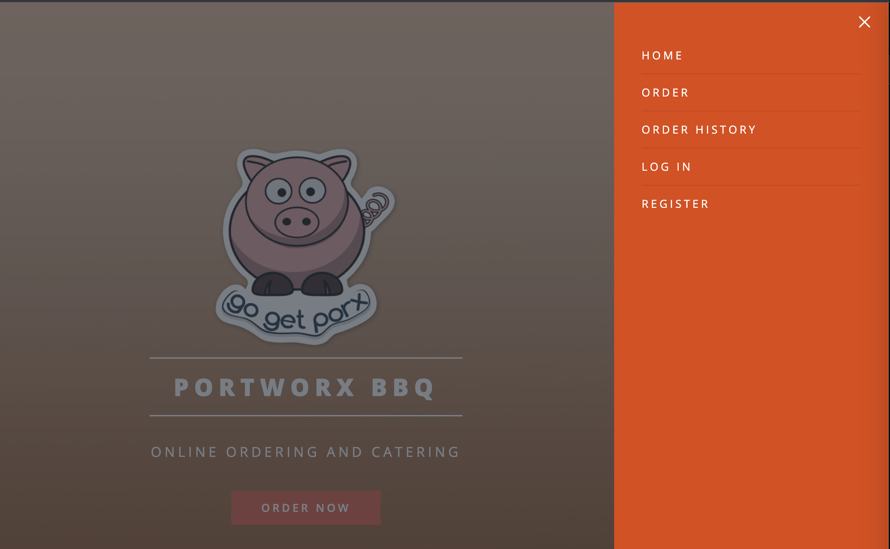
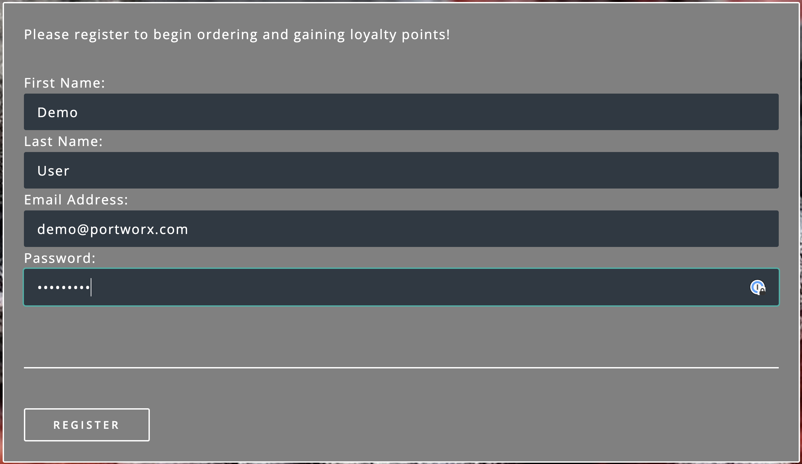
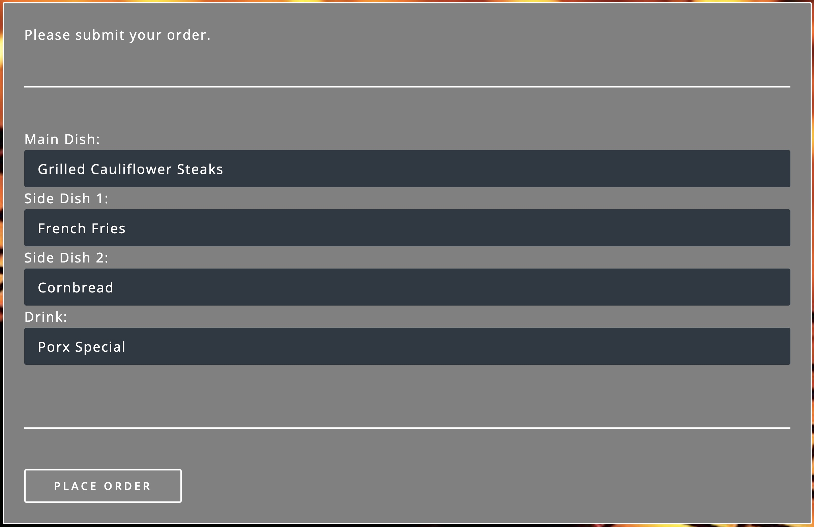
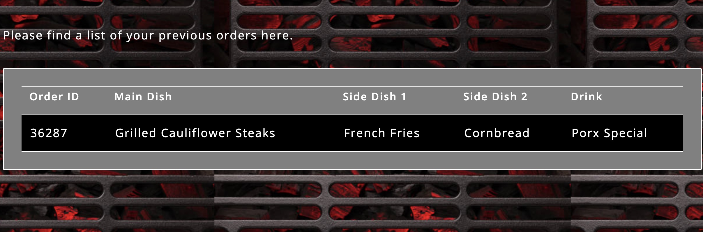

# Lab: Portworx

Portworx Enterprise is the Kubernetes storage and data platform trusted in production by the world’s leading enterprises. Portworx has been identified as the #1 Kubernetes storage solution four years in a row and provides capabilities like Kubernetes-native high availability and replication, unified storage layer for both block and file based persistent volumes, automated capacity management for stateful applications, Synchronous and Asynchronous disaster recovery solution for Kubernetes, and many more! 

**In this lab, we will use Portworx Enterprise 3.0 to walk through some of the capabilities Portworx delivers for AKS**

## Prerequisites

- [jq](https://jqlang.github.io/jq/)

1. Deploy a new AKS cluster using [Azure Kubernetes Service](../../create-aks-cluster/README.md) running Kubernetes version 1.26.6 and selecting AKS worker nodes with at least 4 cores and 4GB of RAM (This guide has been tested by adding the parameter `--node-vm-size Standard_F8s_v2` in the az aks create command). Don't need to walk through the `Namespaces Setup` section after AKS cluster creation on the create-aks-cluster page.

2. Create a custom role for Portworx. Enter the subscription ID using the subscription ID, also specify a role name:

``` bash
SUBSCRIPTIONID=$(az account show --query id -o tsv)
echo export SUBSCRIPTIONID=$SUBSCRIPTIONID >> ~/workshopvars.env
```

``` bash
az role definition create --role-definition '{
"Name": "px-role",
"Description": "Custom role for Portworx",
"AssignableScopes": [
    "/subscriptions/'$SUBSCRIPTIONID'"
],
"Actions": [
    "Microsoft.ContainerService/managedClusters/agentPools/read",
    "Microsoft.Compute/disks/delete",
    "Microsoft.Compute/disks/write",
    "Microsoft.Compute/disks/read",
    "Microsoft.Compute/virtualMachines/write",
    "Microsoft.Compute/virtualMachines/read",
    "Microsoft.Compute/virtualMachineScaleSets/virtualMachines/write",
    "Microsoft.Compute/virtualMachineScaleSets/virtualMachines/read"
],
"NotActions": [],
"DataActions": [],
"NotDataActions": []
}'
```

3. Find the AKS cluster infrastructure resource group, we will use this to create a new service principal in the next step:

``` bash
CLUSTERNAME=<SET TO AKS CLUSTER NAME>
RGNAME=<SET TO AKS RESOURCE GROUP>
INFRARG="$(az aks show -n $CLUSTERNAME -g $RGNAME --query nodeResourceGroup -o tsv)"
echo export INFRARG=$INFRARG >> ~/workshopvars.env
```

4. Create a service principal for Portworx custom role:

``` bash
az ad sp create-for-rbac --role=px-role --scopes="/subscriptions/$SUBSCRIPTIONID/resourceGroups/$INFRARG" --output json > spdetails.json
```

``` bash
CLIENTID=$(cat spdetails.json | jq -r '.appId')
echo export CLIENTID=$CLIENTID >> ~/workshopvars.env

CLIENTSECRET=$(cat spdetails.json | jq -r '.password')
echo export CLIENTSECRET=$CLIENTSECRET >> ~/workshopvars.env

TENANTID=$(cat spdetails.json | jq -r '.tenant')
echo export TENANTID=$TENANTID >> ~/workshopvars.env
```

5. Create a secret called `px-azure` to give Portworx access to Azure APIs.

``` bash
kubectl create ns portworx

kubectl create secret generic -n portworx px-azure --from-literal=AZURE_TENANT_ID=$TENANTID --from-literal=AZURE_CLIENT_ID=$CLIENTID --from-literal=AZURE_CLIENT_SECRET=$CLIENTSECRET
```

## Deploying Portworx on AKS

Now that we have all the prereqs configured, we can proceed with Portworx installation. Portworx is deployed by first installing the Portworx Operator and then deploying a custom resource called the Portworx `StorageCluster`. Portworx Enterprise has a free 30 day trial that users can sign up by creating a new account on [Portworx Central](https://central.portworx.com/). For this workshop, we have a couple of `kubectl apply` commands, that will help us deploy the Operator and the Portworx StorageCluster. 

1. Deploy Portworx Operator

``` bash
kubectl apply -f 'https://install.portworx.com/3.0.0?comp=pxoperator&kbver=1.26.6&ns=portworx'
```

2. Deploy the Portworx StorageCluster

``` bash
kubectl apply -f 'https://install.portworx.com/3.0.0?operator=true&mc=false&kbver=1.26.6&ns=portworx&b=true&iop=6&s=%22type%3DPremium_LRS%2Csize%3D150%22&c=px-demo&aks=true&stork=true&csi=true&mon=true&tel=true&st=k8s&promop=true'
```

3. Monitor the deployment for Portworx

``` bash
watch kubectl get pods -n portworx -l name=portworx -o wide
```
It can take upto 5-7 mins for Portworx to be deployed. When all nodes are `Ready 2/2`, press `CTRL+C` to exit out of the watch command. 

4. Look at the Portworx status using the following command: 

``` bash
PX_POD=$(kubectl get pods -l name=portworx -n portworx -o jsonpath='{.items[0].metadata.name}')
kubectl -n portworx exec $PX_POD -c portworx -it -- /opt/pwx/bin/pxctl status
```

Now that we have Portworx installed on our AKS cluster, we will look at a few of the features that Portworx offers in the rest of the workshop. 

## Dynamic Volume provisioning for stateful applications

In this scenario, you’ll learn about Portworx Enterprise StorageClass parameters and deploy demo applications that use RWO (ReadWriteOnce) and RWX (ReadWriteMany) Persistent Volumes provisioned by Portworx Enterprise.

### Deploying Portworx Storage Classes

> Note: Change directories to the Portworx folder in your cloned repo: `cd kubernetes-hackfest/labs/storage/portworx/yaml`

Portworx provides the ability for users to leverage a unified storage pool to dynamically provision both Block-based (ReadWriteOnce) and File-based (ReadWriteMany) volumes for applications running on your Kubernetes cluster without having to provision multiple CSI drivers/plugins, and without the need for specific backing storage devices!

#### Deploy StorageClass for Block (ReadWriteOnce) volumes

Run the following command to create a block-based StorageClass:

``` bash
kubectl create -f block-sc.yaml
```

PVCs provisioned using the above StorageClass will have a replication factor of 3, which means there will be three replicas of the PVC spread across the Kubernetes worker nodes.

#### Deploy StorageClass for File (ReadWriteMany) volumes

Let’s use the following command to apply this yaml file and deploy the StorageClass on our Kubernetes cluster:

``` bash
kubectl create -f file-sc.yaml
```

PVCs provisioned using the above StorageClass can be accessed by multiple pods at the same time (ReadWriteMany) and will have a replication factor of 2.
Use the following command to look at all the storage classes deployed on your cluster.

``` bash
kubectl get sc
```

### Deploying demo application for ReadWriteOnce volumes

1. In this step, we will deploy a demo application that provisions a MongoDB database that uses a ReadWriteOnce volume to store data.

``` bash 
kubectl create ns pxbbq
```

2.  Deploy the MongoDB backend components for our demo application. This will deploy a PersistentVolumeClaim using the `block-sc` storage class that we deployed in the previous step. Also, deploy the frontend components for our demo application. 

``` bash
kubectl apply -f pxbbq-mongo.yaml
sleep 15
kubectl apply -f pxbbq-frontend.yaml
```

4. Monitor the application deployment using the following commands:

``` bash
watch kubectl get all -n pxbbq
```

When all the pods are running, use `CTRL+C` to exit the watch command. 

5. Access the demo application: 

Use the following commnad to fetch the LoadBalancer endpoint for the pxbbq-svc service in the demo namespace and navigate to it using a new browser tab.

``` bash 
kubectl get svc -n pxbbq pxbbq-svc
```

6. Interact with the Demo application
This demo application allows users to place orders that are saved in the backend MongoDB database. Use the following steps to register a new user and place a simple order.

- Click on Menu on the Top Right and select Register.


- Enter your first name, last name, email address and password. Click Register.


- Click on Menu on the Top Right and select Order.


- Select a Main Dish, Couple of Side dishes and a drink. Click Place Order.



- You can either click on the order confirmation, or navigate to Order History from the Top Right, to find your order.


Now that we have some data generated, let’s use the following command to inspect the MongoDB volume and look at the Portworx parameters configured for the volume:

``` bash 
PXBBQVOL=`kubectl get pvc -n pxbbq | grep mongodb-pvc | awk '{print $3}'`
kubectl exec -it $PX_POD -n portworx -- /opt/pwx/bin/pxctl volume inspect ${PXBBQVOL}
```

Observe how Portworx creates volume replicas, and spreads them across your Kubernetes worker nodes.
In this step, you saw how Portworx can dynamically provisions a highly available ReadWriteOnce persistent volume for your application.

### Deploying demo application for ReadWriteMany volumes

Portworx offers a sharedv4 service volume which allows applications to connect to the shared persistent volume either using a ClusterIP or a LoadBalancer endpoint. This is advantageous as even if one of the worker node goes down, the shared volume is still accessible without any interruption of the application utilizing the data on the shared volume.

1. Create the sharedservice namespace

``` bash
kubectl create ns sharedservice
```

2. Deploy the sharedv4 service PVC and the busybox pods using the following commands: 

``` bash
kubectl apply -f sharedpvc.yaml -n sharedservice
sleep 20
kubectl apply -f busyboxpod.yaml -n sharedservice
```

This creates a deployment using multiple simple busybox pods that have mounted and will constantly write to the shared persistent volume. It also deploys a single busybox pod that will constantly read from the shared persistent volume.

4. Verify the pods and pvc have been deployed: 

``` bash 
watch kubectl get pods,pvc -n sharedservice
```
Once the pods are up and running, Use `CTRL+C` to exit out of the watch command 

5. Inspect the volume

``` bash
BUSYBOXVOL=`kubectl get pvc -n sharedservice | grep px-sharedv4-pvc | awk '{print $3}'`
kubectl exec -it $PX_POD -n portworx -- /opt/pwx/bin/pxctl volume inspect ${BUSYBOXVOL}
```

Note that we have four pods accessing the RWX volume for our demo!

6. Describe the sharedv4service endpoint

``` bash
kubectl describe svc -n sharedservice
```

Applications can mount the RWX using the ClusterIP (IP) and Portworx will automatically redirect it to one of the worker nodes in your cluster. The Endpoint in the output is the current node, but in case of that node going down, Portworx will automatically route the traffic using a different node endpoint, without the user having to reboot/restart the application pods.

7. Inspect the log file to ensure that there was no application interruption due to node failure

``` bash
kubectl logs shared-demo-reader -n sharedservice
```
You’ve just deployed applications with different needs on the same Kubernetes cluster without the need to install multiple CSI drivers/plugins, and it will function exactly the same way no matter what backing storage you provide for Portworx Enterprise to use!

## Protecting your data using VolumeSnapshots and GroupVolumeSnapshots

Portworx allows you to take standard snapshots of your persistent volumes on a per-volume basis, but also gives you the capability to take group snapshots if you have persistence across multiple volumes to enable application-consistent snapshots.

In this scenario, you will:

1. Perform a single volume snapshot and restore
2. Configure pre and post snapshot rules to quiesce an application
3. Perform a group volume snapshot and restore, utilizing the pre and post rules

### Working with single volume snapshots

Before we take volume snapshots, let’s navigate to the application UI that we deployed in the previous step, and verify that we can see order that we placed in the previous section. To find the LoadBalancer endpoint for our demo application, use the following command:

``` bash 
kubectl get svc -n pxbbq pxbbq-svc
```

Navigate to the application and login as the Demo user and look at the Order History


1. Create volumesnapshot for the MongoDB volume. 

``` bash 
cat mongo-snapshot.yaml

kubectl apply -f mongo-snapshot.yaml
```

And let’s look at the snapshot object:
``` bash
kubectl get stork-volumesnapshots,volumesnapshotdatas -n pxbbq
```

2. Accidently “Drop Table” in your MongoDB database

Let’s delete the data within our MongoDB DB by exec’ing into the pod:
``` bash
MONGOPOD=$(kubectl get pods -l app.kubernetes.io/name=mongo -n pxbbq | grep 1/1 | awk '{print $1}')
kubectl exec -it $MONGOPOD -n pxbbq -- mongosh --quiet
```
And then drop our table:

``` bash
use admin
db.auth('porxie','porxie')
show dbs
use porxbbq
db.dropDatabase()
```
Use the `quit` command to exit out of the mongodb pod.

3. Verify data has been deleted

Navigate to the Portworx BBQ App using the LoadBalancer endpoint, you should not see your order from order history.


4. Restore our application from snapshot by creating a new PVC from our snapshot. 

``` bash
kubectl apply -f pvc-from-snap.yaml -n pxbbq
```

``` bash 
kubectl get pvc px-mongo-snap-clone -n pxbbq
```

5. Redeploy the Demo application using the following command: 

``` bash
kubectl delete -f pxbbq-mongo.yaml
```
``` bash
kubectl apply -f pxbbq-mongo-restore.yaml
```

6. Verify the application has been completely restored

Access the application by navigating to the LoadBalancer endpoint and refreshing the page. Our original order will be back in our order history. If you need to find your LoadBalancer endpoint, use the following command:

``` bash
kubectl get svc -n pxbbq pxbbq-svc
```


In this step, we took a snapshot of the persistent volume, deleted the database table and then restored our application by restoring the persistent volume using the snapshot!

### Portworx Group Volume Snapshots

In this step, we will look at how you can use Portworx Group Volume Snapshots and 3D snapshots - to take application consistent multi-PVC snapshots for your application.

1. Create a new StorageClass for GroupVolumeSnapshots. 

``` bash 
kubectl apply -f group-sc.yaml
```

2. Create a new namespace for MySQL

``` bash 
kubectl create ns mysql
```

3. Create a pre-snap and post-snap rules for MySQL

Portworx allows users to specify pre- and post-snapshot rules to ensure that the snapshots are application consistent and not crash consistent. For this example, we are creating a pre-snapshot and a post-snapshot rule for MySQL that we will use when we take a group volume snapshot.

Review the yaml for the snapshot rule:

``` bash
cat mysql-presnap-rule.yaml

cat mysql-postsnap-rule.yaml
```

Let’s apply both the rules:

``` bash 
kubectl apply -f mysql-presnap-rule.yaml -n mysql
kubectl apply -f mysql-postsnap-rule.yaml -n mysql
``` 

4. Deploy MySQL statefulset, service, and secret in the mysql namespace

``` bash 
kubectl apply -f mysql-app.yaml -n mysql
```

Watch until you see the three mysql pods, one mysql-client pod are up and running

``` bash 
watch kubectl get pods,pvc,sts,svc,secret -n mysql
```
Note: use CTRL+C to exit out of the watch command once all the pods are running.

5. Interacting with MySQL
Let’s exec into the mysql-client pod and create a new portworx database and a new features table in that database.

``` bash
kubectl exec mysql-client -n mysql -- apk add mysql-client
```

``` bash 
kubectl exec mysql-client -n mysql -it -- sh
``` 

``` bash
mysql -u root -p --password=password -h mysql-set-0.mysql.mysql.svc.cluster.local
```

``` bash
create database portworx;
show databases;

use portworx;

CREATE TABLE features (id varchar(255), name varchar(255), value varchar(255));
INSERT INTO features (id, name, value) VALUES ('px-1', 'snapshots', 'point in time recovery!');
INSERT INTO features (id, name, value) VALUES ('px-2', 'cloudsnaps', 'backup/restore to/from any cloud!');
INSERT INTO features (id, name, value) VALUES ('px-3', 'STORK', 'convergence, scale, and high availability!');
INSERT INTO features (id, name, value) VALUES ('px-4', 'share-volumes', 'better than NFS, run wordpress on k8s!');
INSERT INTO features (id, name, value) VALUES ('px-5', 'DevOps', 'your data needs to be automated too!');

SELECT * FROM features;
```

``` bash
quit
```

``` bash
exit
```

6. Create and deploy a GroupVolumeSnapshot for MySQL

``` bash 
cat mysql-groupsnapshot.yaml

kubectl apply -f mysql-groupsnapshot.yaml -n mysql
```

Note that once the snapshots have completed successfully, you should see Snapshot created successfully and it is ready for all mysql volumes in the kubectl describe output:

``` bash 
kubectl get groupvolumesnapshot -n mysql
kubectl describe groupvolumesnapshot mysql-group-snapshot -n mysql
``` 

7. Drop the Portworx database from MySQL

Let’s drop our Portworx database, and see if we can recover it from our group volume snapshots.

``` bash 
kubectl exec mysql-client -n mysql -it -- sh
``` 

``` bash
mysql -u root -p --password=password -h mysql-set-0.mysql.mysql.svc.cluster.local
```

``` bash
DROP database portworx;
```

``` bash
quit
```

``` bash
exit
```

Now, that we have dropped the Portworx database, let’s see how we can restore our data.

We will start by deleting the mysql statefulset, Creating new PVCs using the snapshots we created earlier, and then redeploying the mysql statefulset.

``` bash 
kubectl delete sts mysql-set -n mysql
```

And let’s get the snapshot names and assign them into variables

``` bash
SNAP0=$(kubectl get volumesnapshotdatas.volumesnapshot.external-storage.k8s.io -n mysql | grep mysql-group-snapshot-mysql-store-mysql-set-0 | awk '{print $1}')
SNAP1=$(kubectl get volumesnapshotdatas.volumesnapshot.external-storage.k8s.io -n mysql | grep mysql-group-snapshot-mysql-store-mysql-set-1 | awk '{print $1}')
SNAP2=$(kubectl get volumesnapshotdatas.volumesnapshot.external-storage.k8s.io -n mysql | grep mysql-group-snapshot-mysql-store-mysql-set-2 | awk '{print $1}')
echo export SNAP0=$SNAP0 >> ~/workshopvars.env
echo export SNAP1=$SNAP1 >> ~/workshopvars.env
echo export SNAP2=$SNAP2 >> ~/workshopvars.env
```

Now let’s create a new yaml file for our PVC objects that will be deployed from our snapshots:

``` bash
cat << EOF > restoregrouppvc.yaml
apiVersion: v1
kind: PersistentVolumeClaim
metadata:
  name: mysql-snap-store-mysql-set-0
  annotations:
    snapshot.alpha.kubernetes.io/snapshot: $SNAP0
spec:
  accessModes:
     - ReadWriteOnce
  storageClassName: stork-snapshot-sc
  resources:
    requests:
      storage: 2Gi
---
apiVersion: v1
kind: PersistentVolumeClaim
metadata:
  name: mysql-snap-store-mysql-set-1
  annotations:
    snapshot.alpha.kubernetes.io/snapshot: $SNAP1
spec:
  accessModes:
     - ReadWriteOnce
  storageClassName: stork-snapshot-sc
  resources:
    requests:
      storage: 2Gi
---
apiVersion: v1
kind: PersistentVolumeClaim
metadata:
  name: mysql-snap-store-mysql-set-2
  annotations:
    snapshot.alpha.kubernetes.io/snapshot: $SNAP2
spec:
  accessModes:
     - ReadWriteOnce
  storageClassName: stork-snapshot-sc
  resources:
    requests:
      storage: 2Gi
EOF
```

``` bash
kubectl apply -f restoregrouppvc.yaml -n mysql
```

Inspect the PVCs deployed from the snapshots

``` bash
kubectl get pvc -n mysql
```

Once you have these PVCs deployed, you can redeploy the MySQL statefulset.

``` bash
kubectl apply -f mysql-restore-app.yaml -n mysql
```

Inspect the Pods and PVCs deployed to restore our mysql instance:

``` bash
watch kubectl get pods,pvc -n mysql
```

8. Inspect the MySQL instance

Let’s verify that all of our data was restored:

``` bash
kubectl exec mysql-client -n mysql -it -- sh
```

``` bash
mysql -u root -p --password=password -h mysql-set-0.mysql.mysql.svc.cluster.local
```

``` bash
use portworx;
select * from features;
```

``` bash
quit
```

``` bash
exit
```

As you can see, our data has been successfully restored and is consistent due to our pre-snapshot and post-snapshot commands executed prior and post the group volume snapshot!

That’s how easy it is to use Portworx snapshots, groupsnapshots and 3Dsnapshots to create application consistent snapshots for your applications running on Kubernetes.


## Automated storage capacity management using Portworx Autopilot

Portworx Autopilot is a rule-based engine that responds to changes from a monitoring source. Autopilot allows you to specify monitoring conditions along with actions it should take when those conditions occur.

1. Configure Autopilot Rule

Autopilot rules allow users to create IFTTT (IF This Then That) rules, where Autopilot will monitor for a condition and then perform an action on your behalf. 

Let’s create a simple rule that will monitor persistent volumes associated with objects that have the app: postgres label and in namespaces that have the label `type: db`. If capacity usage grows to or above 20%, it will automatically grow the persistent volume and underlying filesystem by 20% of the current volume size, up to a maximum volume size of 50Gi:

Keep in mind, an AutoPilot Rule has 4 main parts.
* Selector Matches labels on the objects that the rule should monitor.
* Namespace Selector Matches labels on the Kubernetes namespaces the rule should monitor. This is optional, and the default is all namespaces.
* Conditions The metrics for the objects to monitor.
* Actions to perform once the metric conditions are met.

``` bash 
cat autopilotrule.yaml
```

``` bash 
kubectl create -f autopilotrule.yaml
```

2. Create a namespace for demo application

Since our Portworx Autopilot rule only targets namespaces that have the label type: db, let’s create the yaml for the namespace:

``` bash
kubectl apply -f namespaces.yaml
```

3. Deploy Postgres App for testing Portworx Autopilot

Let's deploy PVCs and pods for our Postgres and pgbench deployment:

``` bash
kubectl apply -f autopilot-postgres.yaml -n pg1
sleep 30
kubectl apply -f autopilot-app.yaml -n pg1
sleep 20
```

Verify that the application is deployed and pgbench is writing data to the postgres database.

``` bash 
kubectl get pods,pvc -n pg1
```

``` bash
POSTGRES_POD=$(kubectl get pods -n pg1 | grep 2/2 | awk '{print $1}')

kubectl logs $POSTGRES_POD -n pg1 pgbench
```

4. Observe the Portworx Autopilot events

Wait for a couple of minutes and run the following command to observe the state changes for Portworx Autopilot:

``` bash
watch kubectl get events --field-selector involvedObject.kind=AutopilotRule,involvedObject.name=volume-resize --all-namespaces --sort-by .lastTimestamp
```

You will see Portworx Autopilot move through the following states as it monitors volumes and takes actions defined in Portworx Autopilot rules:
1. Initializing (Detected a volume to monitor via applied rule conditions)
2. Normal (Volume is within defined conditions and no action is necessary)
3. Triggered (Volume is no longer within defined conditions and action is necessary)
4. ActiveActionsPending (Corrective action is necessary but not executed yet)
5. ActiveActionsInProgress (Corrective action is under execution)
6. ActiveActionsTaken (Corrective action is complete)

Once you see ActiveActionsTaken in the event output, click CTRL+C to exit the watch command.

5. Verify the Volume Expansion
Now let’s take a look at our PVCs - note the automatic expansion of the volume occurred with no human interaction and no application interruption:

``` bash
kubectl get pvc -n pg1
```

You’ve just configured Portworx Autopilot and observed how it can perform automated capacity management based on rules you configure, and be able to “right size” your underlying persistent storage as it is needed!

## Protect againt accidental volume deletion using Portworx Volume Trashcan

Ever had that sinking feeling after deleting a critical volume, disk, or file? The Portworx Volume Trashcan feature provides protection against accidental or inadvertent volume deletions which could result in loss of data. Volume Trashcan is disabled by default, but can be enabled using a simple pxctl command. Let’s test it out!

1. Setting Volume expiration minutes
First, configure the Portworx cluster to enable volume deletion and tell it how long you want to retain volumes after a delete. In this example, we’ll tell Portworx to retain volumes for 720 minutes after a deletion:

``` bash 
kubectl exec -it $PX_POD -n portworx -- /opt/pwx/bin/pxctl cluster options update --volume-expiration-minutes 720
```

2. Configuring a StorageClass
Review the yaml for the StorageClass that we’ll use - note the reclaimPolicy is set to Delete:

``` bash
kubectl apply -f trash-sc.yaml
```

3. Create a new namespace

``` bash
kubectl create ns trashcan
```

4. Deploy the mongodb backend and frontend components for the application

``` bash 
kubectl create -f pxbbq-mongo-tc.yaml
sleep 5 
kubectl apply -f pxbbq-frontend-tc.yaml
```

6. Access the application
Access the demo application using the LoadBalancer endpoint from the command below, and place some orders to store in the backend MongoDB database. If you need help placing orders, please refer to the steps earlier in this doc.

``` bash 
watch kubectl get pods,pvc,svc -n trashcan
```
Use `Ctrl+C` to exit out of the watch command, once the pods are up and running.

``` bash 
kubectl get svc -n trashcan pxbbq-svc
```

7. Delete the demo application
Once you have placed an order, let's accidently delete the postgres pod and persistent volume: 

``` bash 
kubectl delete -f pxbbq-mongo-tc.yaml
```
Wait for the delete to complete before continuing.

Once the MongoDB is deleted, navigate back to the Demo App tab to verify that it stopped working. Click on the refresh icon to the right of the tabs just to make sure - once the DB pod has been deleted, the app should be unreachable.

8. Restoring volume from Volume Trashcan

Let’s use pxctl commands to restore our volume from the trashcan:

``` bash 
VolMongoTC=$(kubectl exec -it $PX_POD -n portworx -- /opt/pwx/bin/pxctl volume list --trashcan | grep "5 GiB" | awk '{print $8}')
```

``` bash 
kubectl exec -it $PX_POD -n portworx -- /opt/pwx/bin/pxctl volume restore --trashcan $VolMongoTC pvc-restoredvol
```

``` bash
TCVolId=$(kubectl exec -it $PX_POD -n portworx -- /opt/pwx/bin/pxctl volume list | grep "pvc-restoredvol" | awk '{print $1}' )
```

9. Create a persistent volume from the recovered portworx volume
Now that we’ve restored the volume from the trashcan, let’s create the yaml to tie the volume to a Kubernetes persistent volume:

``` bash
cat << EOF > recoverpv.yaml
apiVersion: v1
kind: PersistentVolume
metadata:
  annotations:
    pv.kubernetes.io/provisioned-by: pxd.portworx.com
  finalizers:
  - kubernetes.io/pv-protection
  name: pvc-restoredvol
spec:
  capacity:
    storage: 5Gi
  claimRef:
    apiVersion: v1
    kind: PersistentVolumeClaim
    name: mongodb-pvc
    namespace: trashcan
  accessModes:
    - ReadWriteOnce
  storageClassName: trash-sc
  persistentVolumeReclaimPolicy: Retain
  portworxVolume:
    volumeID: "$TCVolId"
EOF
```

``` bash
kubectl apply -f recoverpv.yaml
```

10. Redeploy the app
Let’s redeploy the application which is using the recovered volume:
``` bash 
kubectl apply -f pxbbq-mongo-tc.yaml
```

Delete the old web front end:
``` bash
kubectl delete deploy pxbbq-web -n trashcan
```

And redeploy the web front end: 
``` bash
kubectl apply -f pxbbq-frontend-tc.yaml
```

11. Verify the restore by accessing the app
Navigate to the Demo App UI by using the LoadBalancer endpoint from the command below and see that our orders are back!

``` bash 
kubectl get svc -n trashcan pxbbq-svc
```
This is how Portworx allows users to use the Trash Can feature to recover accidentally deleted persistent volumes. This prevents additional downtime and reduces ticket churn for data restoration due to human error!

### Wrap up this workshop
Use the following script to delete objects used for this workshop:

``` bash 
./wrapuplab.sh
```

## Docs / References

* [Portworx Documentation](https://docs.portworx.com/)
* [Portworx Central - 30 day free trial](https://central.portworx.com/)
* [Portworx Slack community](https://slack.portworx.com/)

## Troubleshooting

* `No such file or directory` - when you are trying to run a script of apply a yaml file: 

``` bash 
cd kubernetes-hackfest/labs/storage/portworx/yaml
```

* `error: pod, type/name or --filename must be specified`: This is because the PX_POD variable isnt set, use the following command to set the variable and rerun the command:

``` bash
PX_POD=$(kubectl get pods -l name=portworx -n portworx -o jsonpath='{.items[0].metadata.name}')
```
