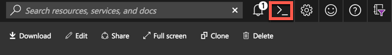

# Lab: Build Application Components and Prerequisites

In this lab we will build Docker containers for each of the application components and setup the back-end database.

## Prerequisites

* Complete previous labs:
    * [Azure Kubernetes Service](../create-aks-cluster/README.md)

## Instructions

1. Login to Azure Portal at http://portal.azure.com.
1. Open the Azure Cloud Shell and choose Bash Shell (do not choose Powershell)

   

1. The first time Cloud Shell is started will require you to create a storage account.

1. Once your cloud shell is started, clone the workshop repo into the cloud shell environment

   ```bash
   git clone https://github.com/Azure/kubernetes-hackfest
   ```

   > Note: In the cloud shell, you are automatically logged into your Azure subscription.

1. Ensure you are using the correct Azure subscription you want to deploy to.

   ```
   # View subscriptions
   az account list
   ```

   ```
   # Verify selected subscription
   az account show
   ```

   ```
   # Set correct subscription (if needed)
   az account set --subscription <subscription_id>

   # Verify correct subscription is now set
   az account show
   ```

1. Create a unique identifier suffix for resources to be created in this lab.

   ```bash
   UNIQUE_SUFFIX=$USER$RANDOM
   # Remove Underscores and Dashes (Not Allowed in AKS and ACR Names)
   UNIQUE_SUFFIX="${UNIQUE_SUFFIX//_}"
   UNIQUE_SUFFIX="${UNIQUE_SUFFIX//-}"
   # Check Unique Suffix Value (Should be No Underscores or Dashes)
   echo $UNIQUE_SUFFIX
   # Persist for Later Sessions in Case of Timeout
   echo export UNIQUE_SUFFIX=$UNIQUE_SUFFIX >> ~/.bashrc
   ```

   **_ Note this value as it will be used in the next couple labs. _**

1. Create an Azure Resource Group in East US.

   ```bash
   # Set Resource Group Name using the unique suffix
   RGNAME=aks-rg-$UNIQUE_SUFFIX
   # Persist for Later Sessions in Case of Timeout
   echo export RGNAME=$RGNAME >> ~/.bashrc
   # Set Region (Location)
   LOCATION=eastus
   # Persist for Later Sessions in Case of Timeout
   echo export LOCATION=eastus >> ~/.bashrc
   # Create Resource Group
   az group create -n $RGNAME -l $LOCATION
   ```

1. Create Azure Container Registry (ACR)
    * Use the same resource group that was created above
    * In this step, you will need a unique name for your ACR instance. Use the following step to create the ACR name and then deploy.

    ```bash
    # Use the UNIQUE_SUFFIX from the first lab. Validate that the value is still set.
    echo $UNIQUE_SUFFIX
    # Set Azure Container Registry Name
    export ACRNAME=acrhackfest$UNIQUE_SUFFIX
    # Check ACR Name (Can Only Container lowercase)
    echo $ACRNAME
    # Persist for Later Sessions in Case of Timeout
    echo export ACRNAME=acrhackfest$UNIQUE_SUFFIX >> ~/.bashrc
    # Create Azure Container Registry
    az acr create --resource-group $RGNAME --name $ACRNAME --sku Basic --admin-enabled
    ```

1. Create a registry credential to be used by the cluster to access your ACR

    **NOTE: We're using admin credentials for this lab. In real world scenarios you may choose to use a service principal and disable admin credentials on the ACR.**

    ```bash
    # Get the Admin user name
    export ACRUSERNAME=$(az acr credential show -g $RGNAME -n $ACRNAME -o tsv --query username)
    # Persist for Later Sessions in Case of Timeout
    echo export ACRUSERNAME=$ACRUSERNAME >> ~/.bashrc
    # Get the password
    export ACRPASSWD=$(az acr credential show -g $RGNAME -n $ACRNAME -o tsv --query passwords[0].value)
    # Persist for Later Sessions in Case of Timeout
    echo export ACRPASSWD=\'$ACRPASSWD\' >> ~/.bashrc
    ```

1. Deploy Azure SQL DB

    In this step, create an Azure SQL DB for used by the application. Again, we will create a random, unique name.

    ```bash
    export SQLSERVERNAME=sql$UNIQUE_SUFFIX
    # Check COSMOS Name
    echo $SQLSERVERNAME
    # Persist for Later Sessions in Case of Timeout
    echo export SQLSERVERNAME=sql$UNIQUE_SUFFIX >> ~/.bashrc

    export SQLSERVERPASSWD=@sqlpw$UNIQUE_SUFFIX
    echo export SQLSERVERPASSWD=@sql1$UNIQUE_SUFFIX >> ~/.bashrc
    # Create SQL Server
    az sql server create --name $SQLSERVERNAME --resource-group $RGNAME --admin-user sqladmin --admin-password $SQLSERVERPASSWD

    # Create SQL DB
    az sql db create --resource-group $RGNAME --server $SQLSERVERNAME --name jabbr --edition GeneralPurpose
    az sql server firewall-rule create --resource-group $RGNAME --server $SQLSERVERNAME -n AllowYourIp --start-ip-address 0.0.0.0 --end-ip-address 0.0.0.0
    ```

    You can validate your Azure SQL DB instance in the portal. The credentials and connect string will be used in the next lab.

1. Create Kubernetes secrets for access to the Jabbr database in your Azure SQL DB

    You will use a secret to hold the credentials for our backend database. In the next lab, you will use this secret as a part of your deployment manifests.

    Once the secret is created, these envvars are no longer needed.

    * Set the Azure SQL DB user and password

    ```bash
    # Get the SQL Server FQDN
    SQLFQDN=$(az sql server show -g $RGNAME -n $SQLSERVERNAME -o tsv --query fullyQualifiedDomainName)

    CONNSTR="Server=tcp:$SQLFQDN,1433;Initial Catalog=jabbr;Persist Security Info=False;User ID=sqladmin;Password=$SQLSERVERPASSWD;MultipleActiveResultSets=False;Encrypt=True;TrustServerCertificate=False;Connection Timeout=30;"

    kubectl create secret generic sql-db-conn-secret --from-literal="connstr=$CONNSTR" -n jabbr
    ```

6. Create Docker containers in ACR

    In this step we will create a Docker container image for each of our microservices. We will use ACR Builder functionality to build and store these images in the cloud.

    ```bash
    git clone https://github.com/swgriffith/JabbR
    az acr build -t jabbr:1.0 -r $ACRNAME --no-logs -o json JabbR --platform Windows
    ```

    You can see the status of the builds by running the command below.

    ```bash
    az acr task list-runs -r $ACRNAME -o table

    az acr task logs -r $ACRNAME --run-id <run id>
    ```

    Browse to your ACR instance in the Azure portal and validate that the images are in "Repositories."

## Troubleshooting / Debugging

* Make sure all of you ACR Task commands are pointing to the correct Azure Container Registry. You can check repositories by navigating to your ACR in the Azure Portal UI.

## Docs / References

* Azure Container Registry Docs. https://docs.microsoft.com/en-us/azure/container-registry 

#### Next Lab: [Helm Setup and Deploy Application](../helm-setup-deploy/README.md)
