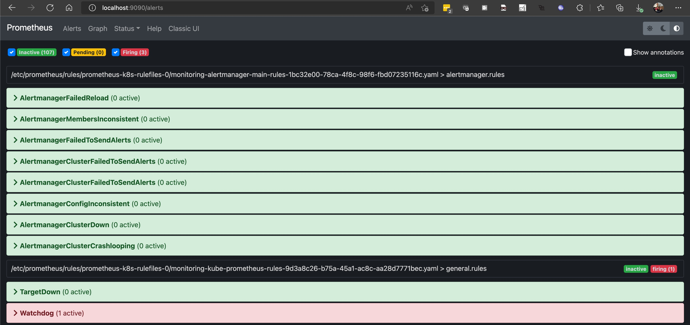
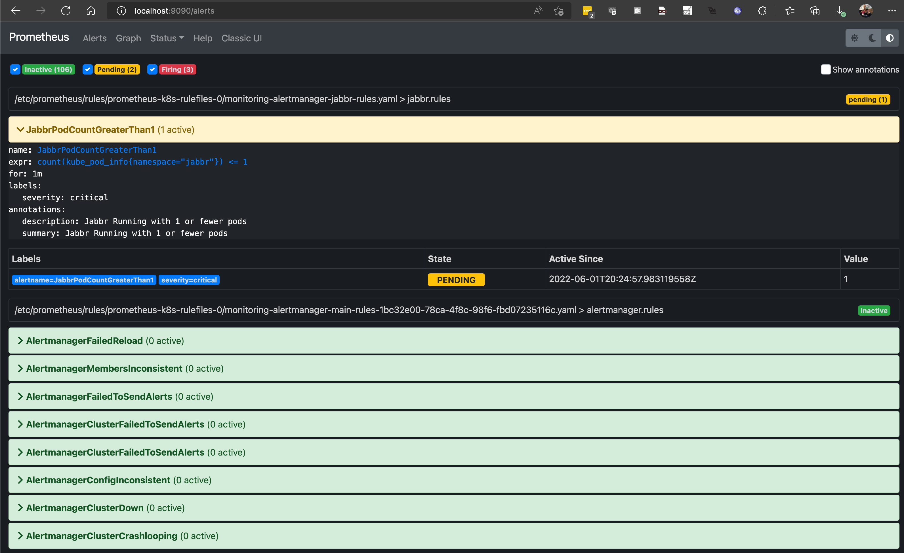
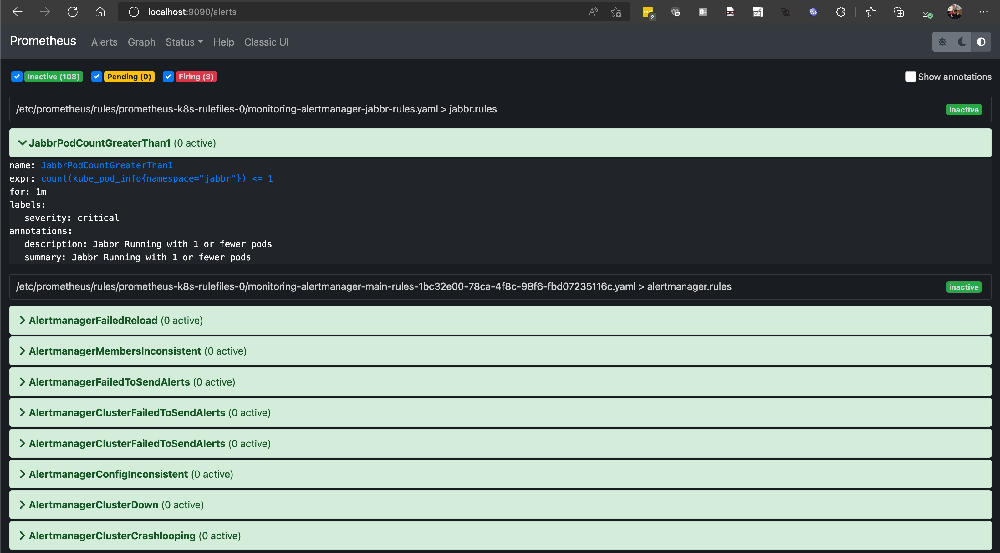

# Lab 2 Part 1: Configure Alerting with Prometheus

In this lab we will configure [Alert Manager](https://prometheus.io/docs/alerting/latest/alertmanager/), which is part of Kube Prometheus, to raise alerts on a given metric.

## Prerequisites

* Complete previous labs:
    * [Create AKS Cluster](../create-aks-cluster/README.md)
    * [Monitoring Setup](./monitoring.md)

## Instructions

Setting up alerting via Alert Manager involves two parts. Part 1 is where we will configure the prometheus rules file to raise the alert on the given metric. Part 2 will involve configuring a notification target. 

Lets get started with the prometheus rule file update.

### Get and edit the existing cluster Prometheus Rules File ConfigMap

Go to the lab folder:
```bash
cd kubernetes-hackfest/labs/windows/labs/monitoring
```

Kube Prometheus comes pre-configured with a number of existing alert rules. You can see this if you connect to the prometheus UI and go to the 'Alerts' tab, as follows:

```bash
# port-forward the prometheus service, if you haven't already exposed it as a service of type 'LoadBalancer'
kubectl port-forward svc/prometheus-k8s -n monitoring 9090:9090
Forwarding from 127.0.0.1:9090 -> 9090
Forwarding from [::1]:9090 -> 9090
```

Navigate to [http://localhost:9090](http://localhost:9090) and click on the 'Alerts' tab.



These alert rules are mantained through a custom resource definition called 'PrometheusRule'. Create a new file called jabbr-rules.yaml and paste the following in the file:

```yaml
apiVersion: monitoring.coreos.com/v1
kind: PrometheusRule
metadata:
  labels:
    prometheus: k8s
    role: alert-rules
  name: jabbr-rules
  namespace: monitoring
spec:
  groups:
  - name: jabbr.rules
    rules:
    - alert: JabbrPodCountGreaterThan1
      annotations:
        description: Jabbr Running with 1 or fewer pods
        summary: Jabbr Running with 1 or fewer pods
      expr: |
        # Get the number of jabbr pods running
        kube_deployment_status_replicas_available{namespace="jabbr",deployment="jabbr"}<=1
      for: 1m
      labels:
        severity: critical 
```

### Apply the rules and check the alerts

```bash
kubectl apply -f jabbr-rules.yaml 
```

Wait for a minute or two for the rule to be loaded and fire and then check the Alerts dashboard again. Notice that the alert is already firing in a 'pending'state and will shortly be in an 'active' state. This is because our rule is checking the number of Jabbr pods we have in our deployment, and right now, unless you've already modified it, you only have 1 jabbr pod. 



Let's resolve the alert. We can do that by scaling our Jabbr deployment up to 2 or more pods.

```bash
kubectl scale deploy jabbr --replicas=2 -n jabbr  
```

Within a few minutes you should see the alert go from yellow or red to green, indicating that it has been resolved.



That's it! You now have a working alert rule in Kube Prometheus. Next we'll work on trigginer an external notification based on this alert.

#### Next Lab: [Alerting Part 2](./alerting-part2.md)