# Lab 2 Part 2: Trigger Notifications Based on Alerts

In the last lab we configured Prometheus and Alert Manager to raise an alert based on a cluster metric. You can see these alerts in the Prometheus dashboard, but you probably want those alerts to surface via email or other means. In this lab we'll configure Alert Manager to invoke an Azure Logic App via a webhook and will configure that logic app to write the alert to a Teams channel.

>*NOTE:* If you don't have Teams, you can easily modify this lab to send an email or just watch the Logic App itself to see the alerts being raised.

## Prerequisites

* Complete previous labs:
    * [Create AKS Cluster](../create-aks-cluster/README.md)
    * [Monitoring Setup](./monitoring.md)
    * [Alerting Part 1](./alerting-part1.md)

## Instructions

Alert Manager provides a bunch of notification options, which are documented [here](https://prometheus.io/docs/alerting/latest/configuration/). For our lab we'll make use of the [WebHook Configuration](https://prometheus.io/docs/alerting/latest/configuration/#webhook_config). Unlike the Prometheus rule file we pulled in the last lab, which was stored in a Kubernetes ConfigMap, the Alert Manager configuration is stored in a Kubernetes Secret. We can update that secret by modifying it's manifest in the kube-prometheus installation manifests.

### Get the Alert Manager Configuration File

In the [Monitoring Setup](monitoring.md) step you cloned the kube-prometheus repository. We'll navigate to that folder.

```bash
# I store my git repos in a github.com folder in my home directory
# modify to match your own folder structure:
cd ~/github.com/kube-prometheus/manifests
```

Now open the file named **alertmanager-secret.yaml** for editing. Take a look at that file and familiarize yourself with the contents. You can review the alert manager configuration document [here](https://prometheus.io/docs/alerting/latest/configuration/) to understand the file structure.

In the 'recievers' section, update to look like the following. 

>**NOTE:** You don't have the logic app URL yet. You'll come back and fill that in later.

```bash
"receivers":
- "name": "Default"
- "name": "Watchdog"
- "name": "Critical"
    "webhook_configs":
    - "url": "INSERT YOUR LOGIC APP URL"
    "send_resolved": true
- "name": "null"
```

### Create the Webhook

You can review the alert manager configuration to see what alert recievers are available out of the box. For our lab we're going to send a message to Microsoft Teams. Fortunately, the [Alert Manager WebHook Documentation](https://prometheus.io/docs/alerting/latest/configuration/#webhook_config) tells us that its WebHook reciever will send a POST to the target URL with the following message body.

```json
{
  "version": "4",
  "groupKey": <string>,              // key identifying the group of alerts (e.g. to deduplicate)
  "truncatedAlerts": <int>,          // how many alerts have been truncated due to "max_alerts"
  "status": "<resolved|firing>",
  "receiver": <string>,
  "groupLabels": <object>,
  "commonLabels": <object>,
  "commonAnnotations": <object>,
  "externalURL": <string>,           // backlink to the Alertmanager.
  "alerts": [
    {
      "status": "<resolved|firing>",
      "labels": <object>,
      "annotations": <object>,
      "startsAt": "<rfc3339>",
      "endsAt": "<rfc3339>",
      "generatorURL": <string>,      // identifies the entity that caused the alert
      "fingerprint": <string>        // fingerprint to identify the alert
    },
    ...
  ]
}
```

This is extremely helpful, because it means we can create an HTTP Reciever that expects that message body. Azure Logic Apps are a great option for this, and Logic Apps provide a lot of out of the box actions to do things like send an email, drop a message in a teams chat, etc. Lets go create a Logic App to act as our reciever.

1. Go to the Azure Portal and click the '+' icon in the top right, search for 'Logic App' and click 'Create'

    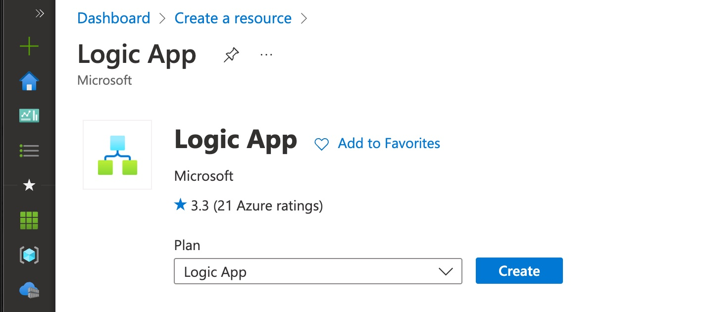

1. Choose a resource group, region and specify the name and plan type and then create:

    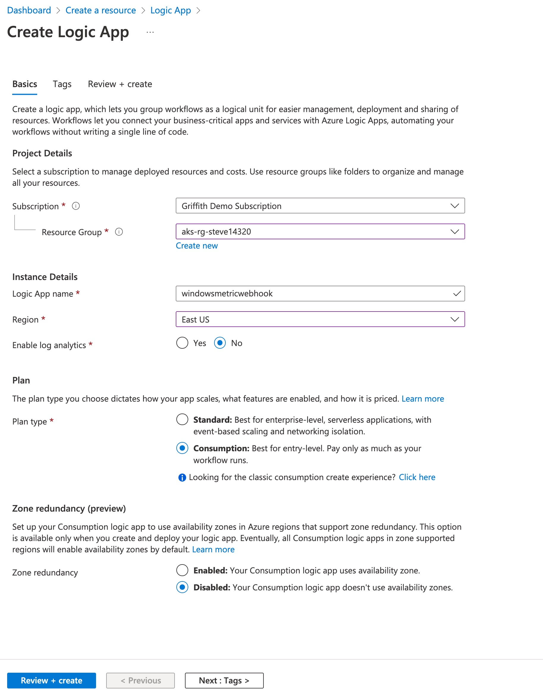

1. When the deployment completes, click on 'Go to resource'

1. We're going to start with a blank logic app, so click the icon for 'Blank Logic App' under 'Templates'

1. We're going to trigger this logic app with an HTTP Post, so we'll use the 'When HTTP request is recieved' trigger. 

    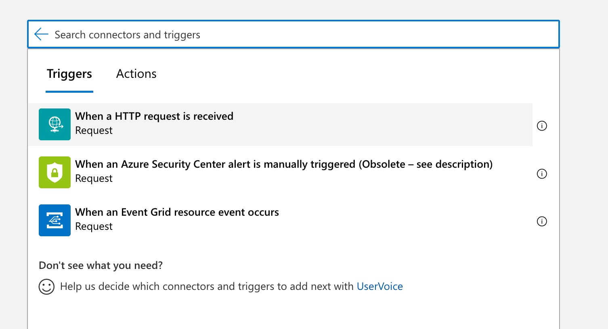

1. For the 'body schema' field, we already have a sample body from the Alert Manager documentation (above), so we can use the 'use sample payload to generate schema' option.

    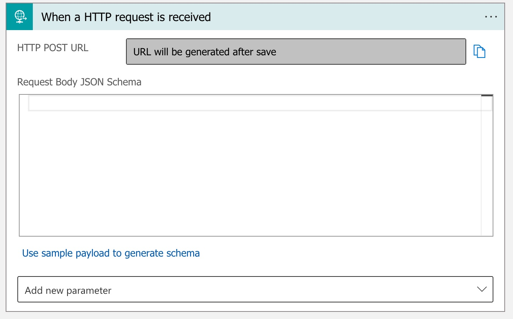

1. Click 'use sample payload to generate schema' and paste in the following and then click 'Done'. This is just the example from the alert manager documentation with a few fixes to make sure the input data is valid.

    ```json
    {
    "version": "4",
    "groupKey": "data",
    "truncatedAlerts": 1,
    "status": "data",
    "receiver": "data",
    "groupLabels": null,
    "commonLabels": null,
    "commonAnnotations": null,
    "externalURL": "data",
    "alerts": [
        {
        "status": "data",
        "labels": null,
        "annotations": null,
        "startsAt": "data",
        "endsAt": "data",
        "generatorURL": "data",
        "fingerprint": "data"
        }
    ]
    }
    ```
    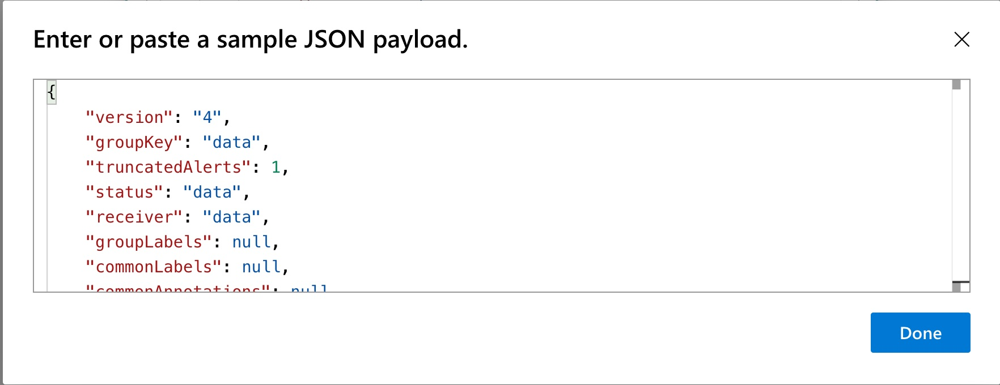

1. Click 'Done'

    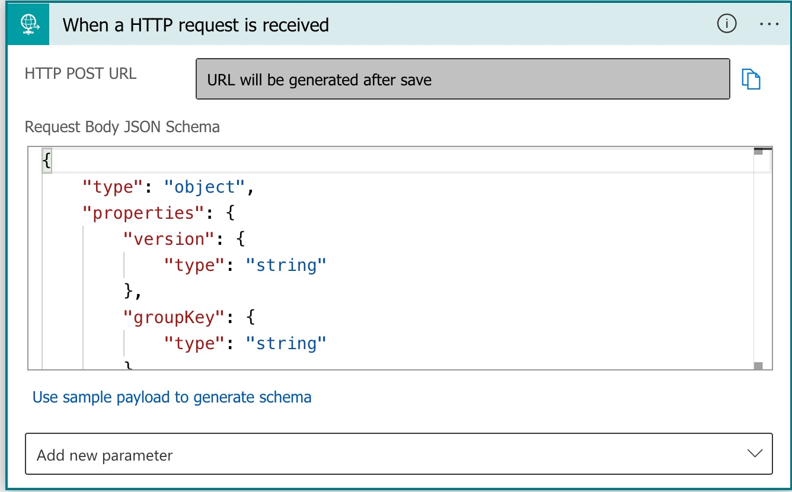

1. There could be multiple alerts, so we'll iterate through the alerts and execute one action per alert. Click on 'New Step' and search for 'For each'. It's under 'Control' so select 'Control' and then 'For Each'
   
   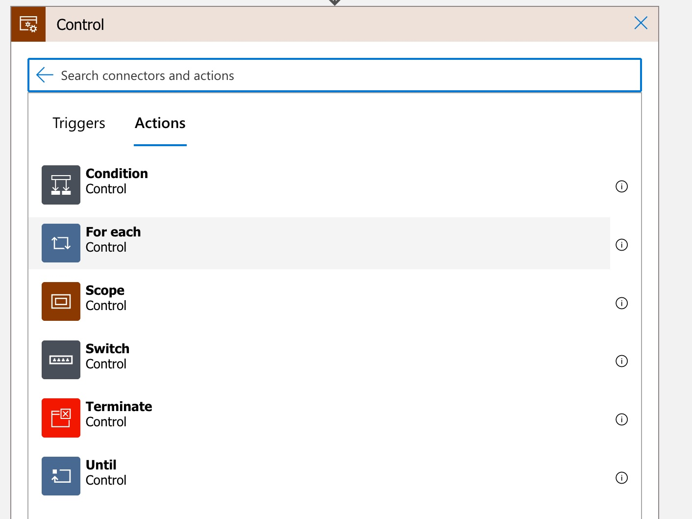

1. Click in the 'Select output from previous steps' dialog and then in the 'Dynamic Content' window select 'alerts'.

    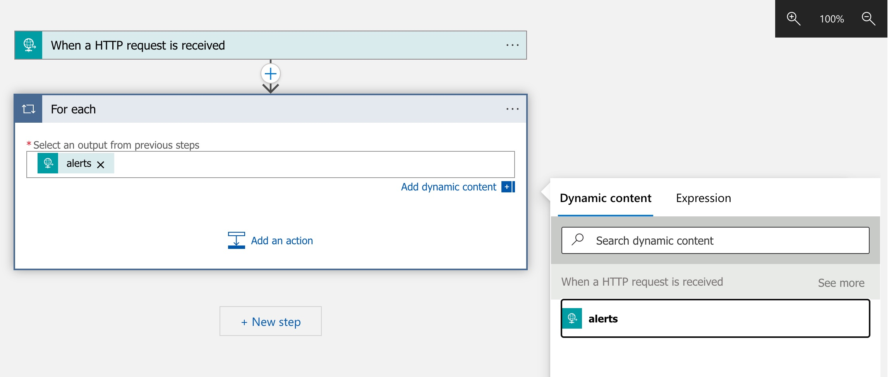

1. We need to parse the contents of each item. We know it's JSON content, so we can use the JSON Parse action. Inside the 'For Each' loop box click on 'add an action' and then search for 'Parse', select 'Data Operations' and then 'Parse Json'

1. Click on the 'Content' dialog and in the 'Dynamic Content' window select 'item' to select the current item of the for each loop.

1. For the schema, we can use the alert item above, but there are some additional fields with an actual alert. Below is a schema you can use, or you could stub this out, complete the lab and then generate an alert to get the schema yourselve. Paste the following into the 'Schema' box

    ```json
    {
        "type": "object",
        "properties": {
            "status": {
                "type": "string"
            },
            "labels": {
                "type": "object",
                "properties": {
                    "alertname": {
                        "type": "string"
                    },
                    "container": {
                        "type": "string"
                    },
                    "deployment": {
                        "type": "string"
                    },
                    "instance": {
                        "type": "string"
                    },
                    "job": {
                        "type": "string"
                    },
                    "namespace": {
                        "type": "string"
                    },
                    "prometheus": {
                        "type": "string"
                    },
                    "severity": {
                        "type": "string"
                    }
                }
            },
            "annotations": {
                "type": "object",
                "properties": {
                    "description": {
                        "type": "string"
                    },
                    "summary": {
                        "type": "string"
                    }
                }
            },
            "startsAt": {
                "type": "string"
            },
            "endsAt": {
                "type": "string"
            },
            "generatorURL": {
                "type": "string"
            },
            "fingerprint": {
                "type": "string"
            }
        }
    }
    ```

    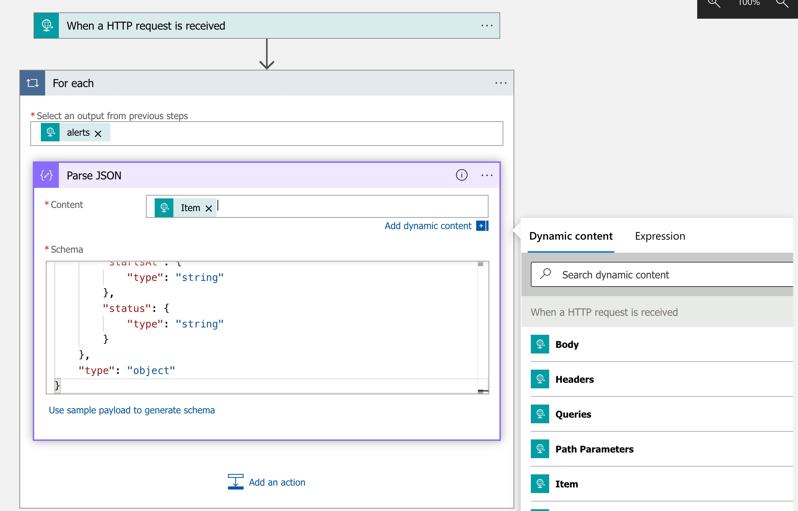

1. Finally, lets add our teams message action. Click on 'Add an action' and search for 'Microsoft Teams'. 

    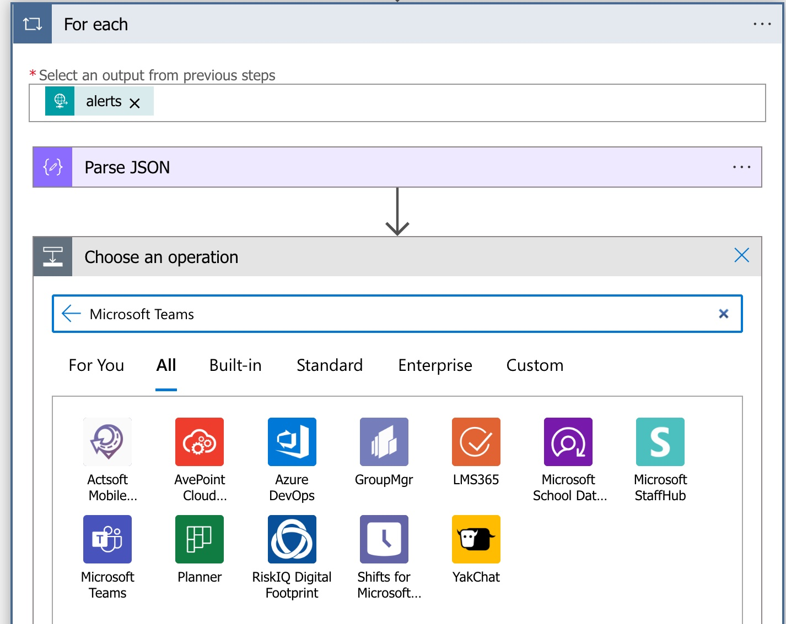

1. Select 'Microsoft Teams' and then 'Post message in chat or channel'

    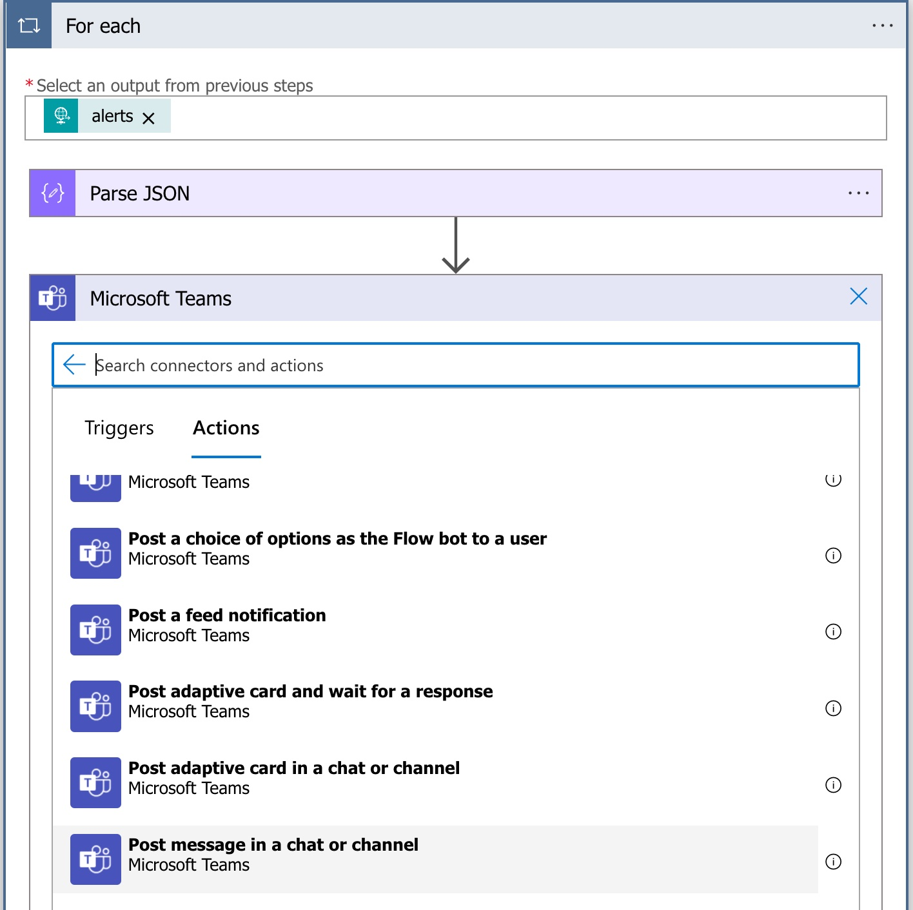

1. The first time you use this you'll need to walk through your teams sign in process, to create the auth token to be used by the logic app. Complete the process.

1. Choose the options for the target chat or channel. I'm posting to a channel called 'Windows Cluster Alerts' in my 'Griffith' team, as shown below.

    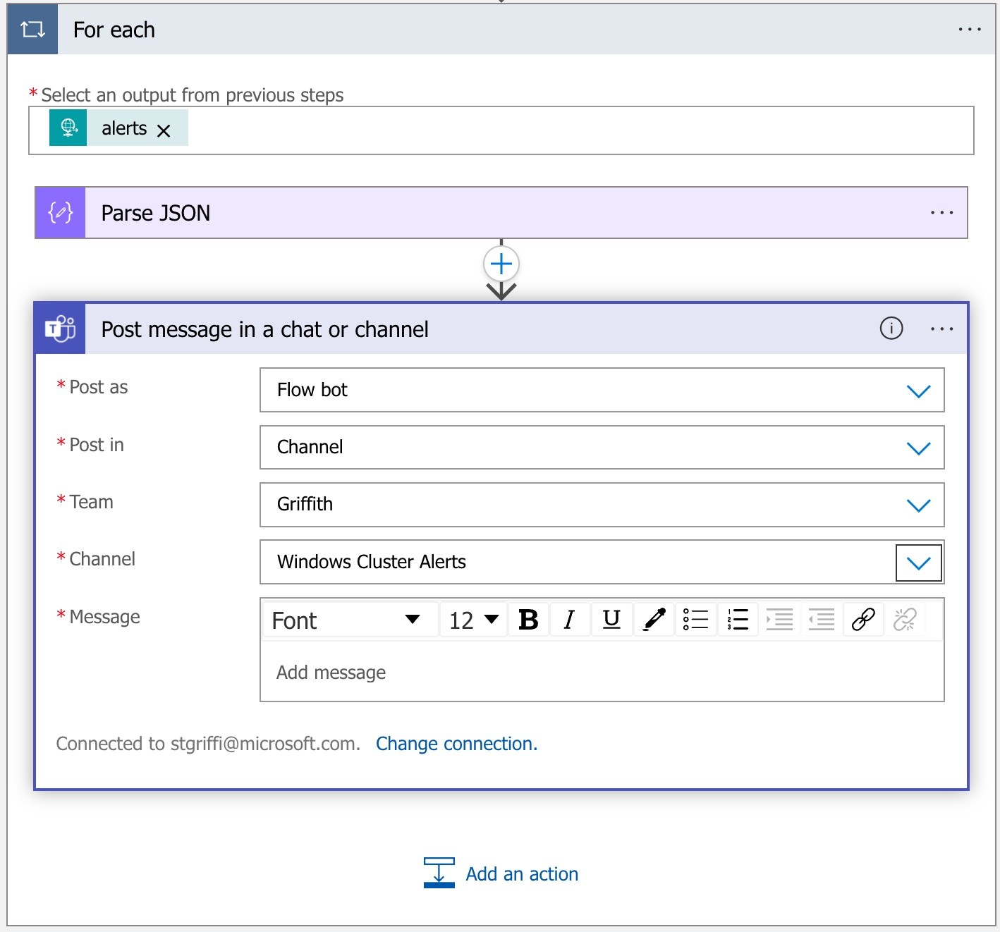

1. Next we format the message we want to post. I'm going to show the Status, Alert Name, Severity and Description fields, so I've added them as shown below. Note that when you go to select 'Dynamic Content' from the 'Parse JSON' action, you may need to click 'Show more' to see all the fields.

    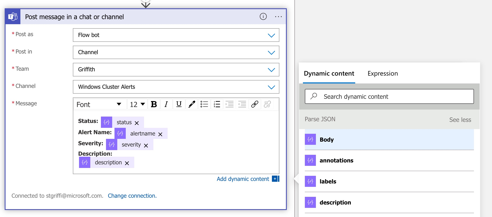

1. Finally, we can click 'Save' at the top of the screen! Now that the Logic App is saved we should be able to get the URL. Click on the 'When an HTTP request is recieved' action and copy the URL.

    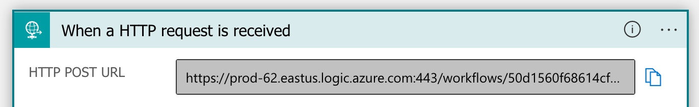

### Update the Alert Manager Config with the WebHook Details

1. Go to your 'alertmanager-secret.yaml' file and update the 'recievers' section as follows, providing your logic app URL:

    ```bash
    "receivers":
    - "name": "Default"
    - "name": "Watchdog"
    - "name": "Critical"
        "webhook_configs":
        - "url": "INSERT YOUR LOGIC APP URL"
        "send_resolved": true
    - "name": "null"
    ```

1. Now we can apply this updated secret.

    ```bash
    kubectl apply -f alertmanager-secret.yaml -n monitoring
    ```

1. Now if we go back and try to trigger our alert and the resolve the alert, we should see the messages arrive in our Teams chat.

    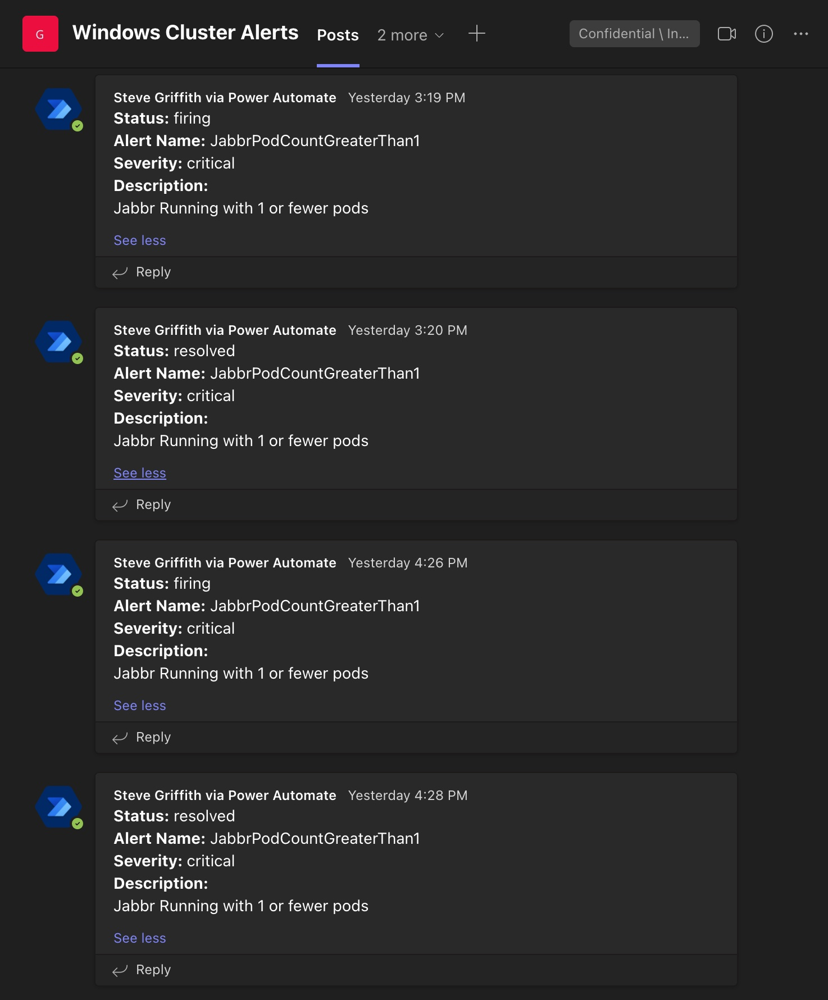

## Conclusion

That's it! You should now have a functioning alert pipeline! You can obvioulsy go back and adjust this to show other alerts by modifying the alert rules you set in part 1, or you can change the output to email or other by adjusting the actions used in this lab.