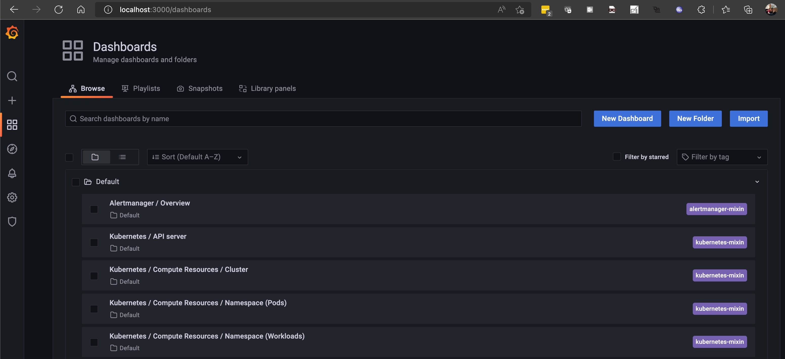
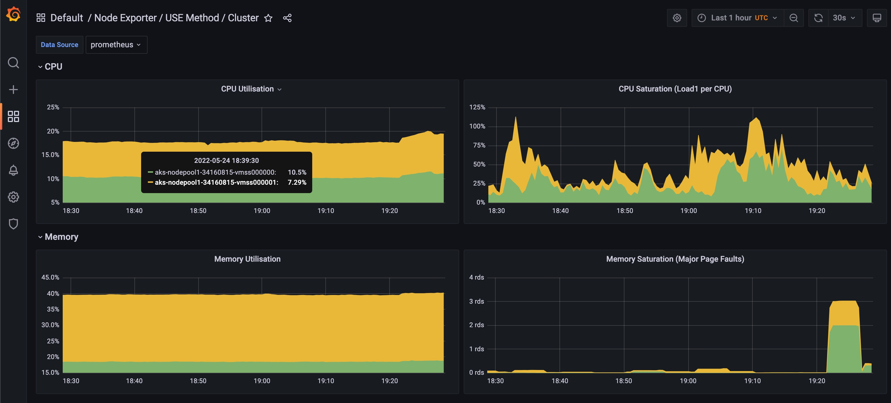
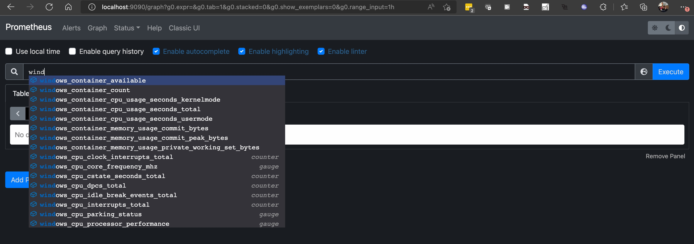
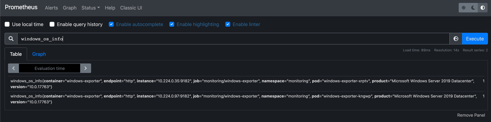
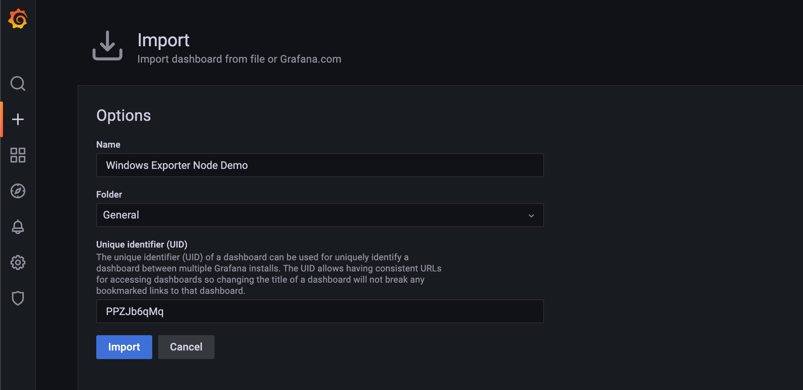
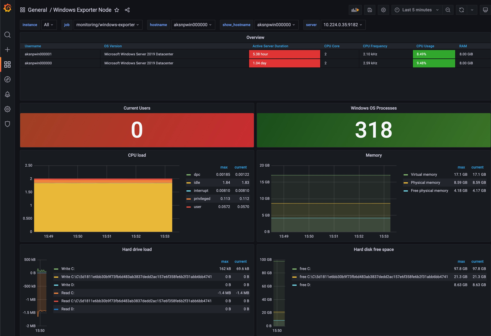

# Lab 1: Enable Kube Prometheus Monitoring for Windows Nodes

In this lab we will install [kube prometheus](https://github.com/prometheus-operator/kube-prometheus/blob/main/README.md) to our cluster, install the Windows Node Exporter, to get node metrics into prometheus, and then will deploy a grafana dashboard to view our Windows node data.

>*NOTE:* This lab assumes your cluster supports [host process pods](https://kubernetes.io/docs/tasks/configure-pod-container/create-hostprocess-pod/), which are the approach for priviledged escalation of pods in Windows nodes. This is supported in beta in Kubenretes 1.23.

## Prerequisites

* Complete previous labs:
    * [Create AKS Cluster](../create-aks-cluster/README.md)
* Kubernetes cluster must be running version 1.23 or later

## Instructions

### Install Kube Prometheus

The first step in getting our Windows node metrics into Prometheus and Grafana is to install the Kube Prometheus project into our cluster. We'll do this using the manifests published by the Kube Prometheus project.

1. Clone the Kube Prometheus repository

    ```bash
    git clone https://github.com/prometheus-operator/kube-prometheus.git
    ```

1. To make sure you're running the right version, check the [version compatibility table](https://github.com/prometheus-operator/kube-prometheus#compatibility) and then git checkout the right branch for your specific Kubernetes version. 

    ```bash
    # Looking at the compatibility matrix I can see that Kubernetes 1.24 is compatible with Kube Prometheus release-0.11

    # Checkout the release-0.11 branch
    git checkout release-0.11
    Switched to branch 'release-0.11'
    Your branch is up to date with 'origin/release-0.11'.
    ```

1. Now we can follow the documented installation steps from the Kube Prometheus project

    ```bash
    # Create the namespace and CRDs, and then wait for them to be available before creating the remaining resources
    kubectl apply --server-side -f manifests/setup
    until kubectl get servicemonitors --all-namespaces ; do date; sleep 1; echo ""; done
    kubectl apply -f manifests/
    ```

1. Check the status of your deployment

    ```bash
    kubectl get svc,pods -n monitoring
    NAME                            TYPE        CLUSTER-IP     EXTERNAL-IP   PORT(S)                      AGE
    service/alertmanager-main       ClusterIP   10.0.208.250   <none>        9093/TCP,8080/TCP            4h34m
    service/alertmanager-operated   ClusterIP   None           <none>        9093/TCP,9094/TCP,9094/UDP   4h30m
    service/blackbox-exporter       ClusterIP   10.0.222.215   <none>        9115/TCP,19115/TCP           4h34m
    service/grafana                 ClusterIP   10.0.143.100   <none>        3000/TCP                     4h34m
    service/kube-state-metrics      ClusterIP   None           <none>        8443/TCP,9443/TCP            4h34m
    service/node-exporter           ClusterIP   None           <none>        9100/TCP                     4h34m
    service/prometheus-adapter      ClusterIP   10.0.238.32    <none>        443/TCP                      4h33m
    service/prometheus-k8s          ClusterIP   10.0.47.227    <none>        9090/TCP,8080/TCP            4h33m
    service/prometheus-operated     ClusterIP   None           <none>        9090/TCP                     4h30m
    service/prometheus-operator     ClusterIP   None           <none>        8443/TCP                     4h33m

    NAME                                       READY   STATUS    RESTARTS   AGE
    pod/alertmanager-main-0                    2/2     Running   0          4h30m
    pod/alertmanager-main-1                    2/2     Running   0          4h30m
    pod/alertmanager-main-2                    2/2     Running   0          4h30m
    pod/blackbox-exporter-6b79c4588b-dwkpf     3/3     Running   0          4h34m
    pod/grafana-7fd69887fb-xgqbx               1/1     Running   0          4h34m
    pod/kube-state-metrics-55f67795cd-hfshk    3/3     Running   0          4h34m
    pod/node-exporter-698pm                    2/2     Running   0          4h34m
    pod/node-exporter-rpxg7                    2/2     Running   0          4h30m
    pod/prometheus-adapter-85664b6b74-cwm6n    1/1     Running   0          4h33m
    pod/prometheus-adapter-85664b6b74-k7tnb    1/1     Running   0          4h33m
    pod/prometheus-k8s-0                       2/2     Running   0          4h30m
    pod/prometheus-k8s-1                       2/2     Running   0          4h30m
    pod/prometheus-operator-6dc9f66cb7-8wc6p   2/2     Running   0          4h33m
    ```

1. Now lets test connectivity to the Prometheus and Grafana dashboards. They're deployed as 'Cluster IP' services, so we can either modify them to be type 'LoadBalancer' or we can use a port-forward. We'll port-forward for now.

    ```bash
    kubectl port-forward service/grafana -n monitoring 3000:3000
    Forwarding from 127.0.0.1:3000 -> 3000
    Forwarding from [::1]:3000 -> 3000
    ```

1. Navigate your browser to http://localhost:3000
   
1. Enter the userid and password (admin:admin) and then follow the prompts to reset the admin password

    

1. Click on the '/Node Exporter/USE Method/Cluster' dashboard, and notice that the data is only sourced from the linux nodes

    

### Install the Windows Node Exporter

The Windows node exporter is a separate Prometheus project, which you can find [here](https://github.com/prometheus-community/windows_exporter). We'll follow the Kubernetes installation instructions [here](https://github.com/prometheus-community/windows_exporter/blob/master/kubernetes/kubernetes.md).


1. Apply the Windows Node Exporter manifests

    > *NOTE:* The windows-exporter-daemonset.yaml contains a configmap which defines the metrics to export. You can look at more options [here](https://github.com/prometheus-community/windows_exporter/blob/master/README.md#collectors). For now we'll just enable '[defaults],container'

    ```bash
    # Move to the directory containing the manifest files
    cd kubernetes-hackfest/labs/windows/labs/monitoring/manifests

    # Apply the manifests
    kubectl apply -f windows-exporter-daemonset.yaml
    kubectl apply -f windows-exporter-podmonitor.yaml

    # Watch the node exporter daemonset start
    watch kubectl get pods -n monitoring
    ```

1. Once the daemonset pods are running, lets port-forward to the prometheus dashboard and check if we have metrics.

    ```bash
    kubectl port-forward svc/prometheus-k8s -n monitoring 9090:9090
    Forwarding from 127.0.0.1:9090 -> 9090
    Forwarding from [::1]:9090 -> 9090
    ```

1. Navigate your browser to http://localhost:9090

    

1. Enter 'windows_os_info' into the query text box and hit 'Execute'. You should see data returned for each windows node.

    

### Install a Windows Dashboard

To visualize data in Grafana, we need a dashboard. We can create one from scratch, or borrow from others. The following is a dashboard created based on a Grafana community dashboard which has been modified.

1. Navigate back to Grafana and click the '+' link on the left of the page and select 'Import' to import a new dashboard. Import from file, using the 'dashboard.json' found at ```kubernetes-hackfest/labs/windows/labs/monitoring/dashboard.json```

    

1. Navigate to the dashboard, if you weren't already taken to it, and check out the new metrics you can view.

    

## Conclusion

Congratulations! You now have windows nodes exporting metrics which Prometheus is scraping. Grafana allows you to create great visualizations of those metrics. From here you can explore the other metrics from the Windows Node Exporter, see link below, and create your own dashboards views.

[Windows Node Exporter Collectors](https://github.com/prometheus-community/windows_exporter#collectors)


#### Next Lab: [Alerting](./alerting-part1.md)
